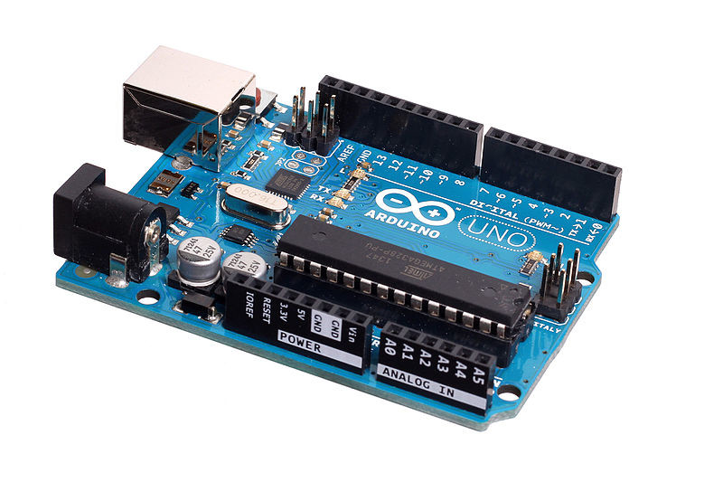

============
Introduction
============

Qu'est-ce qu'un microcontrôleur ?
=================================

Un microcontrôleur est un circuit intégré regroupant un micro-processeur, de la mémoire et des périphériques sur la même puce. Contrairement à un microprocesseur classique, un **microcontrôleur est surtout utilisé pour une application électronique spécifique**.

De nos jours, les microcontrôleurs sont présents un peu partout : dans les appareils domestiques, médicaux, de télécommunication, dans les voitures, les avions, l'industrie, ... 

Apparus dans les années 70, les microcontrôleurs à architecture 8 bits ne sont pas près de disparaître. Très peu chère, on les retrouve dans des petites applications (ex. télécommande).

La célèbre carte **Arduino UNO R3** est construite autour d'un **microcontrôleur 8 bits** !

   
   Carte Arduino UNO (microcontrôleur Atmel ATMEGA 328)

Actuellement, la tendance est aux **microcontrôleurs 32 bits** (ex. ARM Cortex-M, STM32, ...) qui sont plus adaptés aux applications plus évoluées. C'est ce type de microcontrôleur qui a permis le portage du langage Python (Micropython) au sein des microcontrôleurs. Les cartes Micro:bit, Pyboard ou encore à base d'ESP32 en sont les parfaits exemples !

   
   Carte micro:bit

   
   Carte PyBoard (microcontrôleur STM32)

   
   Carte ESP-WROOM-32 (microcontrôleur ESP32)

Pourquoi des microcontrôleurs en sciences physiques ?
=====================================================

Le monde actuel est fortement imprégné par le numérique. Par exemple, les téléphones portables et les objets connectés comportent une **multitude de capteurs** mesurant des grandeurs très variées comme la température, la fréquence cardiaque, la pression, l'accélération, les ondes sonores, ...

Il est donc important d'expliquer comment s'effectue la **mesure d'une grandeur physique analogique** dans ces appareils numériques du quotidien.

Il en est de même pour la **génération de signaux** (ex. son).

Les fonctions d'un microcontrôleur
==================================

Les microcontrôleurs permettent principalement de :

* **générer de signaux** (ex. son, impulsion de commande, ...).

* **mesurer des tensions** (ex. adaptation de capteurs analogiques, acquisition de signaux,   ...).

* **mesurer des durées** (ex. période, fréquence, temps caractéristique, ...).

Applications en sciences physiques
==================================

De manière générale, les microcontrôleurs sont utilisés :

* pour réaliser des **petites applications** (ex. thermomètre, télémètre à ultrasons, ...) en rapport avec un cours ou un TP ;

* dans des **projets** (enseignement scientifique).

Avec des capteurs, il est en plus possible de :

* réaliser des **mesures** (ex. température, célérité son, pression, ...) ;

* faire de **l'acquisition de données** en mode **autonome** (ex. mesure de pression sur un ballon sonde) ou mode **connecté** (branché à un ordinateur).

