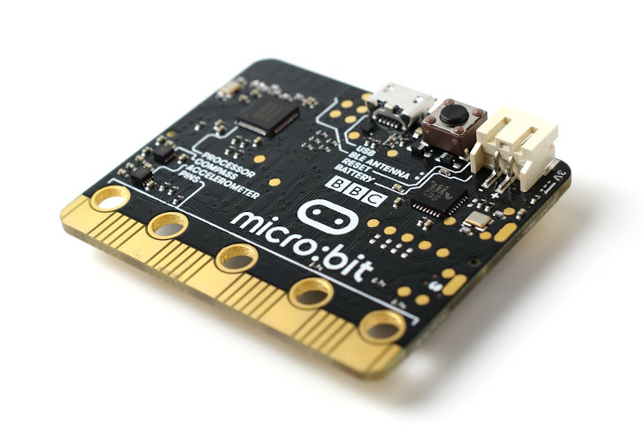

Introduction aux microcontrôleurs
=================================

Qu'est-ce qu'un microcontrôleur ?
---------------------------------

Un microcontrôleur est un circuit intégré regroupant un micro-processeur, de la mémoire et des périphériques sur la même puce. Contrairement à un microprocesseur classique, un **microcontrôleur est surtout utilisé pour une application spécifique**.

De nos jours, les microcontrôleurs sont présents un peu partout : dans les appareils domestiques, médicaux, de télécommunication, dans les voitures, les avions, l'industrie, ... 

Apparus dans les années 70, les microcontrôleurs à architecture 8 bits ne sont pas près de disparaître. Très peu chère, on les retrouve dans des petites applications (ex. télécommande). Par exemple, la célèbre carte Arduino UNO fonctionne avec un microcontrôleur 8 bits !

.. figure:: images/Arduino_Uno_rev3_wikipedia.jpg
   :width: 800
   :height: 533
   :scale: 50 %
   :alt: 
   :align: center
   
   Carte Arduino UNO (microcontrôleur Atmel ATMEGA 328)

Actuellement, la tendance est aux microcontrôleurs 32 bits (ex. ARM Cortex-M, STM32, ...) qui sont plus adaptés aux applications plus évoluées. C'est ce type de microcontrôleur qui a permis le portage du langage Python (MicroPython) au sein des microcontrôleurs. Les cartes Micro:bit, Pyboard ou encore à base d'ESP32 en sont les parfaits exemples !

   
   Carte micro:bit

.. figure:: images/pyboard.jpg
   :width: 500
   :height: 500
   :scale: 70 %
   :alt: 
   :align: center
   
   Carte PyBoard (microcontrôleur STM32)

.. figure:: images/ESP-WROOM-32_Dev_Board.jpg
   :width: 625
   :height: 480
   :scale: 50 %
   :alt: 
   :align: center
   
   Carte ESP-WROOM-32 (microcontrôleur ESP32)

Les différents types de microcontrôleurs
----------------------------------------

Plusieurs critères permettent de différencier les microcontrôleurs : leur architecture, le nombre et le type de périphériques d'entrées/sorties, le langage de programmation, ...

Ces deux derniers points sont à prendre en considération. En particulier, au lycée, le choix de Python comme langage de programmation des microcontrôleurs paraît logique.

En pratique, la plupart des manuels de sciences physiques et des fabricants de matériel spécialisé se sont tournés vers les populaires cartes Arduino même si le langage de programmation utilisé n'est pas du Python mais du C/C++ !

Pourquoi des microcontrôleurs en sciences physiques
---------------------------------------------------

Le monde actuel est fortement imprégné par le numérique. Par exemple, les téléphones portables et les objets connectés comportent une **multitude de capteurs** mesurant des grandeurs très variées comme la température, la fréquence cardiaque, la pression, l'accélération, les ondes sonores, ...

Il est donc important d'expliquer comment la valeur d'une **grandeur physique analogique** est obtenue sur un appareil numérique.

Il en est de même pour la génération de signaux (ex. son) à partir d'un appareil numérique.

Que faire des microcontrôleurs en sciences physiques ?
------------------------------------------------------

En sciences physiques, les microcontrôleurs peuvent-être utiliser pour :

* des **petites applications** (ex. thermomètre, télémètre à ultrasons, ...) ou dans des **projets** en enseignement scientifique ;

* **générer de signaux** (ex. génération d'un son, génération d'une commande, ...) ;

* **mesurer des durées** (ex. période, fréquence, temps caractéristique, ...).

Mais il est également possible de :

* réaliser des **appareils de mesure programmables et modulables** (ex. pressionmètre, teslamètre, joulemètre, ...) ;

* faire de **l'acquisition de données** en mode **autonome** (ex. mesure de pression sur un ballon sonde) ou mode **connecté** (branché à un ordinateur).

