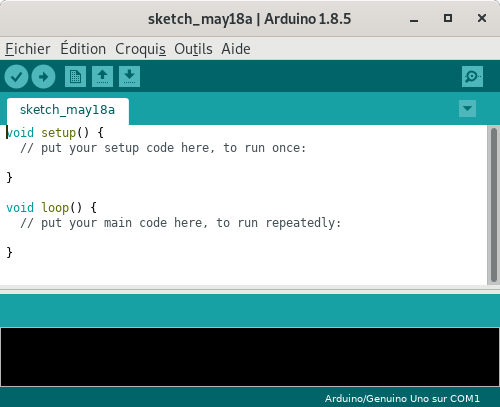
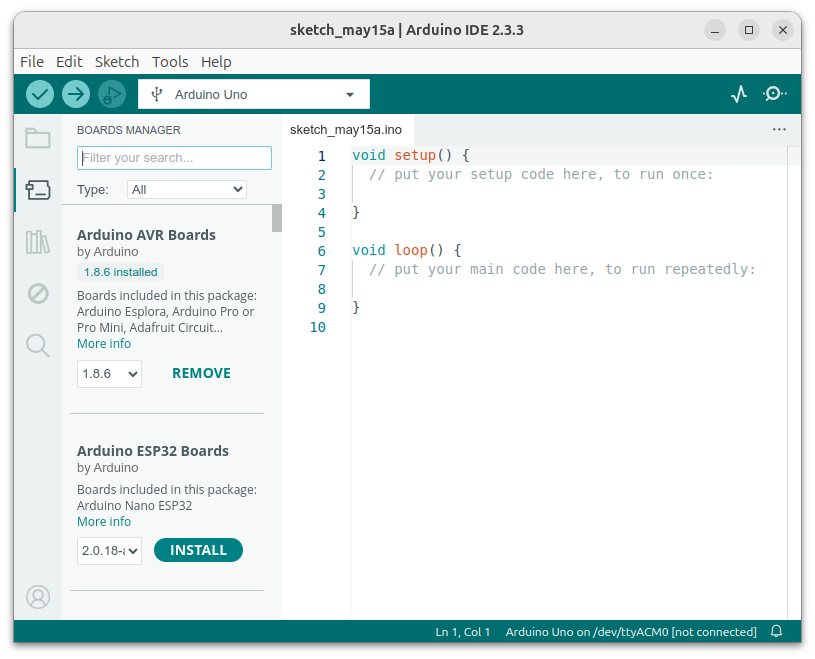

====================
Logiciel Arduino IDE
====================

Arduino IDE (version 1.8)
============================

Le logiciel **Arduino IDE 1.1** est un environnement intégré de développement (IDE) multiplaforme. Il est téléchargeable sur le site officiel http://www.arduino.cc/en/

   
   Logiciel Arduino IDE 1.8

.. .. Note::
..    Arduino.cc propose une **version Web** (https://create.arduino.cc/) de son environnement de développement. Elle nécessite l'installation d'un plugin afin de programmer la carte par le port USB.

Arduino IDE (version 2.x)
=========================

Le logiciel Arduino IDE 2  est la nouvelle version de l'environnement intégré de développement (IDE) d'Arduino.

.. L'interface est plus moderne.

   
   Logiciel Arduino IDE 2

Etapes de la mise en oeuvre d'un projet Arduino
===============================================

La mise en œuvre d'un projet Arduino s'effectue dans l'ordre suivant :

1. **Édition** du code source du programme dans l'éditeur de l'interface ;
2. **Compilation** du code source du programme (vérification du code et génération du programme en langage machine) ;
3. **Téléversement** du programme sur la carte Arduino ;
4. **Exécution** du programme sur le carte Arduino (de façon autonome sans ordinateur).

