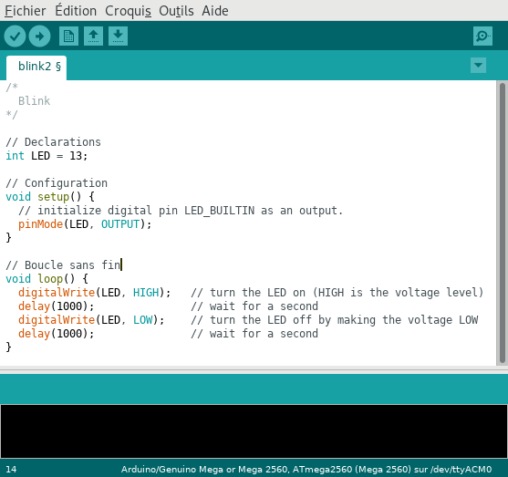

===============================
Spécificités du langage Arduino
===============================

Le langage de programmation C/C++ est utilisé par le logiciel Arduino IDE pour programmer les microcontrôleurs Arduino.

    
    Edition d'un code source d'un programme Arduino

Syntaxe
=======

* Toutes les instructions se terminent par un point virgule ``;`` sauf pour les directives ``#include`` et ``#define``.
* Les **blocs d'instructions** sont délimités par des accolades ``{...}``.
* Les **commentaires** en gris sont délimités par les caractères ``/*`` et ``*/`` sur plusieurs lignes ou commencent pas les caractères ``//`` sur une même ligne.

Typage des variables
--------------------

Le type d'une variable doit être renseigné à sa déclaration.

Quelques types disponibles :

========== ===================== =================
Type       Description           Valeurs
========== ===================== =================
``int``    entier sur 16 bits    -32768 à 32767
``long``   entier sur 32 bits    -2147483648 à 2147483647
``float``  flottant sur 32 bits  -3.4028235E+38 à -3.4028235E+38 ;
``char``   caractère sur 8 bits  Table ASCII 
========== ===================== =================

Exemples :

.. code:: arduino

    int a = 5;
    float pi = 3.14;
    char c = 'A';

Constantes prédéfinies
======================

Afin d'améliorer la lecture du code, des constantes sont définies.

================ ==================================
Constante        Valeur
================ ==================================
``LOW``          0 (niveau logique)
``HIGH``         1 (niveau logique)
``OUTPUT``       broche en sortie
``INPUT``        broche en entrée
``LED_BUILTIN``  ``13`` (numéro de broche de la LED intégrée)
================ ==================================

Structure du programme
======================

Un programme Arduino respecte toujours une **structure spécifique** composée en trois parties :

    * Les déclarations : **définitions** des constantes et des variables ;
    * La fonction ``setup()`` : **configuration** de la carte (entrées, sorties, port série, ...) ;
    * La fonction ``loop()`` : **instructions du programme exécutées** dans une **boucle infinie** (sans fin).

Documentation
=============

Une référence complète du langage Arduino est disponible sur le site officiel `ici <https://docs.arduino.cc/language-reference/>`_.

