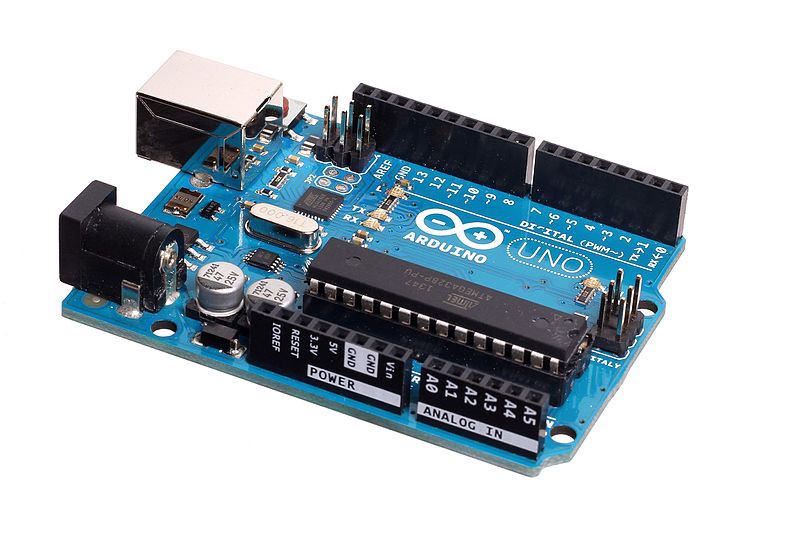
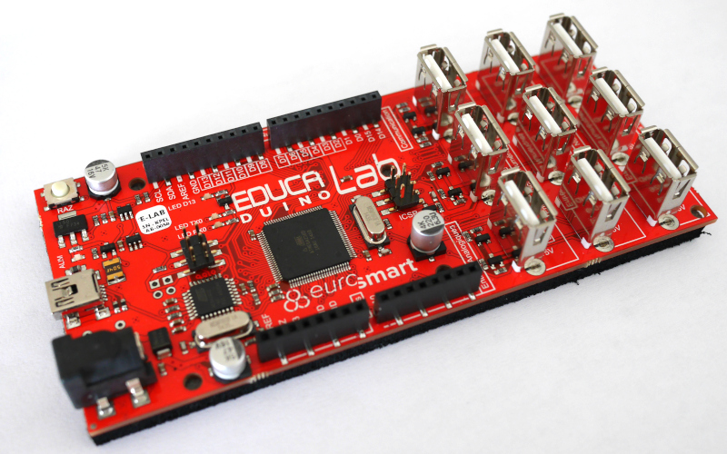
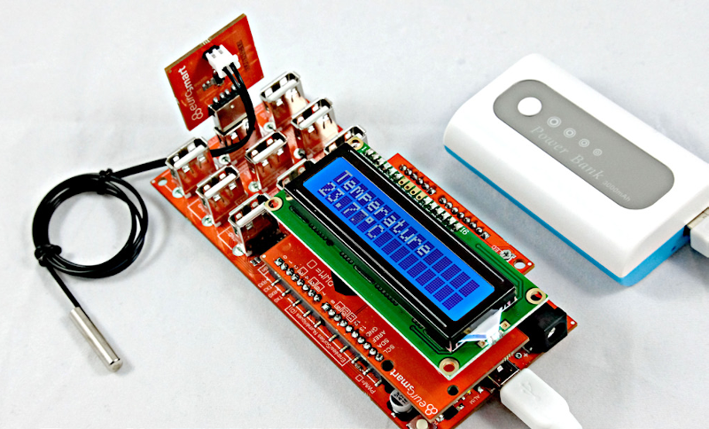
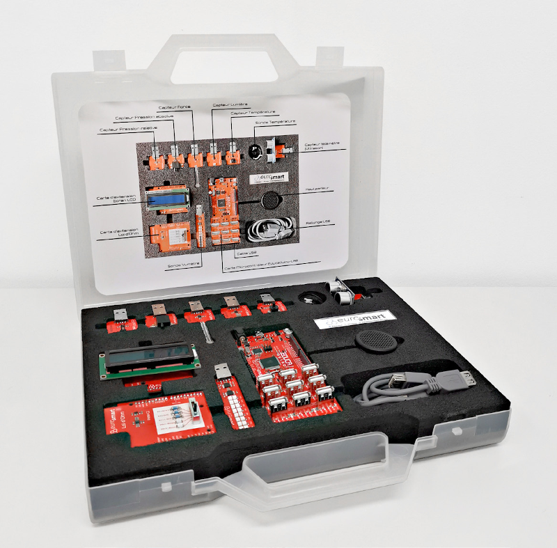
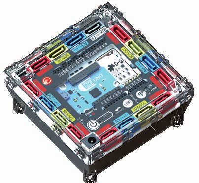
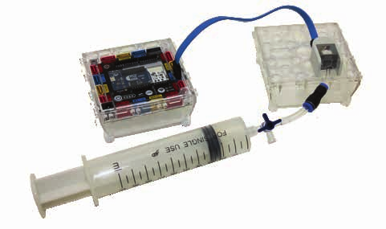

==============
Cartes Arduino
==============

Qu'est-ce qu'Arduino ?
======================

**Arduino** est une **carte électronique** à base de microcontrôleur (ex. ATMEL AVR ATMEGA) développée par Arduino.cc sous licence libre. Tous les schémas des cartes sont disponibles librement sur le Web. A peu près une vingtaine de versions de cartes officielles ont été fabriquées dont la célèbre l'Arduino UNO.

.. figure:: images/Arduino_boards_Arduino.cc.png
   :width: 540
   :height: 413
   :scale: 100 %
   :alt: Quelques cartes Arduino
   :align: center
   
   image : www.arduino.cc

A l'origine conçue pour la **création artistique**, la carte Arduino trouve des applications dans des domaines d'applications aussi variés qu'insolites. Une carte Arduino s'utilise généralement comme :

* **dispositif autonome** dans des applications comme la domotique, la robotique, les systèmes embarqués, ...
* **interface** entre un ordinateur (logiciel tiers) et des capteurs ou des actionneurs ;

**Arduino** est aussi le **logiciel de développement** des cartes du même nom. Également sous licence libre, cet environnement de développement intégré (IDE) utilise C/C++ comme langage de programmation et le port USB pour le téléversement du programme obtenu.

La carte Arduino UNO (Rev 3)
============================

   
   Arduino Uno R3

**Arduino UNO** est une des cartes officielles les plus récentes et économiques.

Caractéristiques principales :

* microcontrôleur 8 bits ATMEGA328P cadencé à 16 Mhz ;
* alimentation externe (7 à 12 V) ou USB (5 V);
* programmation et communication via port USB ;
* 14 broches d'entrées/sorties numériques dont 6 PWM ;
* 6 entrées analogiques sur 10 bits ;
* 1 port I2C (communication avec capteurs/actionneurs numériques) ;
* 1 port UART (communication série) ;
* 3 timers (comptage et mesure de temps) ;
* gestion des interruptions.

.. figure:: images/arduino-uno_rev3_pixabay_rotate.png
   :width: 680
   :height: 960
   :scale: 33 %
   :alt: Quelques cartes Arduino.
   :align: center
   
   Brochage de l'Arduino Uno R3

.. warning::
   Les niveaux de tension acceptables sur les broches d'entrées doivent être **comprises entre 0 V et 5 V** sous peine de détruire le microcontrôleur ou la carte !

.. note::
   La carte Arduino UNO ne possède pas de vraies sorties analogiques mais des sorties à **modulation de largeur d'impulsion** (MLI). Ce sont les six fameuses **sorties PWM** (Pulse Width Modulation).

Educaduino Lab (Eurosmart)
==========================

.. Il s'agit de cartes spécialement conçues pour les sciences physiques avec des **protections sur les ports d'entrée/sortie** contre les mauvaises manipulations (ce type de protections n'existe pas sur les cartes classiques comme l'Arduino Uno). Ces cartes disposent de leurs **propres capteurs** avec une connectique particulière.

https://educaduino-lab.com/

   
   La carte Educaduino-Lab (E-LAB)

La carte **Educaduino Lab** a été conçue sur la base d'une carte Arduino MEGA 2560. Cette dernière est équivalente à une carte arduino UNO mais avec plus de mémoire et surtout **plus de ports d'entrée/sortie**. Ce qui a permis à Eurosmart d'y placer des **connecteurs USB pour ses propres capteurs** tout en gardant la connectique classique de l'Arduino UNO.

Caractéristiques principales :

* microcontrôleur ATMEGA 2560 (comme l'Arduino MEGA 2560) ;
* protection des ports d'entrée/sortie ;
* brochage compatible Arduino Uno Rev 3 (pin 0.8mm, shield Grove, ...) ;
* ports supplémentaires en USB pour capteurs Educaduino-Lab ;

   
   Mesure d'une température (image : Eurosmart)

Une malette avec un afficheur LCD et plusieurs capteurs adaptés au programme du lycée est également proposée.

   
   Kit sciences-physiques 2nde/1ère (image : Eurosmart)

Plug’Uino® Uno (Sciencéthic)
============================

https://www.sciencethic.com/

   
   La carte Plug’Uino ® Uno (image : Sciencéthic)
   
Sciencéthic propose également une carte **Plug'Uino Uno** protégée contre les mauvaises manipulations et 100% compatible Arduino UNO Rev 3.

Caractéristiques principales :

* microcontrôleur ATMEGA 328P (comme l'Arduino Uno) ;
* protection des ports d'entrée/sortie ;
* brochage compatible Arduino Uno Rev 3 (pin 0.8mm, shield Grove, ...) ;
* connecteurs SATA pour les capteurs Plug'uino ;
   

   
   Capteur de pression et loi de Mariotte (image : Sciencéthic)
