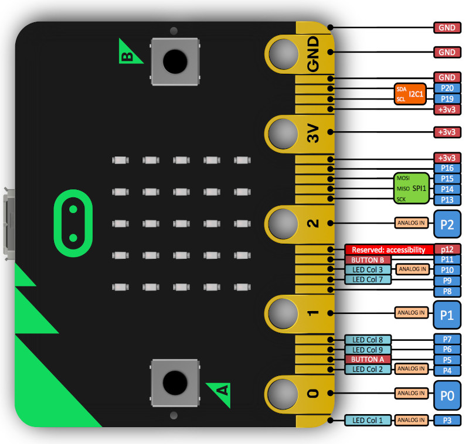

================
Cartes Micro:bit
================

.. image:: images/microbit_flickr.jpg
   :width: 1024
   :height: 681
   :scale: 50 %
   :alt: micro:bit
   :align: center

La carte Micro:bit a été développée par la BBC pour l'enseignement de l'informatique dans les écoles du Royaume Uni. Elle est programmable en MakeCode ou en MicroPython.
 
Principales caractéristiques de la carte :

* Microcontrôleur nRF51822 (ARM Cortex M0 - 32 bit - 16 Mhz) ;
* 256 ko de mémoire flash (ROM) ;
* 16 ko de mémoire vive (RAM) ;
* Tension de fonctionnement à 3,3V ;
* 1 port micro USB (programmation REPL + accès mémoire flash) ;
* 25 ports E/S ;
* 3 entrées analogique ;
* 2 boutons, matrice 5x5 Leds, 1  ;
* Bluetooth 4.0 LE
* Magnétomètre 3D, accéléromètre 3D

Brochage :

Le brochage est assez particulier. Cinq anneaux (grosses broches) donnent accès à 3 entrées/sorties (P0, P1 et P2) et à l'alimentation. Les autres ports sont accessibles sur des petites broches.

