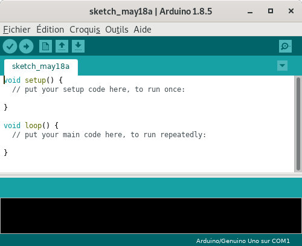

Le logiciel Arduino
===================

Le logiciel **Arduino** est un environnement intégré de développement (IDE) multiplaforme. Il est téléchargeable sur le site officiel http://www.arduino.cc/en/

.. Note::
   Arduino.cc propose une **version Web** (https://create.arduino.cc/) de son environnement de développement. Elle nécessite l'installation d'un plugin afin de programmer la carte par le port USB.

Mise en œuvre d'un projet Arduino :
-----------------------------------

.. image:: images/Arduino_IDE_Barre_Outils.png
   :width: 500
   :height: 33
   :scale: 100 %
   :alt: Quelques cartes Arduino.
   :align: center

La mise en œuvre d'un projet Arduino s'effectue dans l'ordre suivant :

1. **Édition** du programme dans l'éditeur de l'interface ;
2. **Vérification** du programme (compilation) ;
3. **Téléversement** du programme sur la carte Arduino ;
4. **Exécution** du programme sur le carte Arduino (de façon autonome sans ordinateur).

