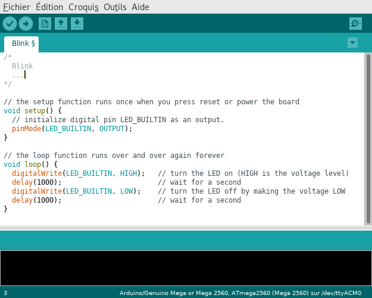
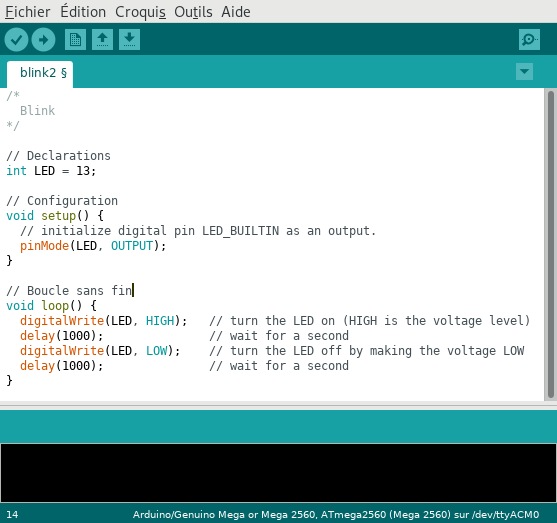
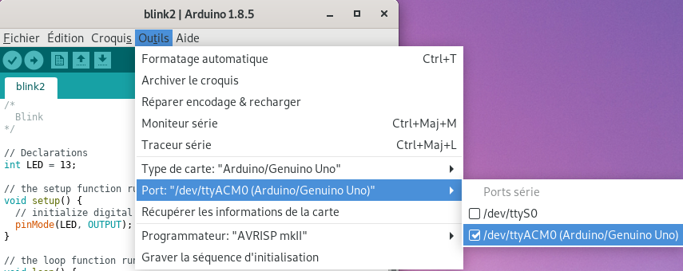
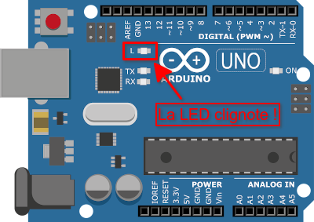

Premier programme : Blink
=========================

Le programme **Blink** propose de faire clignoter la LED intégrée à la carte de développement. Cette LED est connectée en interne à la broche 13.

Edition
-------

Le programme **Blink** est disponible dans les exemples du logiciel **Arduino IDE**.

Dans le menu ``Fichier > Exemples > Basics > Blink``.

.. figure:: images/Blink_01_exemples_blink.png
   :width: 780
   :height: 605
   :scale: 50 %
   :alt: Ouvrir Blink
   :align: center
   
   Ouvrir le programme Blink

   
   Edition du programme Blink

.. note::

   * Un programme Arduino écrit en **langage C/C++** est composé **d'une suite d'intructions**.

   * Ces instructions sont exécutées dans **l'ordre des lignes de code**.

   * Les **commentaires** en gris sont délimités par les caractères ``/*`` et ``*/`` sur plusieurs lignes ou commencent pas les caractères ``//`` sur une même ligne.

   
   Une version modifiée du programme Blink

.. warning::

   Un progamme Arduino respecte toujours une **structure spécifique** composée en trois parties :

      * Les déclarations : **définitions** des constantes et des variables ;
      * La fonction ``setup()`` : **configuration** de la carte (entrées, sorties, port série, ...) ;
      * La fonction ``loop()`` : **instructions du programme exécutées** dans une **boucle infinie** (sans fin).

Compilation
-----------

.. warning::

   Avant de lancer la compilation, il est important de **choisir le modéle de carte Arduino utilisé**. Le programme généré est dépendant du type de microcontrôleur présent sur la carte.
   

.. figure:: images/Blink_03_compilation_choix_carte.png
   :width: 815
   :height: 600
   :scale: 50 %
   :alt: Edition Blink
   :align: center
   
   Choix du type de carte

.. figure:: images/Blink_03_compilation_ksnip.png
   :width: 500
   :height: 600
   :scale: 70 %
   :alt: Edition Blink
   :align: center

   Puis la compilation peut s'effectuée !

Téléversement
-------------

.. warning::

   Pour téléverser le programme obtenu, il est nécessaire de **sélectionner le port de communication série** sur lequel est connectée la carte Arduino.
   

   
   Choix du port de communication

.. figure:: images/Blink_04_televersement_ksnip.png
   :width: 500
   :height: 600
   :scale: 70 %
   :alt: Edition Blink
   :align: center
   
   Téléversement du programme

Exécution
---------

Le programme s'exécute sur la carte Arduino de façon autonome (sans ordinateur).

