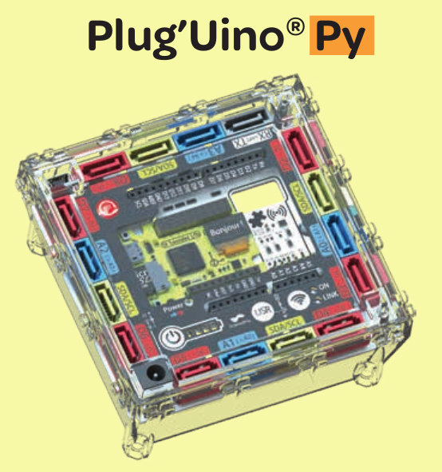
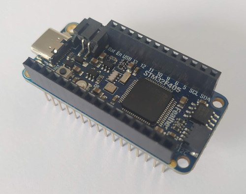

Pyboard
=======

Les cartes "Pyboard"
--------------------

La carte officielle Pyboard
~~~~~~~~~~~~~~~~~~~~~~~~~~~

.. image:: images/pyboard.jpg
   :width: 500
   :height: 500
   :scale: 70 %
   :alt: Quelques cartes Arduino.
   :align: center

Créée par le physicien australien Damien George, la Pyboard est la carte officielle de la distribution MicroPython. Construit autour d'un microcontrôleur STM32 de STMicroelectronics, il s'agit d'une des plus puissantes cartes de développement du marché.

**Principales caractéristiques de la Pyboard v1.1 :**

* Microcontrôleur STM32F405 (ARM Cortex M4 - 32 bit - 168 Mhz) ;
* 1024 ko de mémoire flash (ROM) ;* 192 ko de mémoire vive (RAM) ;
* niveau de tension à 3,3V ;
* 1 port micro USB (programmation REPL + accès mémoire flash) ;
* lecteur micro SD ;
* 2 boutons, 4 LED, 1 accéléromètre 3 axes ;
* 35 ports E/S ;
* 3 CAN disponibles sur 16 broches ;
* 2 CNA disponibles sur 2 broches (X5 et X6) ;
* 17 timers.

**Brochage :**

Les broches d'entrée/sortie sont réparties en deux blocs : X1 à X12 et Y1 à Y12.

.. image:: images/pybv11-pinout.jpg
   :width: 1200
   :height: 900
   :scale: 50 %
   :alt: Quelques cartes Arduino.
   :align: center

   

La carte **Plug'Uino PY** de Sciencethic
~~~~~~~~~~~~~~~~~~~~~~~~~~~~~~~~~~~~~~~~

Le fournisseur `Sciencethic <https://www.sciencethic.com/accueil.html>`_ propose une carte Pyboard (STM32F405) spécialement conçue pour les sciences physiques **Plug'Uino PY**.

   Image : Sciencethic

Par rapport à la carte officielle, cette carte a l'avantage de disposer :

* de **proctections des entrées/sorties** contre les mauvaises manipulations ;
* d'une **adaptation du niveau des tensions à 5V** en logique et en analogique ;
* d'un brochage Arduino en plus des connecteurs SATA pour les capteurs.

Elle dispose en autres :

* d'un écran OLED 64x32 pixels ;
* d'un accéléromètre 3D ;
* d'un lecteur de carte SD.

La carte **Feather STM32F405 Express** d'Adafruit
~~~~~~~~~~~~~~~~~~~~~~~~~~~~~~~~~~~~~~~~~~~~~~~~~

La constructeur Adafruit produit depuis peu la carte de développement `Feather STM32F405 Express <https://www.adafruit.com/product/4382>`_  a un tarif intéressant (~25 €). Associée au `Grove Shield Featherwing <https://www.adafruit.com/product/4309>`_ (~7 €), cela peut-être une alternative intéressante pour les sciences physiques.

Précautions
-----------

.. attention::

    Les cartes Pyboard sont alimentées sous 3,3 V. Même si les microcontrôleur STM32F405 ont une **tolérance de 5 V sur les entrées logiques**, ce n'est pas le cas pour **les tenions appliquées sur les entrées analogiques qui ne doivent pas dépasées les 3,3 V** sous peine de détruire la carte.

Il faudra donc bien faire attention à la compatibilité des niveaux de tension lors du choix des capteurs (ex. capteur de pression). Les capteurs actifs alimentés sous 5 V ne fonctionneront pas !

Ces précautions ne s'appliquent pas pour la carte **Plug'uino Py** car ce dernière est compatible 5 V.

Le langage Micropython
----------------------

Pour de programmer la PyBoard en langage Python natif, un micrologiciel (firmware) contenant l'interpréteur MicroPython est installé dans la mémoire flash de la carte. Ce firmware peut-être mis à jour à partir d'une version plus récente disponible sur le site de `MicroPython <https://micropython.org/download>`_.

Les logiciels `Thonny <https://thonny.org/>`_ et `uPyCraft <https://github.com/DFRobot/uPyCraft>`_ exploitent pleinement la programmation des microcontrôleurs en MicorPython. Ils permettent deux types de programmation :

   * directement dans l'interpréteur MicroPython (REPL) pour tester des instructions par exemple ;
   * ou dans un script (fichier avec l'extension ``.py``) qui peut-être sauvegarder sur la mémoire de la carte pour être exécuté de façon autonome sur la carte.

.. warning::

   À chaque démarrage de la carte ou lors d'un reset, les fichiers ``setup.py`` puis ``main.py`` sont exécutés dans l'ordre. C'est dans le fichier ``main.py`` que doit être écrit le programme !

Les bases de MicroPython pour la Pyboard
----------------------------------------

C'est la librairie ``pyb`` qui rassemble les fonctions spécifiques à la Pyboard.

Écrire sur une sortie digitale
~~~~~~~~~~~~~~~~~~~~~~~~~~~~~~

Les broches de X1 à X12 et de Y1 à Y12 sont utilisables comme entrées/sorties digitales.

L'exemple suivant met la broche X1 en sortie  et à l'état bas.

.. code:: python

   >>> from pyb import Pin            # importation de Pin dans la librairie pyb
   >>> pinX1 = Pin('X1',Pin.OUT)      # La broche X1 en sortie
   >>> pinX1.low()                    # LED éteinte

Puis à l'état haut.

.. code:: python

   >>> pinX1.high()

.. note::

   Quatre LED internes sont également prises en charge par la librairie ``pyb``.

   .. code:: python

      >>> from pyb import LED
      >>> led = LED(1)         # 1=rouge, 2=verte, 3=jaune, 4=bleu
      >>> led.toggle()         # Permutation de l'état
      >>> led.on()             # Allume la LED
      >>> led.off()            # Éteint la LED

Lire une entrée digitale
~~~~~~~~~~~~~~~~~~~~~~~~

L'exemple suivant met la broche X2 en entrée puis lit et affiche son état.

.. code:: python

   from pyb import Pin        # importation de Pin de la librairie pyb
   pinX2 = Pin('X2',Pin.IN)   # La broche X2 en entrée
   val = pinX2.value()        # Lecture de l'état de la broche
   print(val)                 # Affichage

.. note:: La carte incorpore un bouton utilisateur ``USR`` connectée sur la broche X17 avec une résistance de tirage vers le haut. L'appui sur ce bouton donne donc un niveau bas !

   .. code:: python
   
      from pyb import Switch
      btn = Switch()
      val = btn.value()       # Retourne l'état courant du bouton USR
      print(val)              # Affiche la valeur (True ou False)

Mesurer une tension (CAN)
~~~~~~~~~~~~~~~~~~~~~~~~~

La conversion analogique numérique sur 12 bits est disponible sur les broches X1 à X8, X11, X12, X19 à X22, Y11 et Y12.

L'exemple suivant lit une tension sur l'entrée X19.

.. code:: python

   from pyb import Pin, ADC
   can = ADC(Pin('X19'))   # CAN sur la broche X19
   N = can.read()          # lecture d'un entier de 0 à 4095
   print(N*3.3/4095)       # Affichage de la tension

Générer une tension analogique (CNA)
~~~~~~~~~~~~~~~~~~~~~~~~~~~~~~~~~~~~

La carte Pyboard intègre deux convertisseurs numérique-analogique respectivement sur les broches X5 et X6.
L'exemple suivant

L'exemple suivant applique une tension de 1,55 V sur la broche X5.

.. code:: python

   from pyb import Pin, DAC
   cna = DAC(Pin('X5'))     # CNA sur X5
   cna.write(120)           # Ecriture de 120*3,3/255 = 1,55 V

Les CNA définis par défaut sur 8 bits peuvent être paramétrés sur 12 bits.

.. code:: python

   from pyb import Pin, DAC
   cna = DAC(Pin('X5'))     # CNA sur X5
   cna.init(bits=12)        # Paramétrage sur 12 bit
   cna.write(1500)          # Ecriture de 1500*3,3/4095 = 1,21 V

.. note:: Il est aussi possible de générer une tension périodique de forme quelconques.

Générer une tension MLI (PWM)
~~~~~~~~~~~~~~~~~~~~~~~~~~~~~

La génération d'une tension MLI est possible sur un canal d'un timer (4 canaux par timer). Voir brochage pour repérer les canaux des timers.

L'exemple suivant génère une tension MLI sur la broche X2 avec un rapport cyclique de 30%.

.. code:: python

   from pyb import Pin, Timer
   
   pwm = Timer(2).channel(2, Timer.PWM, pin=Pin('X2'))  # pwm sur le canal 2 du Timer 2
   pwm.pulse_width_percent(30)                          # réglage du rapport cyclique
   
.. note::

   Il est intéressant ici de mesurer la tension moyenne au voltmètre numérique (entre GND et X2) en position DC.

Faire une pause
~~~~~~~~~~~~~~~

.. code:: python

   from time import sleep

   sleep(1)  # Pause de 1 s

Mesurer une durée 
~~~~~~~~~~~~~~~~~

Il est possible de mesurer la durée d'une impulsion à l'état haut ou l'état bas avec la fonction time_pulse_us() du module ``machine`` commun à tous les microcontrôleurs sous MicroPython.

L'exemple suivant mesure la durée (en microsecondes) à l'état haut d'une impulsion sur l'entrée X1.

.. code:: python

   from pyb import Pin
   from machine import time_pulse_us
   
   duree = time_pulse_us(Pin('X1'),1)

