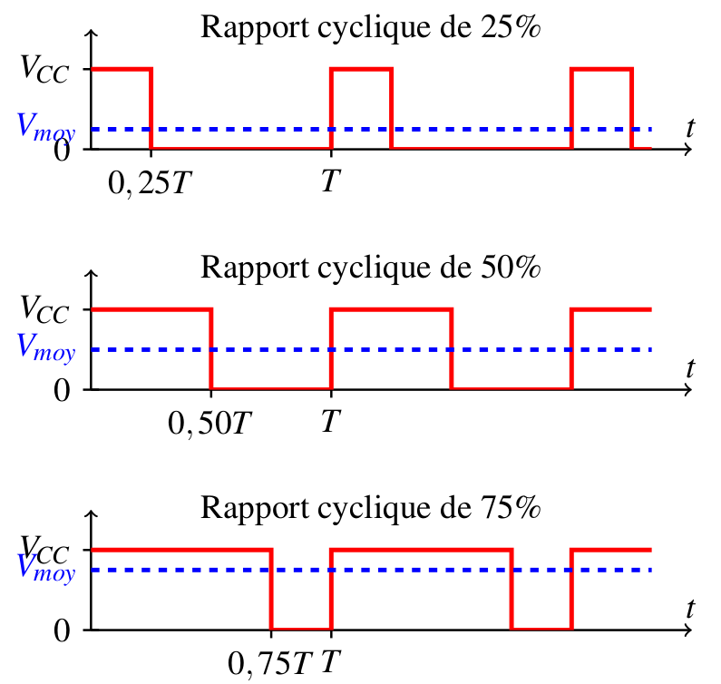

.. |kohm| replace:: :math:`{k\Omega}`
.. |ohm| replace:: :math:`{\Omega}`

Modifier l'intensité lumineuse d'une LED (sorties PWM)
======================================================

Principe
--------

La carte Arduino ne possède pas de vraies sorties analogiques. Mais il est possible de faire **varier la valeur moyenne de la tension d'une sortie digitale** (donc de faire varier l'intensité lumineuse d'une LED) en modifiant son **rapport cyclique** (durée de l'état haut par rapport à la période). C'est le principe de la Modulation à Largeur d'Impulsion (MLI) ou Pulse Width Modulation (PWM) en anglais.

   Principe de la MLI ou PWM

La carte Arduino UNO dispose de 6 sorties PWM sur les broches 3, 5, 6, 9, 10, 11.

.. image:: images/02_arduino_uno_sorties_pwm.png
   :width: 450
   :height: 400
   :scale: 70 %
   :alt:
   :align: center

.. warning::
   La fréquence d'un signal PWM est fixée à 490 Hz !

Montage
-------

.. image:: images/Arduino_LED_PWM.png
   :width: 536
   :height: 423
   :scale: 70 %
   :alt:
   :align: center

Une LED en série avec une résistance de 220 |ohm| est branchée sur la broche 11.

Programme
---------

.. code:: arduino

   #define LED 11           // LED connectée à la broche 11

   void setup() {
     pinMode(LED,OUTPUT)    // Configuration de la broche LED en sortie
   }

   void loop() {
     analogWrite(LED,0);    // PWM à 0%
     delay(1000);           // Attendre 1 s
     analogWrite(LED,100);  // PWM à 100/255 = 39%
     delay(1000);           // Attendre 1 s
     analogWrite(LED,200);  // PWM à 200/255 = 78%
     delay(1000);           // Attendre 1 s
   }

* La fonction ``analogWrite(LED,duty)`` génère une modulation à largeur d'impulsion sur la broche 11.
* L'argument ``duty`` est un nombre entier entre 0 et 255 respectivement pour un rapport cyclique entre 0% et 100%.

A retenir
---------

Seules les broches 3, 5, 6, 9, 10 et 11 de l'Arduino Uno permettent de générer des signaux PWM.

========================== =======================================
Instruction                Description
========================== =======================================
``pinMode(pin,OUTPUT)``    Configure le broche ``pin`` en sortie
``analogWrite(pin,duty)``  Génère une tension PWM sur le broche ``pin``

                           avec le rapport cyclique ``duty`` (entre 0 à 255)
========================== =======================================

Applications
------------

* Variation de l'intensité lumineuse d'une LED.
* Variation de la vitesse d'un moteur à courant continu.
* Obtention d'une tension constante par filtrage passe-bas (limitée en fréquence).
