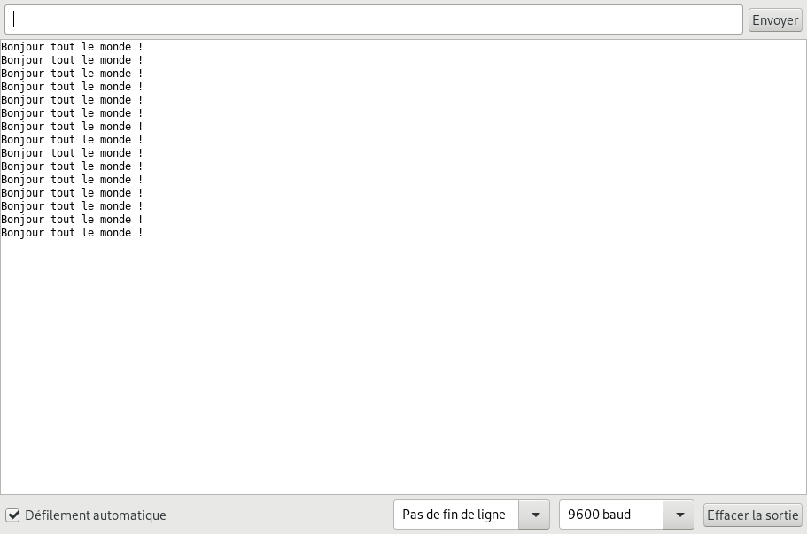
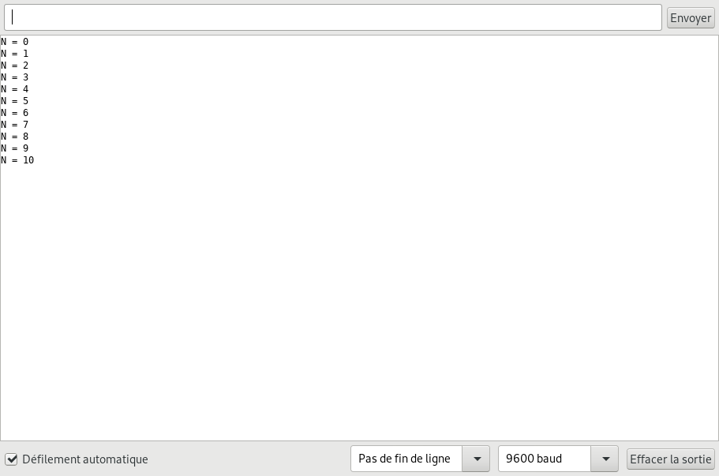

=======================================
Afficher des messages (port série UART)
=======================================

Principe
========

De base, les cartes Arduino ne possède pas d'écran pour afficher des messages. L'interface série (UART) reste le moyen le plus simple pour afficher des informations sur un ordinateur en provenance d'une carte Arduino.

Moniteur série
==============

Le logiciel Arduino IDE intègre un **moniteur série** (dans le menu ``Outils > Moniteur série``) pour **lire des données** au format texte (ASCII) envoyées par le microcontrôleur.

   Moniteur série du d'Arduino IDE 1.8
   
Le moniteur série offre aussi la possibilité de **transmettre des données vers le microcontrôleur** à l'aide du clavier !

.. note::

   Il est possible d'utiliser d'autres logiciels de communication série comme `Putty <https://www.putty.org/>`_ ou encore `Termite <https://www.compuphase.com/software_termite.htm>`_.

Programme de test
=================

Le code source ci-dessous transmet un entier :code:`N` dans le moniteur série d'Arduino IDE. Cet entier, initialisé à 0, est incrémenté de 1 toutes les secondes.

.. code:: arduino

   int n = 0;

   void setup() {
     Serial.begin(9600);     // Paramétrage du port série

   }

   void loop() {
     Serial.print("N = ");   // Affichage
     Serial.println(n);      // Affichage du contenu de la variable n
     n = n + 1;              // Incrémentation de la variable n
     delay(1000);            // Temporisation de 1s
   }

   Affichage dans le moniteur série

* L'instruction ``Serial.begin(9600)`` paramètre le port série à 9600 baud (rapidité).

* ``Serial.print("N = ")`` affiche la chaîne de caractères ``N =`` dans le moniteur série.

* ``Serial.println(n)`` affiche le contenu de la variable ``n`` suivie d'un saut de ligne.

Applications
============

* Affichage d'une ou plusieurs mesures sur l'écran d'un ordinateur.
* Affichage des données d'une acquisition au format CSV pour exploitation par un tableur, des logiciels spécialisés (Regressi, Latis, ...) ou des calculatrices Web (ex. Desmos).

