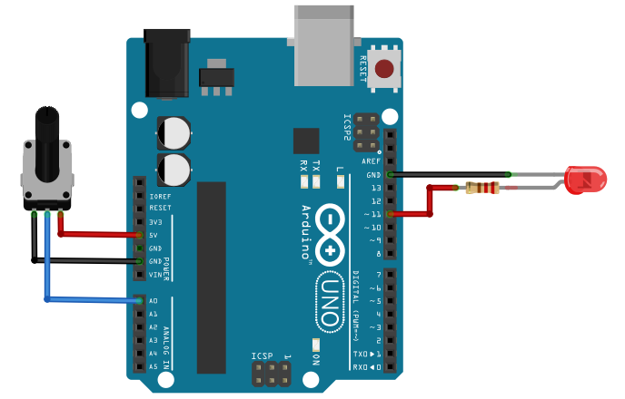

=========================
Mesurer une tension (CAN)
=========================

Principe
========

La mesure d'une tension par un microcontrôleur est réalisée en interne par un **convertisseur analogique-numérique**.

Ce type de conversion est importante en sciences physique. Elle permet par exemple d'obtenir la mesure d'une grandeur physique provenant d'un **capteur**.

.. image:: images/05_arduino_entrees_analogiques.png
   :width: 500
   :height: 400
   :scale: 70 %
   :alt:
   :align: center

Arduino UNO dispose de **6 entrées analogiques** disponibles sur les broches A0 à A5. Par défaut, la tension en entrée doit-être comprise entre 0 V et 5 V (Vref). Le résultat de la conversion donne un nombre sur 10 bits compris entre 0 et 1023. La résolution analogique (**quantum**) est donc :

.. math::

   {q=\dfrac{5}{1023} \approx 4,89\,mV}

.. warning::
   Le tension appliquée sur les entrées analogiques doivent être **strictement comprise entre 0 V et 5 V** sous peine de détruire le microcontrôleur.

Montage
=======

Un potentiomètre monté en pont diviseur de tension est branché entre la masse (``GND``) et la tension d'alimentation (``5V``). Ce potentiomètre délivre donc une **tension réglable** en ``0 V`` et ``5 V`` sur l'entrée ``A0``.

.. figure:: images/05_arduino_uno_can_potentiometre.png
   :width: 667
   :height: 669
   :scale: 50 %
   :alt:
   :align: center
   
   Montage potentiométrique

Programme en langage Arduino (C/C++)
====================================

Le programme suivant lit la tension sur l'entrée ``A0`` et affiche sa valeur dans le moniteur série du logiciel Arduino.

.. code-block:: arduino

   /*
    * Lecture de l'entrée analogique A0 sur le port série.
    */

   int N;           // Entier lu sur A0 compris entre 0 et 1023 (10bits)
   float tension;   // La tension calculée à partir de N

   void setup() {
     Serial.begin(9600);   // Paramétrage port série
   }

   void loop() {
     N = analogRead(A0);                    // Lecture valeur sur A0
     tension = N*5.0/1023;                  // Calcul de la tension
     Serial.print("Valeur lue sur A0 = ");
     Serial.println(N);                     // Affichage valeur sur A0
     Serial.print("Tension = ");
     Serial.println(tension);               // Affichage de la tension
     delay(1000);                           // temporisation de 1 s
   }

* La fonction ``analogRead(A0)`` retourne un entier sur 10 bits compris entre 0 (pour 0V) et 1023 (pour 5V).

* L'expression ``N*5.0/1023`` calcule la valeur de la tension en volt.

Programme en langage Python (pilotage Nanpy)
============================================

.. code-block:: python

   from nanpy import ArduinoApi, SerialManager
   from time import sleep                       # Importation fonction sleep()

   port = SerialManager(device='COM6')          # Sélection du port série à modifier
   uno = ArduinoApi(connection=port)            # Déclaration de la carte Arduino Uno

   for i in range(10):
      N = uno.analogRead(0)              # Lecture la tension numérique sur A0
      print("N = ", N)                   # Affichage
      U = N*5/1023                       # Calcul de la tension en volt
      print("U = ", round(U, 3), " V")   # Affichage
      sleep(1)                           # Temporisation d'une seconde

   uno.connection.close()                 # Deconnexion de Arduino
   port.close()                           # Fermeture du port série

Applications
============

* Interface avec un circuit comportant un capteur.
* Un potentiomètre est un capteur de position.

Aller plus loin : contrôler l'intensité lumineuse d'une LED
===========================================================

En combinant le programme précédant avec celui sur la génération d'une tension PWM, il est possible de régler à l'aide d'un potentiomètre l'intensité lumineuse d'une LED.

Montage
-------

Programme en langage Arduino (C/C++)
------------------------------------

.. code-block:: arduino

   #define pinLED 11

   int N;       // Valeur lue sur A0 de 0 à 1023
   int duty;    // Rapport cyclique de 0 à 255

   void setup() {
   }

   void loop() {
     N = analogRead(A0);       // Conversion analogique-numérique sur A0
     duty = N/4;               // Calcul du rapport cyclique
     analogWrite(pinLED, duty); // Génération de la tension PWM
     delay(30);                // Attendre 30 ms
   }

.. note::

   Pour convertir un entier sur 10 bits en un entier sur 8 bits, il suffit de la **division entière par 4** !

Programme en langage Python (pilotage Nanpy)
--------------------------------------------

.. code-block:: python

   from nanpy import ArduinoApi, SerialManager
   
   port = SerialManager(device='COM6')          # Sélection du port série à modifier
   uno = ArduinoApi(connection=port)            # Déclaration de la carte Arduino Uno
   
   pinLed = 11
   
   while True:
       N = uno.analogRead(0)              # Lecture la tension numérique sur A0
       duty = N//4                        # Division entière par 4
       uno.analogWrite(pinLed, duty)      # Tension PWM sur la LED
