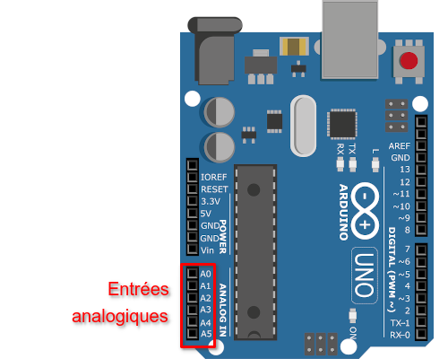

=========================
Mesurer une tension (CAN)
=========================

Principe
========

La mesure d'une tension par un microcontrôleur est prise en charge en interne par un **Convertisseur Analogique-Numérique (CNA)**.

Ce type de conversion est importante en sciences physique. Par exemple, elle permet d'obtenir la mesure d'une grandeur physique provenant d'un **capteur** sous la forme d'une tension électrique.

   Entrées analogiques de l'Arduino Uno R3

Le microcontrôleur de l'Arduino UNO intègre **6 entrées analogiques** disponibles sur les broches A0 à A5. Par défaut, la tension d'entrée doit-être comprise entre 0 V et 5 V (Vref).

Le conversion renvoie un **nombre entier naturel sur 10 bits** compris entre 0 et 1023.

La résolution analogique (**quantum**) est donc :

.. math::

   {q=\dfrac{5}{1023} \approx 4,89\,mV}

.. warning::
   Le tension appliquée sur les entrées analogiques doivent être **strictement comprise entre 0 V et 5 V** sous peine de détruire le microcontrôleur.

Montage
=======

Un potentiomètre (pont diviseur de tension) est branché entre la masse (``GND``) et la tension d'alimentation (``5V``). Ce potentiomètre délivre donc une **tension réglable** en ``0 V`` et ``5 V`` sur l'entrée ``A0``.

.. figure:: images/arduino_uno_can_potentiometre.png
   :width: 667
   :height: 669
   :scale: 50 %
   :alt:
   :align: center
   
   Montage potentiométrique sur l'entrée analogique A0

Programme Arduino
=================

Le programme suivant lit la tension sur l'entrée ``A0`` et affiche sa valeur (en volt) dans le moniteur série du logiciel Arduino IDE.

.. code-block:: arduino

   /*
    * Lecture de l'entrée analogique A0 sur le port série.
    */

   int N;           // Entier lu sur A0 compris entre 0 et 1023 (10bits)
   float tension;   // La tension calculée à partir de N

   void setup() {
     Serial.begin(9600);   // Paramétrage port série
   }

   void loop() {
     N = analogRead(A0);                    // Lecture valeur sur A0
     tension = N*5.0/1023;                  // Calcul de la tension
     Serial.print("Valeur lue sur A0 = ");
     Serial.println(N);                     // Affichage valeur sur A0
     Serial.print("Tension = ");
     Serial.println(tension);               // Affichage de la tension
     delay(1000);                           // temporisation de 1 s
   }

* La fonction ``analogRead(A0)`` retourne un entier sur 10 bits compris entre 0 (pour 0V) et 1023 (pour 5V).

* L'expression ``N*5.0/1023`` calcule la valeur de la tension en volt.

Applications
============

* Interface avec un circuit comportant un capteur.
* Un potentiomètre est un capteur de position.

