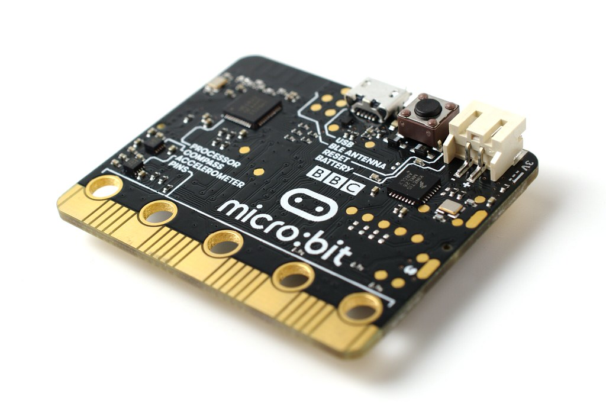
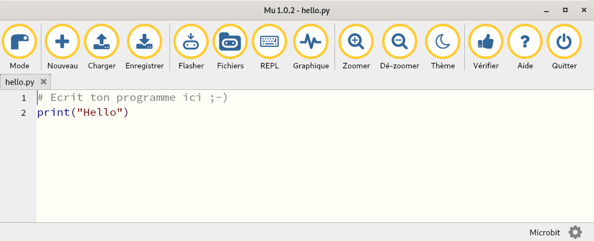
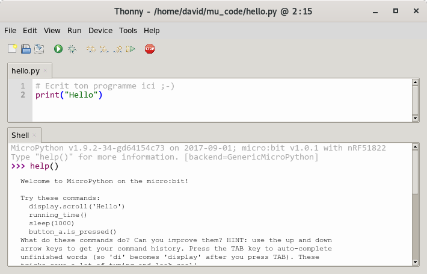

=======================
Langage BBC MicroPython
=======================

Edition
=======

`BBC micro:bit MicroPython <https://microbit-micropython.readthedocs.io/en/latest/>`_ est une édition de MicroPython spécialement conçue pour Micro:bit. 

Pour son développement, il est conseillé d'utiliser l'éditeur `Mu <https://codewith.mu/>`_.

   
   Editeur Mu

Sinon l'éditeur `Thonny <https://thonny.org/>`_ est la meilleure alternative à Mu.

   
   Editeur Thonny

Librairie
=========

Les fonctionnalités spécifiques à la micro:bit sont gérées  par librairie ``microbit``.

Les broches sont notées sous la forme ``pinN`` où ``N`` est le numéro de la broche (ex. ``pin0``, ``pin``, ...).

Écrire sur une sortie digitale
==============================

La fonction ``write_digital(val)`` impose l'état logique ``val`` (0 ou 1) sur une sortie digitale. 

.. code:: python

   from microbit import *
   pin0.write_digital(1)   # Etat 1 sur PO
   pin2.write_digital(0)   # Etat 0 sur P2

.. 25 LED internes sont disposées dans une matrice 5x5.

Lire une entrée digitale
========================

La fonction ``read_digital()`` renvoie le niveau logique sur un broche.

.. code:: python

   from microbit import *
   val = pin0.read_digital()   # Renvoie le niveau logique sur P0
   print(val)                  # Affichage du niveau logique

La micro:bit intègre deux boutons notés A et B respectivement avec les attributs ``button_a`` et ``button_b`` . Ils sont connectés à P5 et P11.

.. code:: python

   from microbit import *
   val = button_a.is_pressed() # renvoie True ou False
   print(val)                  # Affichage de l'état du bouton A
   

Générer une tension MLI (PWM)
=============================

Comme avec Arduino, il est possible de générer une tension Modulée en Largeur d'Impulsion (MLI ou PWM en anglais) avec la fonction ``write_analog(duty)``. Le paramètre ``duty`` est le rapport cyclique codé sur 12 bits (de 0 à 1023 pour un rapport cyclique de 0 à 100%).

La fréquence du signal est fixée par les fonctions ``set_analog_period(T)`` ou ``set_analog_period_microseconds(T)`` où ``T`` est la période respectivement en millisecondes et microsecondes. 

.. code:: python

   from microbit import *
   Pin0.set_analog_period(100)  # fixe une période de 100 ms
   pin0.write_analog(767)       # rapport cyclique à 75% sur P0
   
.. note::

   Il est intéressant ici de mesurer la tension moyenne au voltmètre numérique (entre GND et P0) en position DC.

Mesurer une tension (CAN)
=========================

La lecture sur 12 bits d'une tension entre 0 V et 3,3 V est effectuée par la méthode ``read_analog()``. 

.. code:: python

   from microbit import *
   val = Pin0.read_analog() # renvoie un nombre entre 0 à 1023
   print(val*3.3/1023)      # affichage de la tension
   

Générer une tension analogique (CNA)
====================================

La carte ne dispose pas de vraies sorties analogiques (pas de CNA) !

Faire une pause
===============

Les fonctions ``sleep(T)``, ``sleep_ms(T)`` et ``sleep_us(T)`` du module ``utime`` permettent de faire une pause de durée ``T`` respectivement en seconde, milliseconde et microseconde.
   
.. code:: python

   from utime import sleep
   while True:
      Pin0.write_digital(1)
      sleep(1)
      Pin0.write_digital(0)
      sleep(1)

Mesurer une durée 
=================

Il est possible de mesurer la durée d'une impulsion à l'état haut ou l'état bas avec la fonction ``time_pulse_us()`` du module ``machine`` commun à tous les microcontrôleurs sous MicroPython.

:exemple: mesurer la durée à l'état haut d'une impulsion sur l'entrée X1.

.. code:: python

   from microbit import *
   from machine import time_pulse_us
   duree = time_pulse_us(Pin0,1)
   print(duree)
