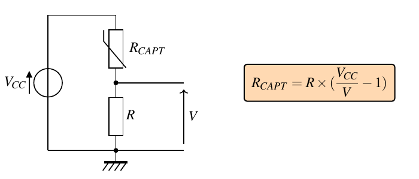
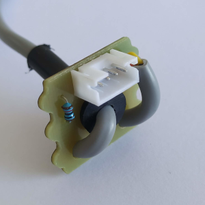
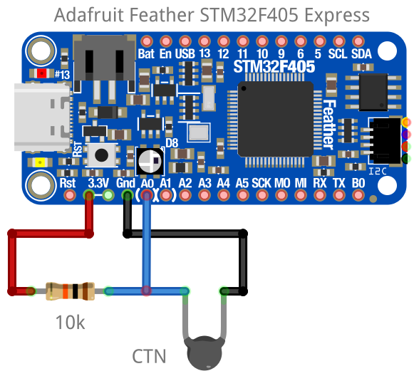
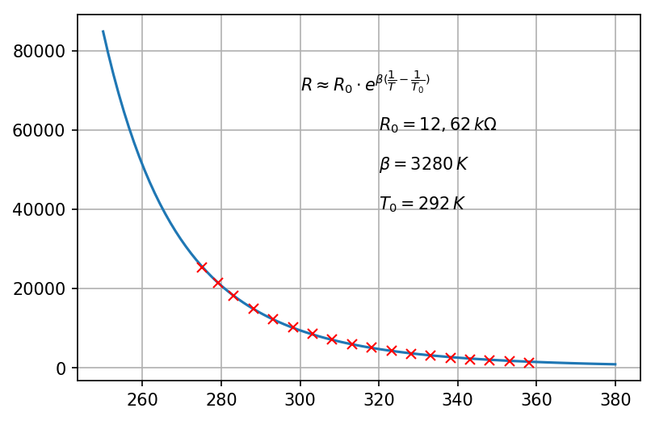

.. |kohm| replace:: :math:`{k\Omega}`

=========================================
Capteur résistif - CTN (seconde générale)
=========================================

.. topic:: Programme de seconde générale 2019 - Enseignement commun

   Mesurer une grandeur physique à l’aide d’un capteur électrique résistif. **Produire et utiliser une courbe d’étalonnage** reliant la résistance d’un système avec une grandeur d’intérêt (température, pression, intensité lumineuse, etc.).
   Utiliser un dispositif avec microcontrôleur et capteur.

Cas d'une CTN
=============

Une CTN est un **capteur résistif  à coefficient de température négatif** dont l'évolution de la résistance en fonction de la température est donnée par la figure suivante :

Principe de mesure de résistance de la CTN
==========================================

La plupart des modules comportant un capteur résistif utilise un pont diviseur de tension pour la mesure de la résistance du capteur.

Montage 1 : capteur connecté à la masse
---------------------------------------

Il s'agit du montage le plus souvent rencontré.

.. image:: Images/ctn_module_resistif_1.png
   :width: 700
   :height: 300
   :scale: 70 %
   :alt:
   :align: center

.. image:: Images/ctn_module_resistif_1_perso.png
   :width: 400
   :height: 340
   :scale: 50 %
   :alt:
   :align: center

Montage 2 : capteur connecté à Vcc 
----------------------------------

   Module Plug'uino (Sciencéthic)

Montage : mesure de la tension et du courant (ex. capteurs Educaduino)
----------------------------------------------------------------------

.. image:: Images/ctn_module_resistif_3.png
   :width: 730
   :height: 350
   :scale: 70 %
   :alt:
   :align: center

.. figure:: Images/ctn_module_resistif_3_educaduino.png
   :width: 800
   :height: 400
   :scale: 50 %
   :alt:
   :align: center

   Module Educaduino Lab (Eurosmart)

En plus de la mesure de la tension du capteur, une mesure du courant est aussi réalisée à partir de la tension aux bornes de la résistance R par l'intermédiaire d'un amplificateur différentiel. La résistance du capteur est alors 
calculée avec la loi d'Ohm. 

Mesure de la résistance de la CTN
=================================

Algorithme
----------

.. code:: 

   REPETER :
      Mesurer la tension U
      Calculer la résistance R
      Afficher R
      Attendre 1 s

Arduino (C/C++)
---------------

L'entrée analogique ``A0`` mesure la tension du capteur.

.. image:: fritzing/ctn_montage_arduino.png
   :width: 961
   :height: 832
   :scale: 33 %
   :alt:
   :align: center

.. code-block:: arduino

   // Mesure de la résistance d'une CTN

   #define Vcc 5       // Tension d'alimentation
   #define Ro  10000   // Résistance du pont

   float U;            // Tension CTN
   float R;            // Résistance CTN
 

   void setup() {
      Serial.begin(9600);  // Paramétrage du port série
   }

   void loop() {
     U = analogRead(A0)*5.0/1023;      // Lecture tension en V
     R = Ro*U/(Vcc-U);                 // Calcul de la résistance
     Serial.println(R);                // Affichage
     delay(1000);                      // Temporisation de 1s
   }

Arduino (Python/Nanpy)
----------------------

Le montage reste le même.

.. code-block:: Python

   # Mesure de la résistance d'une CTN

   from nanpy import ArduinoApi           # Gestion de l'Arduino
   from nanpy import SerialManager        # Gestion port série
   from time import sleep                 # Importation de sleep(seconde)

   Vcc = 5.0                              # Tension d'alimentation
   Ro = 10000                             # Résistance du pont

   port = SerialManager(device='COM6')    # Sélection du port série (à remplacer) 
   uno = ArduinoApi(connection=port)      # Déclaration de la carte Arduino

   while True :
      U = uno.analogRead(0)*5/1023        # Lecture la tension sur A0
      R = Ro*U/(Vcc-U)                    # Calcul de la résistance
      print("R = ", R)                    # Affichage
      sleep(1)                            # Temporisation d'une seconde

   port.close()                           # Fermeture du port série

PyBoard (MicroPython)
---------------------

.. code-block:: Python

   # Mesure de la resistance d'une CTN

   from pyb import Pin, ADC
   from time import sleep_ms

   adc = ADC(Pin("A0"))        # Déclaration du CAN

   Ro = 10e3                   # Résistance série

   while True:
      N = adc.read()           # Mesure de la tension
      R = Ro*N/(4095-N)        # Calcul de R
      print("R =", R)          # Affichage
      sleep_ms(1000)           # Temporisation

Micro:bit (MicroPython)
-----------------------

.. image:: fritzing/ctn_montage_microbit.png
   :width: 588
   :height: 742
   :scale: 33 %
   :alt:
   :align: center

.. code-block:: Python

   # Mesure de la resistance d'une CTN et calcul de la température

   from microbit import *
 
   Ro = 10e3                   # Résistance série

   while True:
      N = pin0.read_analog()   # Mesure de la tension
      R = Ro*N/(1023-N)        # Calcul de R
      print("R =", R)          # Affichage
      sleep(1000)              # Temporisation

Caractéristique R=f(T)
======================

Courbe
------

Les mesures suivantes peuvent être effectuées avec le **microcontrôleur** ou à **l'ohmmètre**.

.. figure:: Images/CTN_Caracteristique_R(T).png
   :width: 843
   :height: 581
   :scale: 50 %
   :alt: 
   :align: center
   
   Courbe d'étalonnage d'une CTN 10k 

.. note::

   Pour 25°C la résistance mesurée prend la valeur particulière de 10 |kohm| !

Relation de Steinhart-Hart
--------------------------

Sur une grande plage de variation, la relation entre la température (en K) et la résistance de la CTN est :

.. math::

   \dfrac{1}{T} = A + B \times \ln(R) + C \times (\ln(R))^3

A, B et C sont les coefficients de Steinhart-Hart. Ils sont donnés par le constructeur
ou peuvent se déterminer expérimentalement à partir de trois points de mesure et du programme Python :download:`steinhart-hart.py <files/steinhart-hart.py>`.

Résultats obtenus :

.. math::

   A = 1,144 \cdot 10^{-3}K^{-1} \qquad B=2,078\cdot10^{-3}K^{-1} \qquad C=3,610 \cdot 10^{-7}K^{-1}

Simplification de relation de Steinhart-Hart
--------------------------------------------

Sur une plage de variation plus réduite de la température, la relation de Steinhart-Hart permet d'écrire :

.. math::

   R \approx R_0 \times e^{\beta(\frac{1}{T}-\frac{1}{T_0})}

* :math:`{R_0}` est la valeur de la résistance pour la température :math:`{T_0}`.

* :math:`{\beta}` (en K).

Ces coefficients sont généralement donnés par le constructeur ou peuvent être déterminés par une modélisation de la caractéristique.

Le calcul de la température (en K) s'effectue à l'aide de la relation suivante :

.. math::

   \dfrac{1}{T} = \dfrac{1}{\beta}\times\ln(\dfrac{R}{R_0})+\dfrac{1}{T_0}

Application : affichage de la température
=========================================

Arduino (C/C++)
---------------

.. code-block:: arduino

   // Mesure de la resistance d'un CTN
   // Calcul de la température à partir de la relation de Steinhart-Hart

   #define Vcc 5       // Tension d'alimentation
   #define Ro  10000   // Résistance du pont
   #define A   1.0832e-3
   #define B   2.1723e-4
   #define C   3.2770e-7

   float u;            // Tension CTN
   float R;            // Résistance CTN
   float logR;         // ln(R)
   float T;            // Température en °C

   void setup() {
      Serial.begin(9600);  // Paramétrage du port série
   }

   void loop() {
     u = analogRead(A0)*5.0/1023;                  // Lecture tension en V
     R = Ro * u/(Vcc-u);                           // Calcul de la résistance
     logR = log(R);                                // Calcul de ln(R)
     T = (1.0 / (A + B*logR + C*logR*logR*logR));  // Calcul de la température
     T = T - 273.15;                               // Conversion en °C
     Serial.print("R = ");                         // Début affichage
     Serial.println(R);
     Serial.print("T = ");
     Serial.println(T);                            // Fin affichage
     delay(1000);                                  // Temporisation de 1s
   }

Arduino (Python/Nanpy)
----------------------

.. code-block:: Python

   # Mesure de la resistance d'une CTN et calcul de la température
   # Calcul de la température à partir de la relation de Steinhart-Hart

   from nanpy import ArduinoApi           # Gestion de l'Arduino
   from nanpy import SerialManager        # Gestion port série
   from time import sleep                 # Importation de sleep(seconde)
   from math import log

   Vcc = 5.0      # Tension d'alimentation
   Ro = 10000     # Résistance du pont
   A = 1.0832e-3  # Coeff. de Steinhart-Hart
   B = 2.1723e-4  # ...
   C = 3.2770e-7  # ...

   port = SerialManager(device='COM6')          # Sélection du port série (à remplacer) 
   uno = ArduinoApi(connection=port)            # Déclaration de la carte Arduino

   while True :
      U = uno.analogRead(0)*5/1023              # Lecture la tension sur A0
      R = Ro*U/(Vcc-U)                          # Calcul de la résistance
      T = 1.0 / (A + B*log(R) + C*log(R)**3)    # Calcul de la température en Kelvin
      T = T-273.15                              # Calcul de la température en Celsius
      print("R = ", R, "T = ", T)               # Affichage
      sleep(1)                                  # Temporisation d'une seconde

   port.close()                                 # Fermeture du port série

PyBoard (MicroPython)
---------------------

.. code-block:: Python

   # Mesure de la resistance d'une CTN et calcul de la température
   # Calcul de la température à partir de la relation de Steinhart-Hart

   from pyb import Pin, ADC
   from math import log
   from time import sleep_ms

   adc = ADC(Pin("A0"))        # Déclaration du CAN

   Ro = 10e3                   # Résistance série
   A =  0.0010832035972923174  # Coeff. de Steinhart-Hart
   B =  0.00021723460553451255 # ...
   C =  3.276999926128753e-07  # ...

   while True:
      N = adc.read()                               # Mesure de la tension
      R = Ro*N/(4095-N)                            # Calcul de R
      T = 1/(A + B*log(R) + C*log(R)**3) - 273.15  # Relation de Steinhart-Hart
      print("R =", R, "T =", T)                    # Affichage
      sleep_ms(1000)                               # Temporisation

Micro:bit (MicroPython)
-----------------------

.. code-block:: Python

   # Mesure de la resistance d'une CTN et calcul de la température
   # Calcul de la température à partir de la relation de Steinhart-Hart

   from microbit import *
   from math import log

   Ro = 10e3     # Résistance série
   A = 1.0832e-3 # Coefficients de Steinhart-Hart
   B = 2.1723e-4 # ...
   C = 3.2770e-7 # ...

   while True:
      N = pin0.read_analog()                       # Mesure de la tension
      R = Ro*N/(1023-N)                            # Calcul de R
      T = 1/(A + B*log(R) + C*log(R)**3) - 273.15  # Relation de Steinhart-Hart
      print("R =", R, "T =", T)                    # Affichage
      sleep(1000)                                  # Temporisation

A retenir
=========

Placer un **capteur résistif** (température, pression, lumière, ...) dans un **pont diviseur de tension** reste une **solution simple pour mesurer sa résistance** à l'aide d'un microcontrôleur.

