.. |kohm| replace:: :math:`{\rm k\Omega}`

=========================================
Capteur résistif - CTN (seconde générale)
=========================================

.. topic:: Programme de seconde générale 2019 - Enseignement commun

   Mesurer une grandeur physique à l’aide d’un capteur électrique résistif. **Produire et utiliser une courbe d’étalonnage** reliant la résistance d’un système avec une grandeur d’intérêt (température, pression, intensité lumineuse, etc.).
   Utiliser un dispositif avec microcontrôleur et capteur.

Principe
========

La résistance électrique d'un capteur résistif varie en fonction de la grandeur physique mesurée (ex. température, pression, intensité lumineuse, ...).

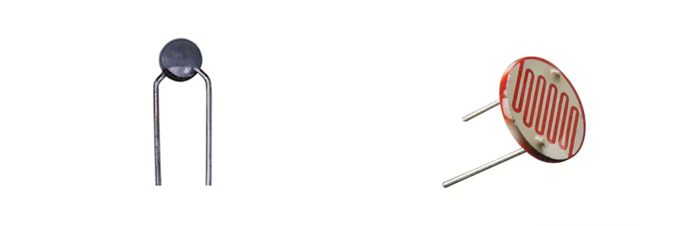
   
   Capteur de température CTN / Capteur de lumière LDR 

Pour obtenir une valeur de cette grandeur physique, il est nécessaire de **mesurer la résistance du capteur**.

Malheureusement un microcontrôleur ne mesure que des tensions sur ses entrées analogique (ex. A0, A1, ... pour Arduino). Il faut donc **adapter le capteur dans un montage électrique** (ex. pont diviseur de tension, pont wheatstone). 

Montages pour la mesure d'une résistance
========================================

La plupart des modules avec capteur résistif utilise un **pont diviseur de tension** pour la mesure de la résistance du capteur. Par rapport au pont Wheatstone, cette méthode présente l’avantage d’être simple à mettre en oeuvre.

Montage 1 : capteur connecté à la masse
---------------------------------------

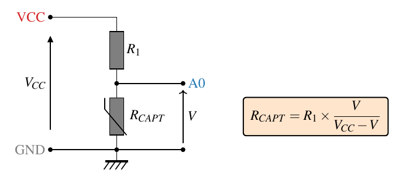

- VCC est la tension d'alimentation du microcontrôleur.

- L'entrée analogique A0 mesure la tension :math:`V` aux bornes du capteur résistif.

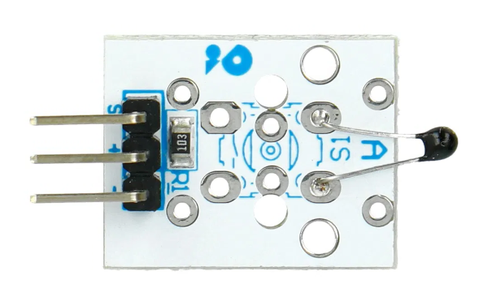

   Module Velleman VMA320 (:math:`R_1=10\rm~k\Omega`)

Montage 2 : capteur connecté à Vcc 
----------------------------------

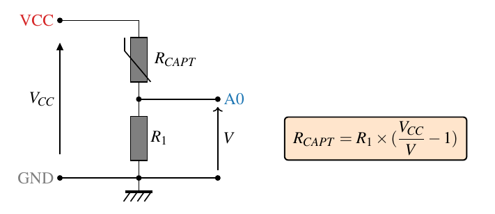

- VCC est la tension d'alimentation du microcontrôleur.

- L'entrée analogique A0 mesure la tension :math:`V` aux bornes de la résistance :math:`R`.

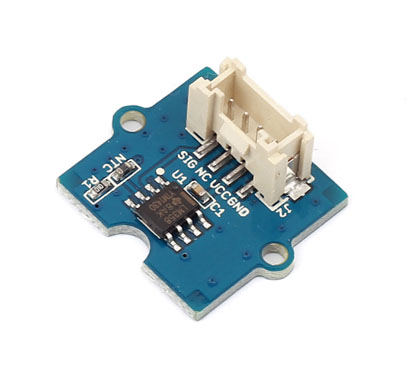

   Module Grove - Temperature Sensor V1.2  (:math:`R_1=100\rm~k\Omega`)

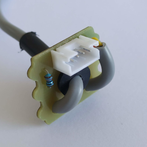

   Module CTN Plug'uino (:math:`R_1=10\rm~k\Omega`)

Montage 3 : mesure de la tension et du courant (ex. capteurs Educaduino)
------------------------------------------------------------------------

En plus de la **mesure de la tension** du capteur, une **mesure du courant** est aussi réalisée à partir de la tension aux bornes de la résistance R par l’intermédiaire d’un amplificateur différentiel. La résistance du capteur est alors calculée avec la **loi d’Ohm**. 

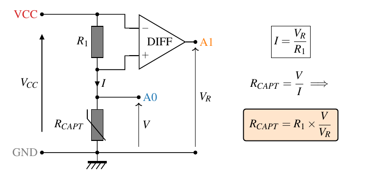

- L'entrée analogique A0 mesure la tension :math:`V` aux bornes du capteur résistif. 

- L'entrée analogique A1 mesure la tension :math:`V_R` aux bornes de la résistance :math:`R`.

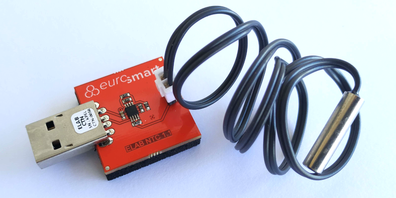

   Module CTN 10K Educaduino LAB (:math:`R_1=10\rm~k\Omega`)

Cas d'un capteur résistif  CTN
==============================

Une CTN est un **capteur résistif  à coefficient de température négatif** ...

Courbe d'étalonnage
-------------------

Les mesures sont effectuées avec un thermomètre et un **ohmmètre**.

+--------+---------+
| T (°C) | R (Ohm) |
+========+=========+
| 2.4    | 25455   |
+--------+---------+
| 5.1    | 22714   |
+--------+---------+
| 10.0   | 18622   |
+--------+---------+
| 15.1   | 15201   |
+--------+---------+
| 20.0   | 12607   |
+--------+---------+
| 25.0   | 10475   |
+--------+---------+
| 30.0   | 8740    |
+--------+---------+
| 35.1   | 7333    |
+--------+---------+
| 40.0   | 6194    |
+--------+---------+
| 45.0   | 5217    |
+--------+---------+
| 50.0   | 4358    |
+--------+---------+
| 55.1   | 3689    |
+--------+---------+
| 60.0   | 3120    |
+--------+---------+
| 65.1   | 2647    |
+--------+---------+
| 70.1   | 2264    |
+--------+---------+
| 75.1   | 1926    |
+--------+---------+
| 80.0   | 1658    |
+--------+---------+

Téléchargement : :download:`data_ctn_1.txt<../download/data_ctn_1.txt>` (mesures au format CSV).

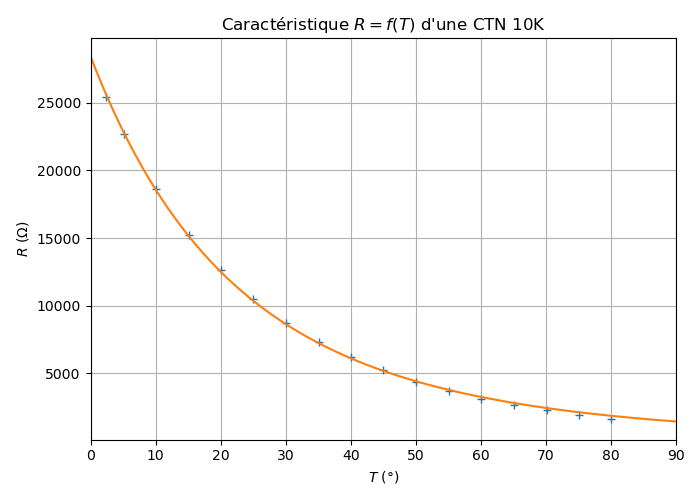
   
   Courbe d'étalonnage d'une CTN 10k

.. note::

   Dans cet exemple, la résistance mesurée prend la valeur particulière de 10 |kohm| pour 25°C  !

Relation de Steinhart-Hart
--------------------------

Sur une grande plage de variation, la relation entre la température (en K) et la résistance de la CTN est :

.. math::

   \dfrac{1}{T} = A + B \times \ln(R) + C \times (\ln(R))^3

A, B et C sont les coefficients de Steinhart-Hart. Ils sont donnés par le constructeur
ou peuvent se déterminer expérimentalement à l'aide du programme Python :download:`steinhart-hart.py <../download/steinhart-hart.py>` à partir de trois points de la courbe d'étalonnage.

Résultats obtenus à partir du programme Python :

.. math::

   A = 1,144 \cdot 10^{-3}K^{-1} \qquad B=2,078\cdot10^{-3}K^{-1} \qquad C=3,610 \cdot 10^{-7}K^{-1}

Relation simplifiée de Steinhart-Hart
-------------------------------------

Sur une **plage de variation plus réduite de la température**, la relation de Steinhart-Hart permet d'écrire :

.. math::

   R \approx R_0 \times e^{\beta(\frac{1}{T}-\frac{1}{T_0})}

* :math:`{R_0}` est la valeur de la résistance pour la température :math:`{T_0}`.

* :math:`{\beta}` est le coefficient de température (en K).

Ces coefficients sont généralement donnés par le constructeur (datasheet).

.. list-table::
   :widths: 30 30 20 20
   :header-rows: 1

   * - Module
     - Référence CTN
     - :math:`R_0~{\rm (k\Omega)}`
     - :math:`\beta~{\rm (K)}`
   * - Grove - Temperature Sensor V1.2
     - NCP18WF104F03RC
     - :math:`100`
     - :math:`4255~(25/80{\rm^\circ C})` 
   * - Velleman VMA320
     - NTC-MF52 3950
     - :math:`10`
     - :math:`3950`

Les coefficients :math:`{R_0}` et :math:`{\beta}`  peuvent être également déterminés par une modélisation de la caractéristique sur la plage de température d'utilisation de la CTN.

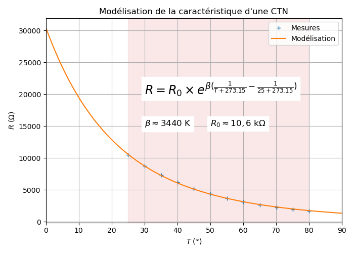

   Modélisation de la caractéristique de la CTN de 25°C à 80°C

Résultat de la modélisation de :math:`T_0 = 25{\rm^\circ C}` à :math:`80{\rm^\circ C}` :

.. math:: 

   R_0 \approx 10,6~{\rm k\Omega}
   \qquad\text{et}\qquad
   \beta \approx 3440~{\rm K}

Inversement, le calcul de la température (en K) s'obtient à partir de la relation suivante :

.. math::

   \boxed{\dfrac{1}{T} = \dfrac{1}{\beta}\times\ln(\dfrac{R}{R_0})+\dfrac{1}{T_0}}

Programme 1 : mesure de la résistance de la CTN
===============================================

La CTN est connectée à la masse (montage 1). L'entrée analogique ``A0`` mesure la tension du capteur.

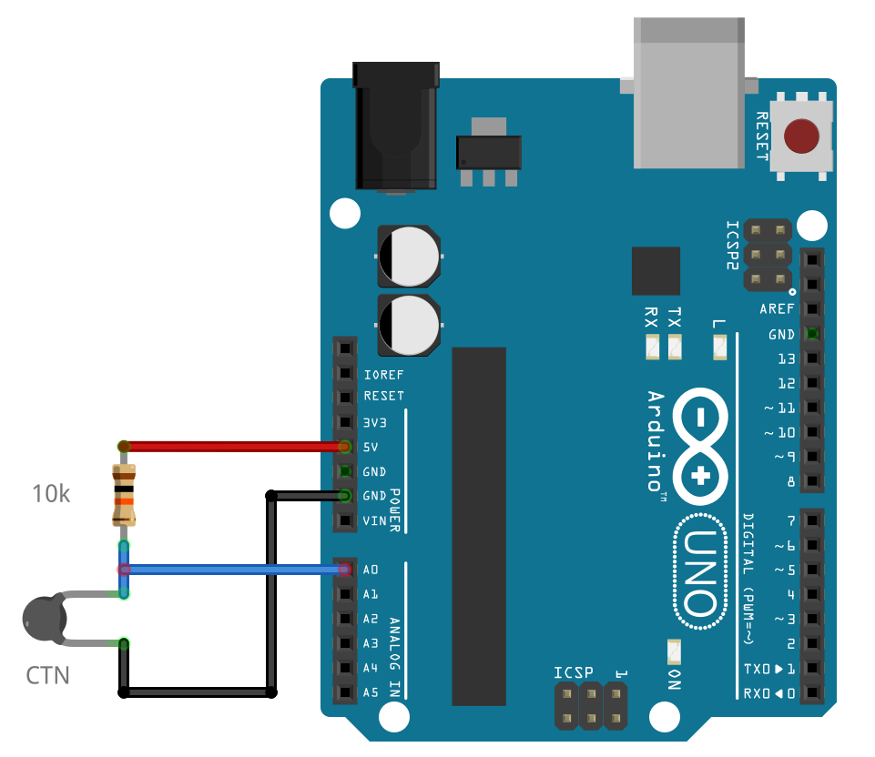

   Mesure de la résistance d'une CTN sur l'entrée analogique A0

.. code-block:: arduino

   /* 
   *  Mesure de la résistance d'une CTN
   */

   // Déclaration des variables pour la mesure de la résistance
   float Vcc = 5.0;    // Tension d'alimentation
   float R1 = 10000;   // Résistance du pont diviseur de tension
   float U;            // Tension de la CTN en volt
   float R_mes;        // Résistance mesurée de le CTN en Ohm

   void setup() {
      Serial.begin(9600);  // Paramétrage du port série
   }

   void loop() {
      U = analogRead(A0)*Vcc/1023;   // Lecture tension en V
      R_mes = R1*U/(Vcc-U);          // Calcul de la résistance
      Serial.print("R = ");          // Affichage
      Serial.print(R_mes);           // Affichage
      Serial.println(" Ohm");         // Affichage + sout de ligne
      delay(1000);                   // Temporisation de 1s
   }

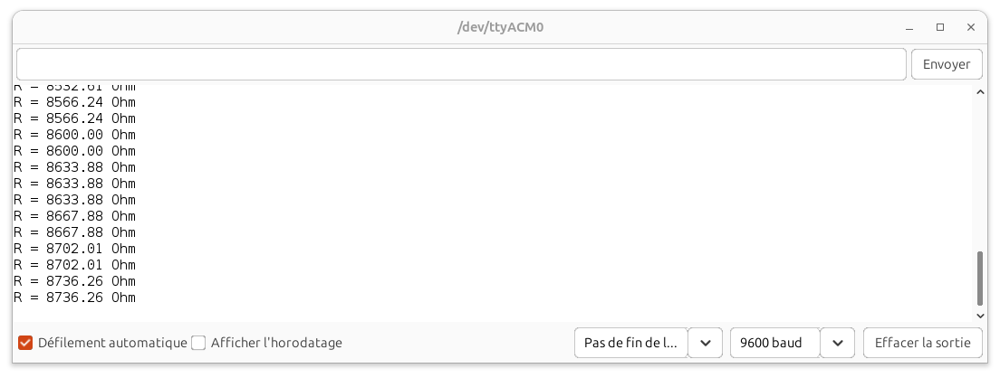

   Résultats dans le moniteur série d'Arduino IDE

Programme 2 : thermomètre numérique (application)
==================================================

   Mesure de la température donnée par une CTN sur l'entrée analogique A0

Rappel de relation simplifiée de Steinhart-Hart :

.. math::

   \dfrac{1}{T} = \dfrac{1}{\beta}\times\ln(\dfrac{R}{R_0})+\dfrac{1}{T_0}

avec pour notre CTN :

.. math:: 
   R_0 \approx 10,5~{\rm k\Omega}
   \qquad\text{et}\qquad
   \beta \approx 3290~{\rm K}
   

.. code-block:: arduino

   /*
   * Mesure de la résistance d'une CTN et
   * Calcul de la température à partir de la relation simplifiée de Steinhart-Hart
   */

   // Déclaration des variables pour la mesure de la résistance
   float Vcc = 5.0;    // Tension d'alimentation
   float R1 = 10000;   // Résistance du pont diviseur de tension
   float U;            // Tension CTN en volt
   float R_mes;        // Résistance CTN en ohm

   // Déclaration des variables pour la calcul de la température
   float T0 = 25;      // Température de référence (25°C)
   float R0 = 10600;   // Resistance R0 à T0 = 25°C
   float beta = 3440;  // Coefficient de temperature en K
   float inverse;      // Inverse de la temperature en K-1
   float T_K;          // Temperature en K
   float T;            // Temperature en °C

   void setup() {
      Serial.begin(9600);  // Paramétrage du port série
   }

   void loop() {
      U = analogRead(A0)*5.0/1023;                      // Lecture de la tension en V
      R_mes = R1*U/(Vcc-U);                             // Calcul de la résistance mesurée
      Serial.print("R = ");                             // Affichage
      Serial.print(R_mes);                              // Affichage
      Serial.println("Ohm");                            // Affichage + retour à la ligne
      
      inverse = 1/beta * log(R_mes/R0) + 1/(T0+273.15); // Calcul de l'inverse de la temperature
      T_K = 1/inverse;                                  // Calcul de la température en Kelvin
      T = T_K - 273.15;                                 // Caclul de la température en °C
      Serial.print("T = ");                             // Affichage
      Serial.print(T);                                  // Affichage
      Serial.println("°C");                             // Affichage + retour à la ligne
      delay(1000);                                      // Pause
   }

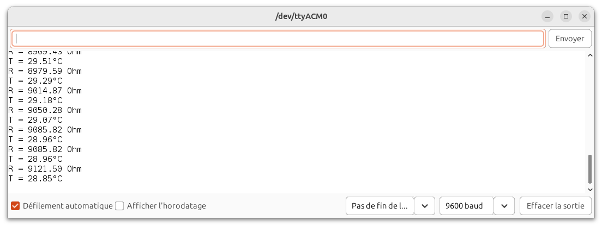

   Résultats dans le moniteur série d'Arduino IDE

A retenir
=========

Placer un **capteur résistif** (température, pression, lumière, ...) dans un **pont diviseur de tension** reste une **solution simple pour mesurer sa résistance** à l'aide d'un microcontrôleur.

