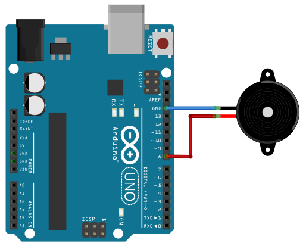

====================================
Émission d'un son (seconde générale)
====================================

.. topic:: Programme de seconde générale 2019 - Enseignement commun

   Utiliser un dispositif comportant un microcontrôleur pour produire un signal sonore.

Principe
========

Certains microcontrôleurs (Arduino et Micro:bit) ne possédant pas de sortie analogique (CNA) pour générer des tensions sinusoïdales,
une méthode simple pour produire un son est de générer une tension carrée (entre 0 et Vcc) de fréquence f à l'entrée d'un haut-parleur.

Le son obtenu par cette technique n'est pas pur car il comporte des harmoniques aux fréquences 3f, 5f, 7f, ...

.. warning::

   Pour les faibles fréquences, le son devient "métallique" avec la présence importante d'harmoniques !

Méthode 1 : construire le signal carré
======================================

   Branchement d'un haut-parleur sur la broche 8

.. code-block:: arduino

   #define brocheHP 8
                            
   float frequence=440;                             
   float periode=1/frequence;

   void setup(){           
       pinMode(brocheHP, OUTPUT); 
   }

   void loop(){          
     digitalWrite(brocheHP,HIGH);               
     delayMicroseconds(1000000*periode/2.0);  
     digitalWrite(brocheHP,LOW);               
     delayMicroseconds(1000000*periode/2.0);  
   }

Méthode 2 : utiliser une fonction spéciale
==========================================

.. code-block:: arduino

   /*
   Exemple Arduino
   */
   #include "pitches.h"

   // notes in the melody:
   int melody[] = {NOTE_C4, NOTE_G3,NOTE_G3, NOTE_A3, NOTE_G3,0, NOTE_B3, NOTE_C4};

   // note durations: 4 = quarter note, 8 = eighth note, etc.:
   int noteDurations[] = {4, 8, 8, 4, 4, 4, 4, 4 };

   void setup() {
   for (int thisNote = 0; thisNote < 8; thisNote++) {
      int noteDuration = 1000/noteDurations[thisNote];
      tone(8, melody[thisNote],noteDuration);
      int pauseBetweenNotes = noteDuration * 1.30;
      delay(pauseBetweenNotes);
      noTone(8);
   }
   }

   void loop() {
   // Pas de boucle ici !
   }

Applications
============

* Hauteur d'un son (relation entre fréquences et notes).

* Générer une mélodie à partir de plusieurs notes.

