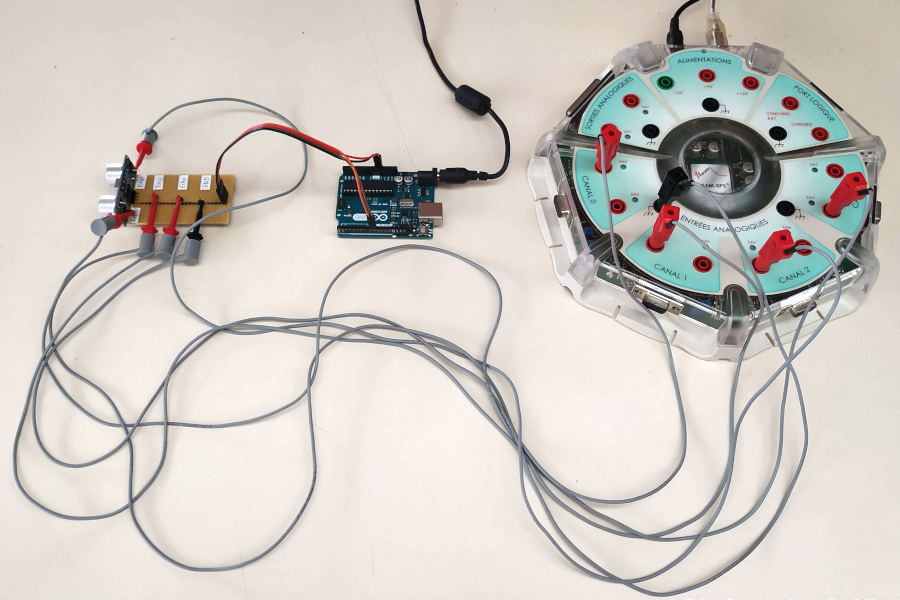

Mesurer la célérité d'un son (première générale)
================================================

.. topic:: Programme de première générale 2019 - Enseignement de spécialité.

   Exploiter la relation entre la durée de propagation, la distance parcourue par une perturbation et la célérité, notamment pour localiser une source d’onde. Déterminer, par exemple à l’aide d’un microcontrôleur ou d’un smartphone, une distance ou la célérité d’une onde.

Présentation du module HC-SR04
------------------------------

Les modules du type  HC-SR04 sont des émetteurs-récepteurs ultrasonores fonctionnant par réflexion. Ils sont utilisés généralement dans des applications comme télémètre (< 5 m).

.. figure:: Images/Ultrason_HC-SR04-Photo.png
   :width: 292
   :height: 162
   :scale: 70 %
   :alt: Montage ultrason - Arduino
   :align: center
   
   Module HC-SR04

Fonctionnement
~~~~~~~~~~~~~~
* Le module est alimenté entre ``GND`` et ``Vcc`` (généralement 5 V ou 3,3 V sur certains modules).
* Le déclenchement d'une mesure (émission d'une salve) se fait par une brève impulsion (> 10 µs) sur l'entrée ``trig``.
* La durée que prend l'onde pour aller de l'émetteur au récepteur est celle de l'impulsion renvoyée sur la sortie ``echo``. 

Modification du module
~~~~~~~~~~~~~~~~~~~~~~

Tel qu'il est vendu, ce module n'a peu d'intérêt en sciences physiques car les signaux électriques sur l'émetteur et le récepteur ne sont pas accessibles.
Il est possible de résoudre ce problème en y soudant deux connecteurs supplémentaires (voir photo ci-dessous) et de visualiser ces deux signaux à l'oscilloscope ou avec une interface d'acquisition.

Mesure de la célérité du son
----------------------------

Principe
~~~~~~~~

Montage
~~~~~~~

.. figure:: Images/Ultrason_HC-SR04-Montage-Oscillo.png
   :width: 837
   :height: 434
   :scale: 50 %
   :alt: Montage ultrason - Arduino
   :align: center

   Montage avec oscilloscope ou interface d'acquisition

   Acquisition avec interface Sysam SP5

.. figure:: Images/Ultrason_HC-SR04-modifie.png
   :width: 900
   :height: 900
   :scale: 50 %
   :alt:
   :align: center

   Branchement du module HC-SR04 modifié

Programme
~~~~~~~~~

.. code-block:: arduino

   /*
    * Mesurer vitesse son
    */

   #define pinTrig 8       // Trig sur broche 8
   #define pinEcho 9       // Echo sur broche 9

   float distance = 0.3;   // Distance en module et réflecteur
   long dureeEcho;         // Durée mesurée
   float vitesse ;         // Vitesse obtenue

   void setup() {
     pinMode(pinTrig,OUTPUT);      // Broche Trig en sortie
     digitalWrite(pinEcho,LOW);    // Sortie Trig à l état bas
     pinMode(pinEcho,INPUT);       // Broche Echo en entrée
     Serial.begin(9600);           // Paramétrage du port série
   }

   void loop() {
     digitalWrite(pinTrig,HIGH);            // Début impulsion de declenchement
     delayMicroseconds(10);                 // Attendre 10 microseconde
     digitalWrite(pinTrig,LOW);             // Fin impulsion (Etat bas)
     dureeEcho = pulseIn(pinEcho,HIGH);     // Mesure de la durée de l'impulsion sur Echo
     vitesse = 2*distance/dureeEcho * 1E6;  // Calcul de la vitesse
     Serial.print("Durée (s) = ");          // Affichage sur port série
     Serial.println(dureeEcho);
     Serial.print("Vitesse (m/s) = ");
     Serial.println(vitesse);
     delay(1000);                           // Attendre 1s
   }

Résultats
~~~~~~~~~

.. figure:: Images/Ultrasons_Latis.png
   :width: 932
   :height: 857
   :scale: 50 %
   :alt:
   :align: center

   Mesures obtenues dans Latis avec Sysam SP5

.. figure:: Images/Ultrasons_scope_60cm.png
   :width: 900
   :height: 600
   :scale: 50 %
   :alt:
   :align: center

   Mesures à l'oscilloscope pour une distance de 30 cm

.. note::

   La fonction ``+Width`` de l'oscilloscope mesure en temps réel la durée de l'impulsion sur la broche ``Echo``.

Par exemple, pour une distance de 30 cm, la mesure de la célérité du son est :

.. math::

   c = \dfrac{2 \times d}{\Delta t} = \dfrac{2 \times 300}{1,73} \approx 347\,m\cdot s^{-1}

Application : réalisation d'un télémètre
----------------------------------------

Principe
~~~~~~~~

Connaissant la célérité du son, la distance par rapport à un obstacle est calculée par le microcontrôleur à l'aide de la relation suivante :

.. math::

   d = \dfrac{c \times \Delta t}{2}

L'affichage de la distance peut se faire sur un afficheur ou dans le moniteur série de l'ordinadeur.

Montage
~~~~~~~

.. figure:: Images/Ultrason_HC-SR04-Montage.png
   :width: 720
   :height: 429
   :scale: 50 %
   :alt: Montage ultrason - Arduino
   :align: center

   Montage télémètre

Programme
~~~~~~~~~

Le programme est le même, seule le calcul change !

.. code-block:: arduino

   /*
    * Application : télémétre
    */

   #define pinTrig 8       // Trig sur broche 8
   #define pinEcho 9       // Echo sur broche 9

   float distance;         // Distance en module et réflecteur
   long dureeEcho;         // Durée mesurée
   float vitesse = 340 ;         // Vitesse obtenue

   void setup() {
     pinMode(pinTrig,OUTPUT);      // Broche Trig en sortie
     digitalWrite(pinEcho,LOW);    // Sortie Trig à l état bas
     pinMode(pinEcho,INPUT);       // Broche Echo en entrée
     Serial.begin(9600);           // Paramétrage du port série
   }

   void loop() {
     digitalWrite(pinTrig,HIGH);                   // Début impulsion de déclenchement
     delayMicroseconds(10);                        // Attendre 10 microseconde
     digitalWrite(pinTrig,LOW);                    // Fin impulsion (Etat bas)
     dureeEcho = pulseIn(pinEcho,HIGH);            // Mesure de la durée de l'impulsion sur Echo
     distance = (vitesse * dureeEcho * 1E6) / 2;   // Calcul de la distance
     Serial.print("Durée (s) = ");                 // Affichage sur port série
     Serial.println(dureeEcho);
     Serial.print("Distance (m) = ");
     Serial.println(distance);
     delay(1000);                                   // Attendre 1s
   }

A retenir
---------

* Le module HC-SR04 fournit un **signal Echo pour la mesure automatique de la durée** de propagation du son.

* La fonction ``pulseIn(pin,HIGH)`` **mesure cette durée**.

