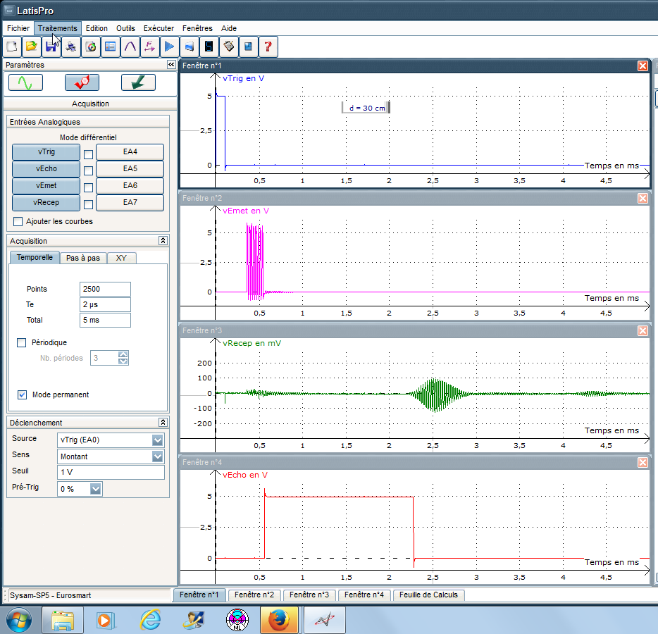
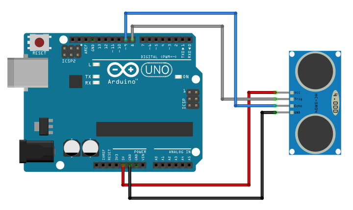
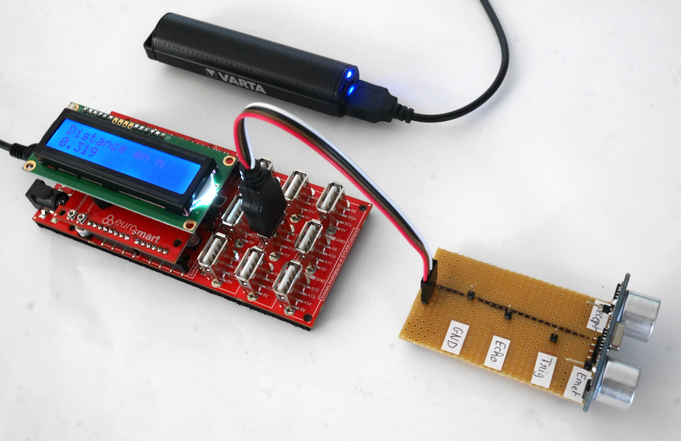

================================================
Mesurer la célérité d'un son (première générale)
================================================

.. topic:: Programme de première générale 2019 - Enseignement de spécialité.

   Exploiter la relation entre la durée de propagation, la distance parcourue par une perturbation et la célérité, notamment pour localiser une source d’onde. Déterminer, par exemple à l’aide d’un microcontrôleur ou d’un smartphone, une distance ou la célérité d’une onde.

Présentation du module HC-SR04
==============================

Les modules du type  HC-SR04 sont des émetteurs-récepteurs ultrasonores fonctionnant par réflexion. Ils sont utilisés généralement dans des applications comme télémètre (< 5 m).

.. figure:: Images/Ultrason_HC-SR04-Photo.png
   :width: 292
   :height: 162
   :scale: 70 %
   :alt: Montage ultrason - Arduino
   :align: center
   
   Module HC-SR04

Fonctionnement
--------------

* Le module est alimenté entre ``GND`` et ``Vcc`` (généralement 5 V ou 3,3 V sur certains modules).
* Le déclenchement d'une mesure (émission d'une salve) se fait par une brève impulsion (> 10 µs) sur l'entrée ``trig``.
* La durée que prend l'onde pour aller de l'émetteur au récepteur est celle de l'impulsion renvoyée sur la sortie ``echo``. 

Modification du module
----------------------

Tel qu'il est vendu, ce module n'a peu d'intérêt en sciences physiques car les signaux électriques sur l'émetteur et le récepteur ne sont pas accessibles.
Il est possible de résoudre ce problème en y soudant des **connecteurs supplémentaires** (voir photo ci-dessous) et de **visualiser les signaux correspondants à l'oscilloscope ou avec une interface d'acquisition**.

.. image:: Images/Ultrason_HC-SR04-modifie-soudures.png
   :width: 700
   :height: 500
   :scale: 50 %
   :alt:
   :align: center

.. figure:: Images/Ultrason_HC-SR04-modifie.png
   :width: 900
   :height: 900
   :scale: 33 %
   :alt:
   :align: center

   Branchement du module HC-SR04 modifié

.. figure:: Images/Ultrason_HC-SR04-Montage-Oscillo.png
   :width: 837
   :height: 434
   :scale: 50 %
   :alt: Montage ultrason - Arduino
   :align: center

   Montage avec oscilloscope ou interface d'acquisition

   Mesures obtenues dans Latis avec Sysam SP5

.. figure:: Images/Ultrasons_scope_60cm.png
   :width: 900
   :height: 600
   :scale: 50 %
   :alt:
   :align: center

   Mesures à l'oscilloscope pour une distance de 30 cm

Mesure de la célérité du son
============================

La manipulation consiste à relever la durée de l'écho sonore à l'aide du microcontrôleur pour différentes distances et déduire la célérité du son. 

Algorithme
----------

.. code::

   REPETER :
      Sortie TRIG à l'état haut
      Attendre 10 microseconde
      Sortie TRIG à l'état bas
      Mesurer durée d'impulsion sur l'entrée Echo 
      Afficher le durée

Pour plus de précision, il est possible de modifier le programme afin de **réaliser plusieurs mesures** de la durée de l'écho et d'en déduire sa **moyenne**.

Arduino (C/C++)
---------------

   Montage célérité son

.. code-block:: arduino

   // Mesure de la durée de l'écho sonore

   #define pinTrig 8       // Trig sur broche 8
   #define pinEcho 9       // Echo sur broche 9

   long dureeEcho;         // Durée de l'Echo

   void setup() {
     pinMode(pinTrig,OUTPUT);      // Broche Trig en sortie
     digitalWrite(pinEcho,LOW);    // Sortie Trig à l état bas
     pinMode(pinEcho,INPUT);       // Broche Echo en entrée
     Serial.begin(9600);           // Paramétrage du port série
   }

   void loop() {
     digitalWrite(pinTrig,HIGH);            // Début impulsion de declenchement
     delayMicroseconds(10);                 // Attendre 10 microseconde
     digitalWrite(pinTrig,LOW);             // Fin impulsion (Etat bas)
     dureeEcho = pulseIn(pinEcho,HIGH);     // Mesure de la durée de l'impulsion sur Echo
     Serial.print("Durée (µs) = ");          // Affichage sur port série
     Serial.println(dureeEcho);
     delay(1000);                           // Attendre 1s
   }

Arduino (Python/Nanpy)
----------------------

PyBoard (MicroPython)
---------------------

Micro:bit (MicroPython)
-----------------------

Application : réalisation d'un télémètre
========================================

Connaissant la célérité du son, la distance par rapport à un obstacle est calculée par le microcontrôleur à l'aide de la relation suivante :

.. math::

   d = \dfrac{c \times \Delta t}{2}

Il suffit d'ajouter le calcul de la distance juste après la mesure de la durée.

Arduino (C/C++)
---------------

.. code-block:: arduino

   //Application : télémétre sur écran LCD 2x16
   
   #include <LiquidCrystal.h>        // Importation de la librairie LiquidCrystal
   #define pinTrig 8       // Trig sur broche 8
   #define pinEcho 9       // Echo sur broche 9

   LiquidCrystal lcd(12, 11, 5, 4, 3, 2);  // Brochage de l'afficheur

   float distance;         // Distance en module et réflecteur
   long dureeEcho;         // Durée mesurée
   float vitesse = 345 ;   // Vitesse obtenue

   void setup() {
    pinMode(pinTrig,OUTPUT);      // Broche Trig en sortie
    digitalWrite(pinEcho,LOW);    // Sortie Trig à l état bas
    pinMode(pinEcho,INPUT);       // Broche Echo en entrée
    lcd.begin(16, 2);               // fixe le nombre de colonnes et de lignes de l afficheur
   }

   void loop() {
    digitalWrite(pinTrig,HIGH);                   // Début impulsion de déclenchement
    delayMicroseconds(10);                        // Attendre 10 microseconde
    digitalWrite(pinTrig,LOW);                    // Fin impulsion (Etat bas)
    dureeEcho = pulseIn(pinEcho,HIGH);            // Mesure de la durée de l'impulsion sur Echo
    distance = (vitesse*dureeEcho*1E-6)/2;    // Calcul de la distance
    lcd.setCursor(0,0);                           // place le curseur au début de la ligne 0
    lcd.print("Distance en m");                  // Affiche la légende
    lcd.setCursor(0,1);                           // place le curseur au début de la ligne 1
    lcd.print(distance);                          // Affiche la valeur de la distance
    delay(1000);                                  // Attendre 1s
   }

   Télémètre sur Educaduino-Lab LCD

A retenir
=========

* Le module HC-SR04 fournit un **signal Echo pour la mesure automatique de la durée** de propagation du son.

* La fonction ``pulseIn()`` **mesure cette durée**.

