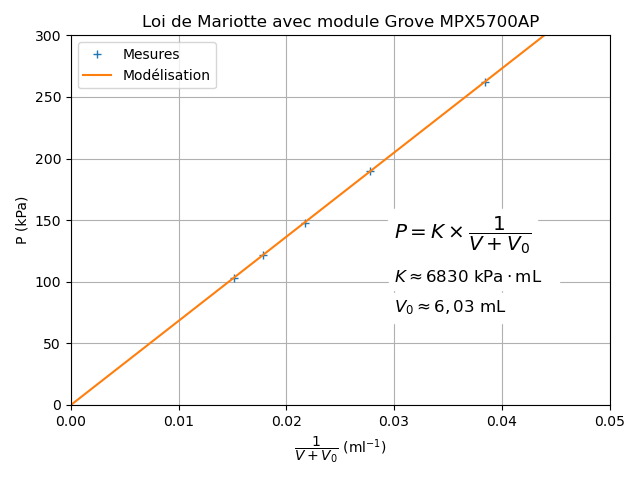

==========================================================
Mesurer une pression - Loi de Mariotte (première générale)
==========================================================

.. topic:: Programme de première générale 2019 - Enseignement de spécialité.

   Tester la loi de Mariotte, par exemple en utilisant un dispositif comportant un microcontrôleur.

Principe
========

La manipulation consiste à vérifier la loi de Mariotte  (à température et à quantité de matière constantes) :

.. math:: 

   \boxed{P \times V = \rm Constante}

Capteur de pression absolue MPX5700AP
=====================================

Le MPX5700AP est un capteur analogique de pression absolue (15 kPa à 700 kPa - 5V).

.. La tension de sortie est linéaire à la pression mesurée.

.. figure:: images/pression_absolue/MPX5700/MPX5700AP_grove.jpg
   :width: 1024
   :height: 938
   :scale: 33 %
   :alt: 
   :align: center
   
   Capteur MPX5700AP Grove (15 kPa à 700 kPa) (image : seeedstudio)

   
   Schéma électrique (source : Freescale Semiconductor, Inc.)

   
   Caractéristiques (source : Freescale Semiconductor, Inc.)

Calcul de la pression
=====================

La mesure de pression (en kPa) est donnée par la relation pour une alimentation de 5 V :

   .. math:: 

      \boxed{P = \dfrac{P_{max}-P_{min}}{V_{max}-V_{min}} \times (v_{out}-V_{min}) + P_{min}}

Soit :

   .. math::
      P = \dfrac{700-15}{4,7-0,2} \times (v_{out}-0,2) + 15
      \quad\implies\quad
      \boxed{P \approx 152\times (v_{out}-0,2) + 15}

Programme Arduino
=================

.. code-block:: arduino

   /*
    * Mesure d'une pression absolue
    * Capteur Grove MPX5700AP (15 kPa à 700 kPa) branché sur la broche A0
    * David THERINCOURT - 2025
    */

   float tension ;    // Tension mesurée (V)
   float pression ;   // Pression mesurée (kPa)

   void setup() {
      Serial.begin(9600); // Initialisation du port série
   }

   void loop() {
      tension = analogRead(A0)*5.0/1023 ;    // Lecture de la tension sur A0 en volt
      pression = 152*(tension-0.2) + 15 ;    // Calcul de la pression en kPa
      Serial.print("U = ");                  // Affichage dans le moniteur série
      Serial.print(tension);                 // Affichage de la tension
      Serial.print(" V  =>  ");              // ...
      Serial.print("P = ");                  // ...
      Serial.print(pression, 0);             // Affichage de la pression arrondie
      Serial.println(" kPa");                // Fin affichage
      delay(1000);                           // Temporisation
   }

   Résultats obtenus dans le moniteur série d'Arduino IDE

Résultats
=========

+---------+-----+-----+-----+-----+-----+
| V (mL)  | 60  | 50  | 40  | 30  | 20  |
+=========+=====+=====+=====+=====+=====+
| P (kPa) | 103 | 122 | 148 | 190 | 262 |
+---------+-----+-----+-----+-----+-----+

:math:`V_0` est le volume additionnel contenu dans le tube et le capteur.

