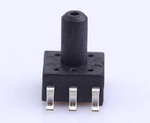
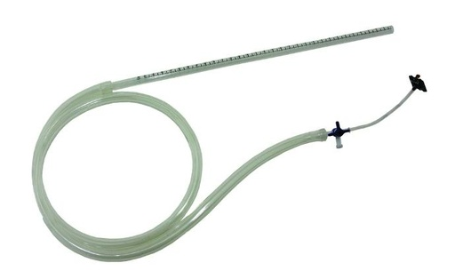
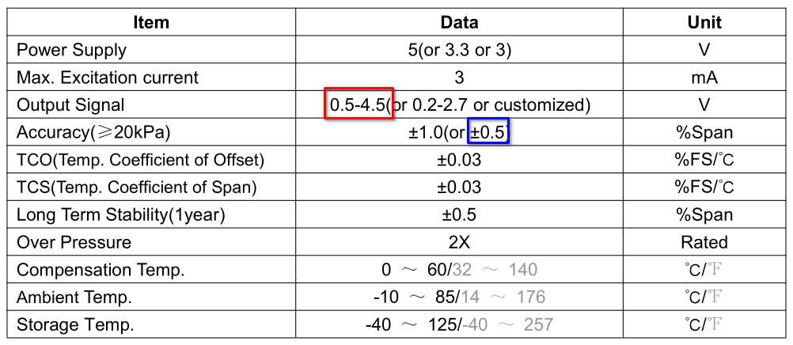
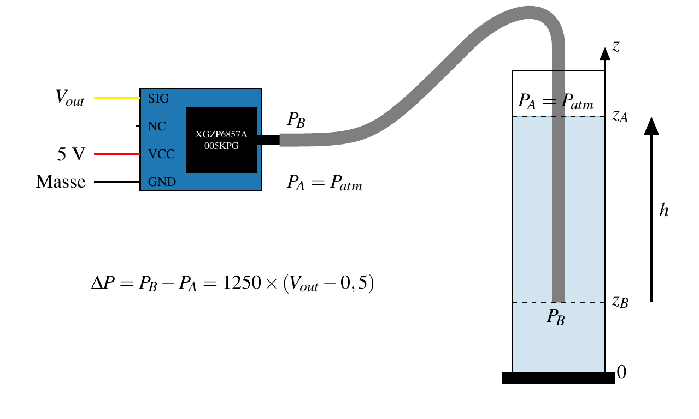
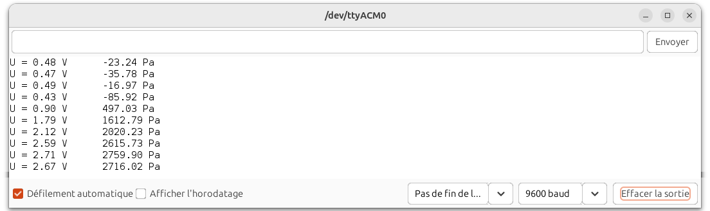
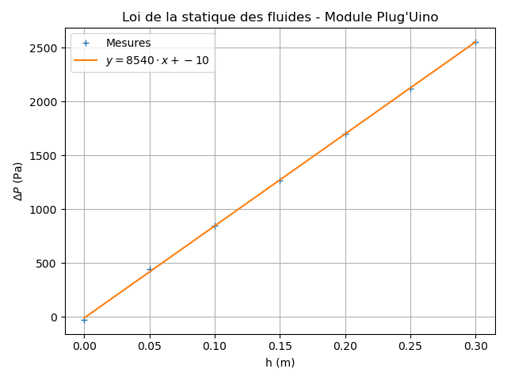

Mesurer une pression - Loi de la statique des fluides (première générale)
=========================================================================

.. topic:: Programme de première générale 2019 - Enseignement de spécialité.

   Tester la loi fondamentale de la statique des fluides.

Principe
--------

Vérifier expérimentalement la loi de la statique des fluides à l'aide d'un capteur de pression différentielle.

.. math:: 

   \boxed{P_B-P_A = \rho\times g \times (z_A-z_B)}

Capteur Plug'Uino (XGZP6857A)
-----------------------------------

Le capteur Plug'Uino (pression pour statistique des fluides) comporte un capteur de pression différentielle (manomètre) de référence XGZP6857A005KPG.

   Capteur de pression différentielle XGZP6857A (manomètre)

Ce capteur délivre une tension analogique de :math:`0,5~\rm V` à :math:`4,5~\rm V` pour pression différentielle comprise entre :math:`0` et :math:`5~\rm kPa`.

   Kit Plug'Uino compatible Grove avec capteur XGZP6857A (image : Sciencéthic)

   Extrait de la documentation technique du capteur XGZP6857A

Le calcul de la pression obtient alors par l'expression suivante :

.. math:: 

   \boxed{P = \dfrac{P_{max}-P_{min}}{V_{max}-V_{min}} \times (v_{out}-V_{min}) + P_{min}}

Soit :

.. math::
   
   P = \dfrac{5000-0}{4,5-0,5} \times (v_{out}-0,5) + 0
   \quad\implies\quad
   \boxed{P \approx 1250\times (v_{out}-0,5)}

La précision du capteur est de :

.. math:: 

   \pm 0,5\% \times 5000 = \pm 25~{\rm Pa}

Montage
-------

Programme Arduino
-----------------

.. code:: arduino

   /*
    * Capteur de pression différentielle Plug'Uino
    * 0 - 5 kPa -> 0,5 - 4,5 V (capteur XGZP6857A005KPG)
    * David THERINCOURT - 2025
    */

   void setup() {
      Serial.begin(9600);          // Initialisation du port série
   }

   void loop() {
      int N = analogRead(A0);       // Lecture sur A0
      float u = N * (5.0 / 1023.0); // Calcul de la tension en volt
      float P = 1250*(u-0.5);       // Calcul de la pression en Pa
      Serial.print("U = ");         // Affichage
      Serial.print(u);              // ...
      Serial.print(" V \t");        // ... \t pour un tabulation
      Serial.print(P);              // ...
      Serial.println(" Pa");        // ...
      delay(1000);                  // Temporisation
   }

   Résultats dans le moniteur série d'Arduino IDE

.. A retenir
.. ---------
