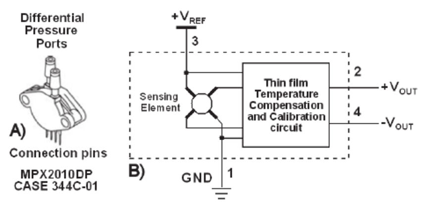

Mesurer une pression - Loi de la statique des fluides (première générale)
=========================================================================

.. topic:: Programme de première générale 2019 - Enseignement de spécialité.

   Tester la loi fondamentale de la statique des fluides.

Principe
--------

La mesure de pression s'effectue avec un capteur de pression différentiel du type MPX2010 (10 kPa - 5V).

La tension de sortie est proportionnelle à la pression mesurée.

Montage
-------

Le montage est composé d'une carte Educaduino Lab et d'un capteur de pression différentiel Educaduino (0 à 10 kPa).

L'expression de la pression (en Pa) en fonction de la tension délivrée par le capteur est :

.. math::

   P = 2000 \times U

Programme
---------

.. code-block:: arduino

   /*
    * Mesure d une pression relative
    * Capteur Educaduino MPX2010 de 200 hPa à 4000 hPa
    * branché sur la broche A9
    */

   #define brocheCapteur A9      // Numéro de broche connectée au capteur
   #include <LiquidCrystal.h>    // Librairie de gestion de l écran LCD

   LiquidCrystal lcd(12, 11, 5, 4, 3, 2);  // Déclaration de l écran LCD

   int n;
   float tension ;               // Tension mesurée
   int pression ;                // Pression mesurée

   void setup() {
     lcd.begin(16, 2);           // Paramétrage de l ecran LCD

   }

   void loop() {
     n = analogRead(brocheCapteur) ;   // Lecture de la tension
     tension = n*5.0/1023 ;            // Lecture de la tension
     pression = round(tension*2000) ;  // Calcul de la pression en Pa
     lcd.clear();                      // Début affichage
     lcd.setCursor(0,0);
     lcd.print("N");
     lcd.setCursor(6,0);
     lcd.print("P (Pa)");
     lcd.setCursor(0,1);
     lcd.print(n);                     // Fin affichage
     lcd.setCursor(6,1);
     lcd.print(round(pression));       // Fin affichage
     delay(1000);
   }

A retenir
---------
