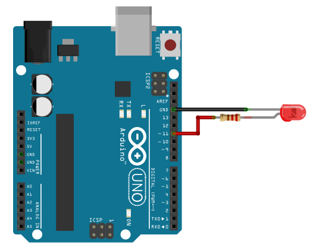

.. |kohm| replace:: :math:`{k\Omega}`
.. |ohm| replace:: :math:`{\Omega}`

==========================================
Arduino IDE - Saisir une valeur au clavier
==========================================

Montage
=======

   Branchement d'une LED sur la broche 11

Une LED en série avec une résistance de 220 |ohm| est branchée sur la broche 11.

Programme
=========

Le programme ci-dessous contrôle l'intensité de la LED interne d'un Arduino avec le clavier.

- Le rapport cyclique (entier entre 0 et 255) est saisie au clavier dans le moniteur série avec la fonction :code:`parseInt()` de la librairie :code:`Serial`.

- Un signal PWM est généré sur la broche 11 (LED interne) avec la fonction :code:`analogWrite()`.

.. code:: arduino

   // PWM avec saisie du rapport cyclique (entier de 0 à 255) au clavier dans le moniteur série.
   // ATTENTION : Sélectionner "Pas de fin de ligne" dans le monitor série !!!
   // David THERINCOURT 2025

   #define LED 11           // LED connectée à la broche 11

   void setup()
   {
      Serial.begin(9600);   // Initialisation du port série
      pinMode(LED,OUTPUT);  // Configuration de la broche LED en sortie
   }

   void loop()
   {
      Serial.print("Rapport cyclique entre 0 et 255 : ");  // Indication à l'utilisateur
      while (Serial.available()==0){}                      // Attente d'un message (Cocher "Pas de fin de ligne")
      int N = Serial.parseInt();                           // Extraction de la valeur numérique (entier)
      Serial.println(N);                                   // Affichage de N
      analogWrite(LED, N);                                 // Ecriture sur la sortie PWM
   }
