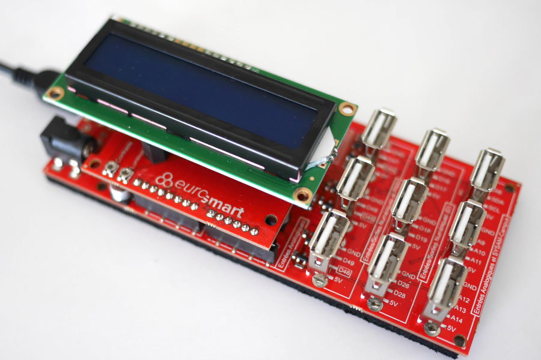

==============================
Educaduino Lab - Afficheur LCD
==============================

Principe
========

Le pilotage d'un afficheur LCD 16x2 nécessite de 6 broches numériques. Le brochage dépend de la référence de l'afficheur.

Pour éviter un câblage trop complexe, le plus simple est de fixer sur la carte de développement un "shield" afficheur comme celui proposé par Educaduino LAB.

   Afficheur LCD 16x2 d'Educaduino-Lab

.. Le logiciel Arduino met à disposition la librairie ``LiquidCrystal`` (installée par défaut) pour le pilotage ce type d'afficheur.

Programme 
=========

La librairie :code:`LiquidCrystal` est installée par défaut dans Arduino IDE.

.. code-block:: arduino

   /*
    * Exemple d'utilisation d'un écran LCD 16x2 parallèle
    */

   #include <LiquidCrystal.h>        // Importation de la librairie LiquidCrystal

   LiquidCrystal lcd(12, 11, 5, 4, 3, 2);  // Brochage de l'afficheur

   void setup() {
     lcd.begin(16, 2);               // fixe le nombre de colonnes et de lignes de l afficheur
   }

   void loop() {
     lcd.setCursor(5,0);             // place le curseur à la colonne 5 et à la ligne 0
     lcd.print("Bonjour");           // Affiche un texte
     lcd.setCursor(0,1);             // place le curseur à la colonne 0 et à la ligne 1
     lcd.print("tout le monde !");   // Affiche un autre texte
   }

.. note::

   Il sera peut-être necessaire d'installer la librairie ``LiquidCrystal`` dans le logiciel Arduino.

En résumé
---------

========================================== =======================================
Instruction                                Description
========================================== =======================================
``#include <LiquidCrystal.h>``             Importe la librairie de gestion de l'afficheur LCD
``LiquidCrystal lcd(12, 11, 5, 4, 3, 2)``  Déclare l'afficheur en précisant les numéros de broches
``lcd.begin(16, 2)``                       Fixe le nombre de colonnes et de lignes de l'afficheur
``lcd.setCursor(col,line)``                Positionne le cuseur
``lcd.print(variable)``                    Affiche le contenu d'une variable à la position du curseur
========================================== =======================================
