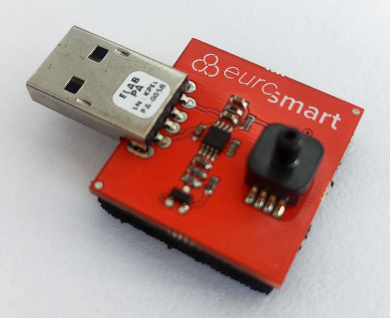
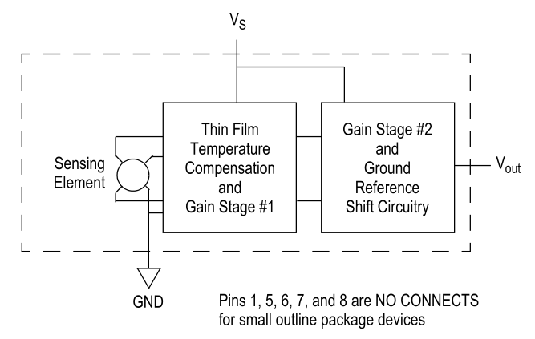
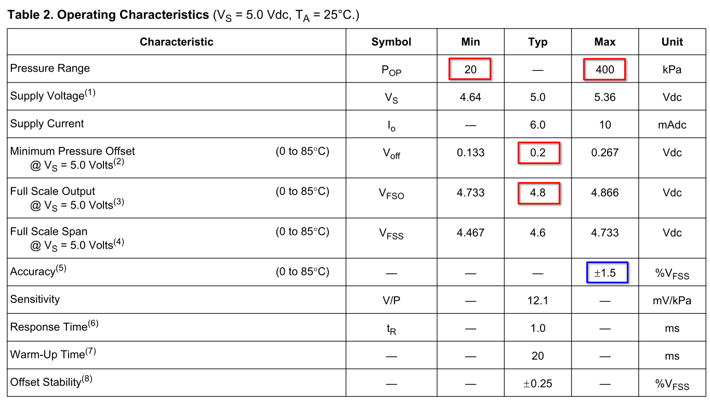
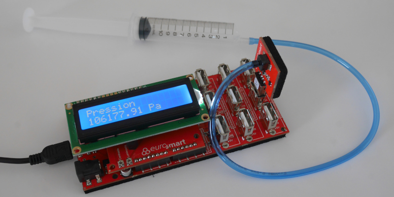

================================
Educaduino Lab - Loi de Mariotte
================================

Principe
========

La manipulation consiste à vérifier la loi de Mariotte  (à température et à quantité de matière constantes) :

.. math:: 

   \boxed{P \times V = \rm Constante}

Capteur MPXHZ6400A
==================

Le MPXHZ6400A est un capteur analogique de pression absolue (20 kPa à 400 kPa - 5V).

   
   Capteur MPX6400A Educaduino LAB

   
   Schéma électrique (source : Freescale Semiconductor, Inc.)

   
   Caractéristiques (source : Freescale Semiconductor, Inc.)

Calcul de la pression
=====================

   La mesure de pression (en kPa) est donnée par la relation pour une alimentation de 5 V :

   .. math:: 

      \boxed{P = \dfrac{P_{max}-P_{min}}{V_{max}-V_{min}} \times (v_{out}-V_{min}) + P_{min}}

Soit :

   .. math::
      P = \dfrac{400-20}{4,8-0,2} \times (v_{out}-0,2) + 20
      \quad\implies\quad
      \boxed{P \approx 82,6\times (v_{out}-0,2) + 20}

.. note:: 

   Dans la bibliothèque Educaduino, l'expression de la pression n'est pas en accord avec la documentation technique !

   .. math:: 

      P = \dfrac{400-20}{5-0} \times v_{out} + 20
      \quad\implies\quad
      \cancel{P\approx 76\times v_{out} + 20}
      \qquad {\rm(kPa)}

Montage
=======

Le montage est composé d'une carte Educaduino Lab, d'un capteur de pression Educaduino  (MPXHZ6400A / 20 kPa à 400 kPa) et d'une seringue.

.. L'expression de la pression (en kPa) en fonction de la tension délivrée par le cateur est :

.. .. math::
.. 
..   P = 76 \times U + 20

   Mesure d'une pression avec Educaduino Lab

Programme Arduino
=================

.. code-block:: arduino
   :linenos:

   /*
    * Mesure d'une pression absolue
    * Capteur Educaduino 20 kPa à 400 kPa
    * branché sur la broche A9
    */

   #define brocheCapteur A9      // Numéro de broche connectée au capteur
   #include <LiquidCrystal.h>    // Librairie de gestion de l écran LCD

   LiquidCrystal lcd(12, 11, 5, 4, 3, 2);  // Déclaration de l écran LCD

   float tension ;               // Tension mesurée
   float pression ;              // Pression mesurée

   void setup() {
     lcd.begin(16, 2);           // Paramétrage de l ecran LCD

   }

   void loop() {
     tension = analogRead(brocheCapteur)*5.0/1023 ;   // Lecture de la tension
     pression = 82.6*(tension-0.2) + 20 ;               // Calcul de la pression en kPa
     lcd.clear();                                     // Début affichage
     lcd.setCursor(0,0);
     lcd.print("Pression en kPa");
     lcd.setCursor(0,1);
     lcd.print(pression);                             // Fin affichage
     delay(1000);
   }

Résultats
=========

======== ==== ==== ==== ==== ==== ==== ==== ==== ====
V (mL)   12   11   10   9    8    7    6    5    4
P (kPa)  96,5 105  114  124  136  152  171  194  227
======== ==== ==== ==== ==== ==== ==== ==== ==== ====

Ces mesures ne tiennent pas compte du volume additionnel dans le tube et le capteur !