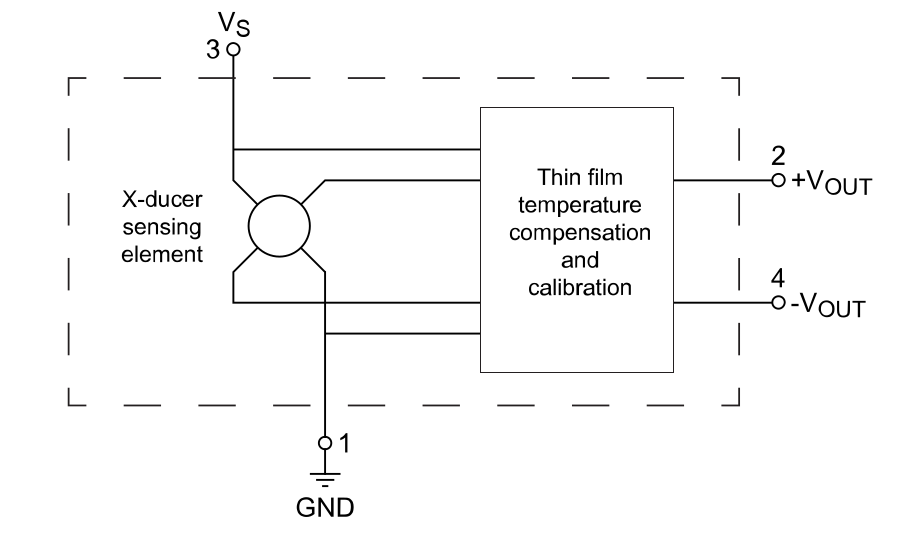
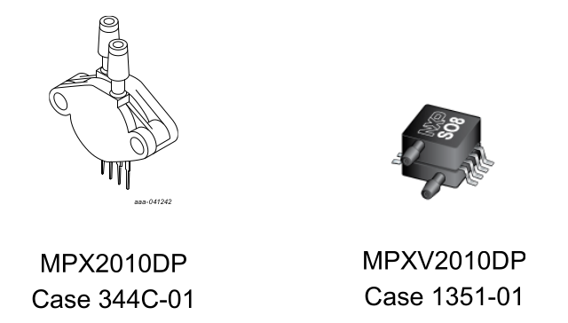
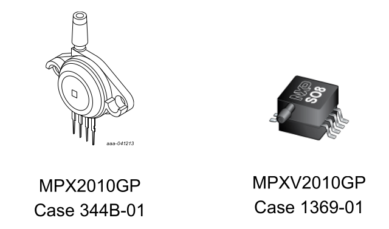
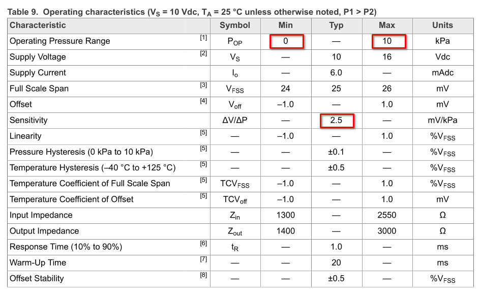
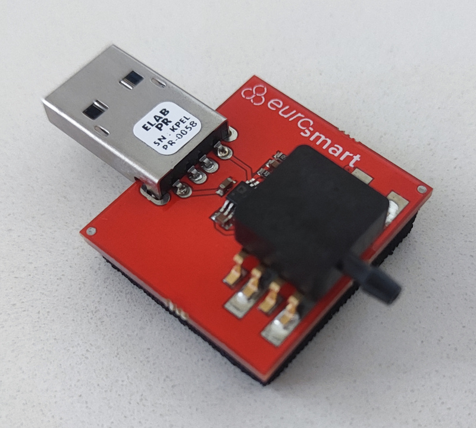
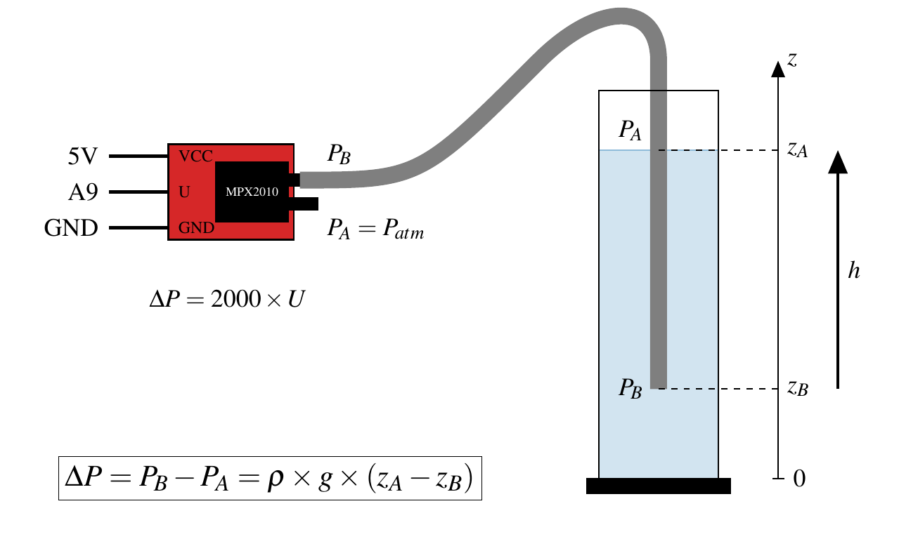

===============================================
Educaduino Lab - Loi de la statique des fluides
===============================================

Principe
========

Vérifier expérimentalement la loi de la statique des fluides à l'aide d'un capteur de pression différentielle.

.. math:: 

   \boxed{P_B-P_A = \rho\times g \times (z_A-z_B)}

Capteur MPX2010DP/GP
====================

La mesure de pression s'effectue avec un capteur de pression différentiel du type MPX2010 (0 à 100 hPa) compensé en température.

   Schéma électrique du MPX2010 (image : NXP Semiconductors)

   (image : NXP Semiconductors)

La **version DP** (pression différentielle) mesure la différence de pression entre deux points d'entrée.

   (image : NXP Semiconductors)

La **version GP** (pression relative - manomètre) mesure la pression d'un point d'entrée par rapport à une pression de référence (pression atmosphérique).

   Extrait datasheet (source : NXP Semiconductors)

Pour ce capteur, la tension de sortie est proportionnelle à la différence de pression mesurée telle que :

.. math:: 

   U_{out} = S \times \Delta P
   \qquad\text{avec}\qquad
   S = 2,5~{\rm mV/kPa}

Capteur Educaduino Lab (MPX2010GP)
==================================

Le module Educaduino LAB est conçu autour sur le capteur MPX2010GP.

   Capteur de pression différentielle Educaduino LAB (jauge)

Après adaptation (amplification), l'expression de la pression différentielle (en Pa) en fonction de la tension en sortie du capteur est :

.. math:: 

   \Delta P = 2000 \times U
   \qquad
   {\rm (Pa)}

Montage
=======

   Montage de la vérification de loi de la statique des fluides à partir d'un Arduino
   

Programme Arduino
=================

Avec écran LCD Educaduino LAB. La lecture de la tension analogique se fait sur la broche A9.

.. code-block:: arduino

   /*
    * Mesure d une pression relative
    * Capteur Educaduino MPX2010GP 0 à 10 kPa
    * branché sur la broche A9
    */

   #define brocheCapteur A9      // Numéro de broche connectée au capteur
   #include <LiquidCrystal.h>    // Librairie de gestion de l écran LCD

   LiquidCrystal lcd(12, 11, 5, 4, 3, 2);  // Déclaration de l écran LCD

   int n;
   float tension ;               // Tension mesurée
   int pression ;                // Pression mesurée

   void setup() {
     lcd.begin(16, 2);           // Paramétrage de l ecran LCD

   }

   void loop() {
     n = analogRead(brocheCapteur) ;   // Lecture de la tension
     tension = n*5.0/1023 ;            // Lecture de la tension
     pression = round(tension*2000) ;  // Calcul de la pression en Pa
     lcd.clear();                      // Début affichage
     lcd.setCursor(0,0);
     lcd.print("N");
     lcd.setCursor(6,0);
     lcd.print("P (Pa)");
     lcd.setCursor(0,1);
     lcd.print(n);                     // Fin affichage
     lcd.setCursor(6,1);
     lcd.print(round(pression));       // Fin affichage
     delay(1000);
   }