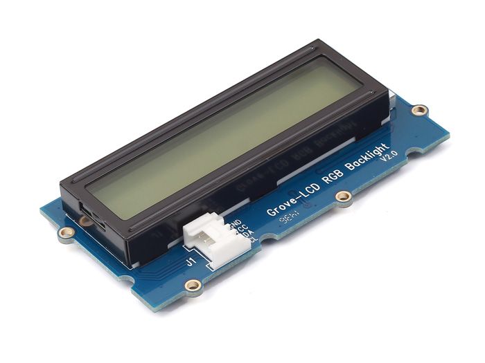
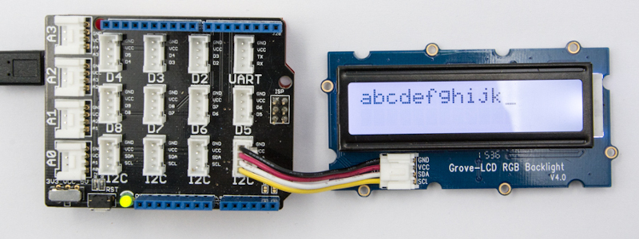
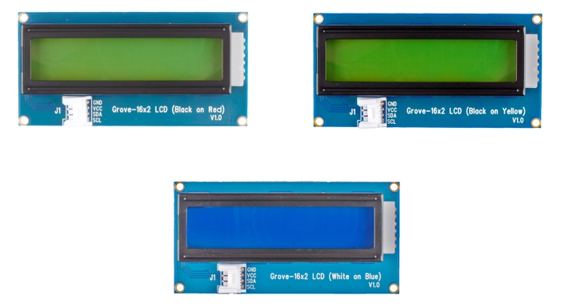

=======================================
Grove - Afficheur LCD 16x2 sur port I2C
=======================================

Principe
========

Il s'agit d'un afficheur de 32 caractères disposés sur 2 lignes (16 caractères par ligne).

La communication avec le microcontrôleur s'effectue via un port série de données (I2C) nécessitant moins de câbles (4 en tout).

   
   Module Grove - LCD RGB Backlight (image : http://wiki.seeedstudio.com)

Chaque afficheur utilise sa propre librairie (ex. ``rgb_lcd.h`` pour le Grove LCD RGB Backlight) en plus de la librairie ``wire.h`` qui est obligatoire pour la gestion du port I2C.

Grove LCD RGB Backlight
=======================

   
   Modules Grove (image : http://wiki.seeedstudio.com)

Télécharger `ici <https://github.com/Seeed-Studio/Grove_LCD_RGB_Backlight>`_ le fichier ``Grove_LCD_RGB_Backlight-master.zip`` pour l'installation de la librairie ``rgb_lcd`` avant la compilation du programme.

.. code-block:: arduino

   /*
    * Exemple affichage sur LCD 2x16 RGB I2C Grove
    */

   #include <Wire.h>       // Importation librairie gestion port I2C
   #include "rgb_lcd.h"    // Importation librairie gestion afficheur LCD I2C Grove

   rgb_lcd lcd;            // Déclaration de l'afficheur

   const int colorR = 255; // Couleur fond écran
   const int colorG = 0;
   const int colorB = 0;

   void setup()
   {
       lcd.begin(16, 2);                      // Fixe 2 colonnes et 16 caractères/ligne
       lcd.setRGB(colorR, colorG, colorB);    // Fixe couleur de fond
       lcd.print("hello, world!");            // Affiche texte
       delay(1000);                           // Temporisation 1s
   }

   void loop()
   {
       lcd.setCursor(0, 1);                  // Déplace le curseur
       lcd.print(millis()/1000);             // Affiche le temps écoulé en s (timer interne)
       delay(100);                           // Temporisation 1s
   }

Grove LCD 16x2 (rouge/jaune/bleu)
=================================

   
   Grove LCD 16x12 (image: http://wiki.seeedstudio.com)

Toujours avec la librairie précédente ``rgb_lcd``.

.. code-block:: arduino

   /*
    * Exemple affichage sur LCD 2x16 I2C Grove sans RGB
    */

   #include <Wire.h>
   #include "rgb_lcd.h"

   rgb_lcd lcd;         // Déclation de l'afficheur LCD branché sur un port I2C

   void setup() 
   {
      lcd.begin(16, 2);  // Initialisation de l'afficheur LCD sur 2 lignes à 16 caractères
   }

   void loop() 
   {
      lcd.setCursor(0, 0);        // Placement du curseur
      lcd.print("Bonjour !");     // Affichage de la valeur de la tension
      delay(1000);                // Pause de 1000 ms
   }

