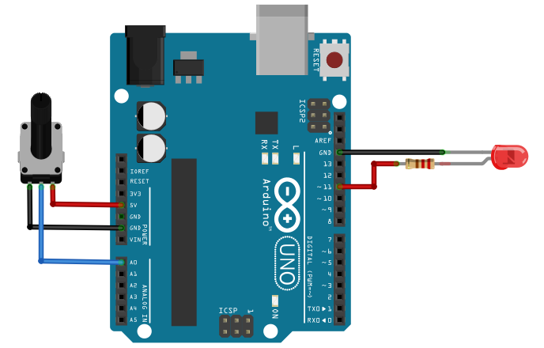

=====================================================
Contrôler l'intensité d'une LED avec un potentiomètre
=====================================================

Montage
=======

   Commande de l'intensité d'une LED avec un potentiomètre

Programme
=========

.. code-block:: arduino

   #define pinLED 11

   int N;       // Valeur lue sur A0 de 0 à 1023
   int duty;    // Rapport cyclique de 0 à 255

   void setup() {
   }

   void loop() {
     N = analogRead(A0);       // Conversion analogique-numérique sur A0
     duty = N/4;               // Calcul du rapport cyclique
     analogWrite(pinLED, duty); // Génération de la tension PWM
     delay(30);                // Attendre 30 ms
   }

.. note::

   Pour convertir un entier sur 10 bits en un entier sur 8 bits, il suffit de la **division entière par 4** !
