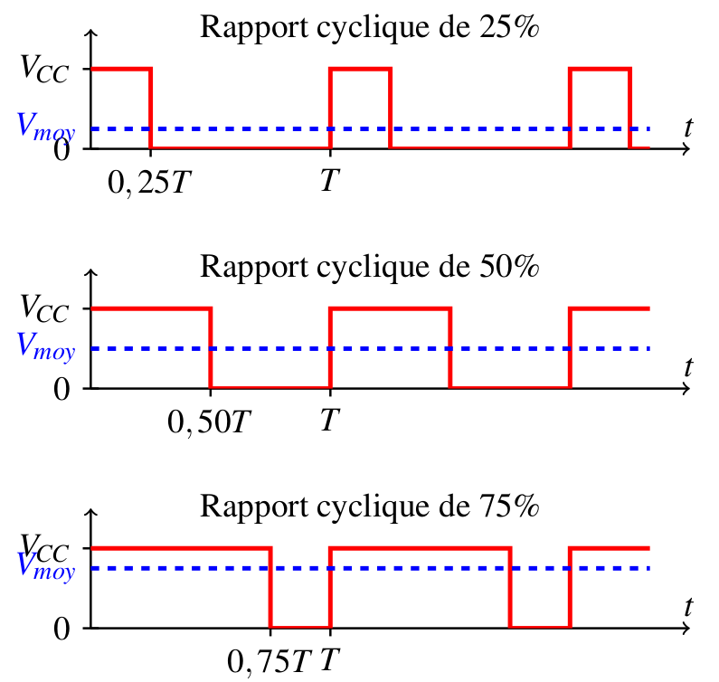
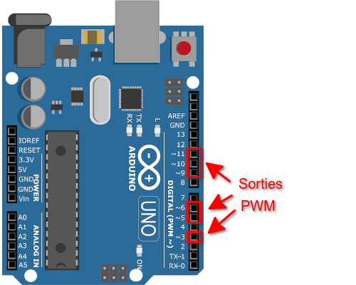
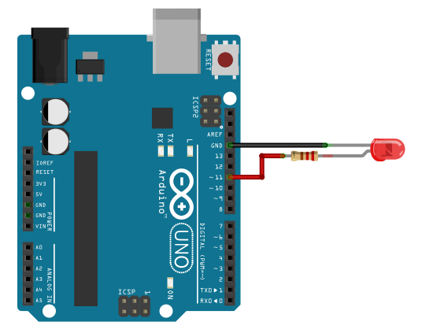

.. |kohm| replace:: :math:`{k\Omega}`
.. |ohm| replace:: :math:`{\Omega}`

======================================================
Modifier l'intensité lumineuse d'une LED (sorties PWM)
======================================================

Principe
========

La carte Arduino ne possède pas de vraies sorties analogiques. Mais il est possible de faire **varier la valeur moyenne de la tension d'une sortie digitale** (donc de faire varier l'intensité lumineuse d'une LED) en modifiant son **rapport cyclique** (durée de l'état haut par rapport à la période). C'est le principe de la Modulation à Largeur d'Impulsion (MLI) ou Pulse Width Modulation (PWM) en anglais.

   Principe de la MLI ou PWM

La carte Arduino UNO dispose de 6 sorties PWM sur les broches 3, 5, 6, 9, 10, 11.

   Soties PWM de l'Arduino Uno R3

.. warning::
   La fréquence d'un signal PWM est fixée à 490 Hz pour un arduino Uno R3 !

Montage
=======

   Branchement d'une LED sur la broche 11

Une LED en série avec une résistance de 220 |ohm| est branchée sur la broche 11.

Programme en langage Arduino (C/C++)
====================================

.. code:: arduino

   #define LED 11           // LED connectée à la broche 11

   void setup() {
     pinMode(LED,OUTPUT);   // Configuration de la broche LED en sortie
   }

   void loop() {
     analogWrite(LED,0);    // PWM à 0%
     delay(1000);           // Attendre 1 s
     analogWrite(LED,100);  // PWM à 100/255 = 39%
     delay(1000);           // Attendre 1 s
     analogWrite(LED,200);  // PWM à 200/255 = 78%
     delay(1000);           // Attendre 1 s
   }

La fonction ``analogWrite(LED,duty)`` génère une modulation à largeur d'impulsion sur la broche 11 où ``duty`` est un nombre entier entre 0 et 255 respectivement pour un rapport cyclique entre 0% et 100%.

Le code qui suit est une version avec la saisie du rapport cyclique au clavier dans le moniteur série.

.. code:: arduino

   // PWM avec saisie du rapport cyclique (entier de 0 à 255) au clavier dans le moniteur série.
   // ATTENTION : Sélectionner "Pas de fin de ligne" dans le monitor série !!!
   // David THERINCOURT 2025

   #define LED 11           // LED connectée à la broche 11

   void setup()
   {
      Serial.begin(9600);   // Initialisation du port série
      pinMode(LED,OUTPUT);  // Configuration de la broche LED en sortie
   }

   void loop()
   {
      Serial.print("Rapport cyclique entre 0 et 255 : ");  // Indication à l'utilisateur
      while (Serial.available()==0){}                      // Attente d'un message (Cocher "Pas de fin de ligne")
      int N = Serial.parseInt();                           // Extraction de la valeur numérique (entier)
      Serial.println(N);                                   // Affichage de N
      analogWrite(LED, N);                                 // Ecriture sur la sortie PWM
   }

Programme en langage Python (Nanpy)
===================================

.. code:: python

   from nanpy import ArduinoApi, SerialManager
   from time import sleep
   
   port = SerialManager(device='COM6')          # Sélection du port série à modifier
   uno = ArduinoApi(connection=port)            # Déclaration de la carte Arduino Uno
   
   pinLed = 11                                  # Led branchée sur broche 11
   uno.pinMode(pinLed, uno.OUTPUT)              # Broche Led en sortie
   
   for i in range(9):
       uno.analogWrite(pinLed, 10)   # PWM à 10/255
       sleep(1)                      # Attendre 1s
       uno.analogWrite(pinLed, 50)   # PWM à 50/255
       sleep(1)                      # Attendre 1s
       uno.analogWrite(pinLed, 200)  # PWM à 200/255
       sleep(1)                      # Attendre 1s
   
   port.close()                      # Fermeture du port série

Applications
------------

* Variation de l'intensité lumineuse d'une LED.
* Variation de la vitesse d'un moteur à courant continu.
* Obtention d'une tension constante par filtrage passe-bas (limitée en fréquence).
