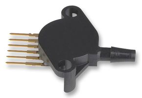
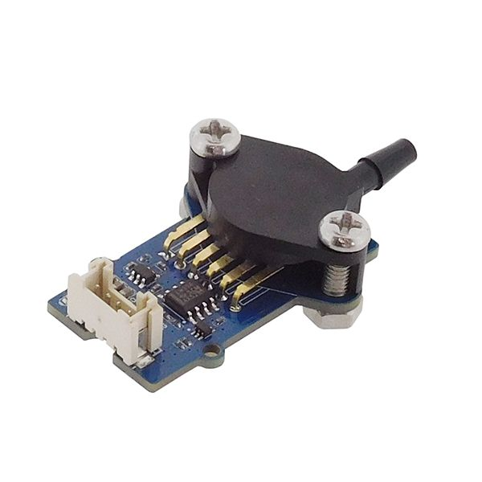
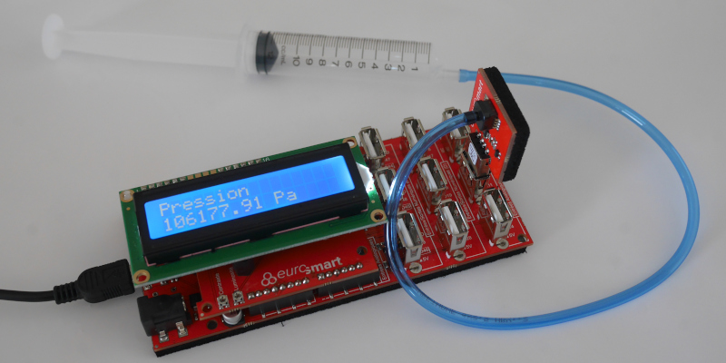
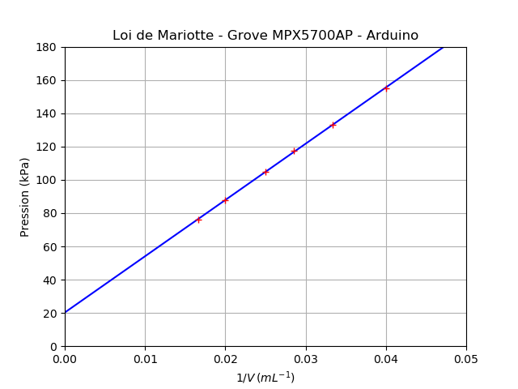
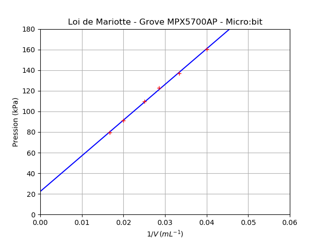

==========================================================
Mesurer une pression - Loi de Mariotte (première générale)
==========================================================

.. topic:: Programme de première générale 2019 - Enseignement de spécialité.

   Tester la loi de Mariotte, par exemple en utilisant un dispositif comportant un microcontrôleur.

Principe
========

La manipulation consiste à vérifier la loi de Mariotte :math:`{P \times V = constante}` (à température et quantité de matière constantes).

La mesure de pression s'effectue avec un capteur de pression absolue du type MPX5700 (700 kPa - 5V). La tension de sortie est linéaire à la pression mesurée.

   
   Capteur MPX5700GP (0 à 700 kPa) (image : farnell.fr)

   
   Capteur MPX5700AP Grove (15 kPa à 700 kPa) (image : gotronic.fr)

Arduino (C/C++)
===============

Le montage est composé d'une carte Educaduino Lab, d'un capteur de pression Educaduino (20 kPa à 400 kPa) et d'une seringue. L'expression de la pression (en kPa) en fonction de la tension délivrée par le cateur est :

.. math::

   P = 76 \times U + 20

   Mesure d'une pression avec Educaduino Lab

.. note::

   Dans cette manipulation, il est important de tenir compte du volume d'air :math:`{V_O}` présent dans le tube. La loi de Mariotte s'écrit alors 

   .. math::
      P \times (V+V_0) = constante

.. code-block:: arduino
   :linenos:

   /*
    * Mesure d'une pression absolue
    * Capteur Educaduino 20 kPa à 400 kPa
    * branché sur la broche A9
    */

   #define brocheCapteur A9      // Numéro de broche connectée au capteur
   #include <LiquidCrystal.h>    // Librairie de gestion de l écran LCD

   LiquidCrystal lcd(12, 11, 5, 4, 3, 2);  // Déclaration de l écran LCD

   float tension ;               // Tension mesurée
   float pression ;              // Pression mesurée

   void setup() {
     lcd.begin(16, 2);           // Paramétrage de l ecran LCD

   }

   void loop() {
     tension = analogRead(brocheCapteur)*5.0/1023 ;   // Lecture de la tension
     pression = tension * 76 + 20 ;                   // Calcul de la pression en kPa
     lcd.clear();                                     // Début affichage
     lcd.setCursor(0,0);
     lcd.print("Pression en kPa");
     lcd.setCursor(0,1);
     lcd.print(pression);                             // Fin affichage
     delay(1000);
   }

Résultats :

======== ==== ==== ==== ==== ==== ==== ==== ==== ====
V (mL)   12   11   10   9    8    7    6    5    4
P (kPa)  96,5 105  114  124  136  152  171  194  227
======== ==== ==== ==== ==== ==== ==== ==== ==== ====

Arduino (Python/Nanpy)
======================

Cet exemple utilise un module Grove MPX5700AP (15-700 kPa). Les mesures sont affichées au format CSV pour exploitation avec un tableur, Regressi, Latis ou Python par un copier-coller.

.. code-block:: Python

   # Vérification de la loi de Boyle-Mariotte avec module Grove MPX5700AP 15-700 kPa > 0.2-4.7 V
   from nanpy import ArduinoApi                    # Gestion de la carte Arduino
   from nanpy import SerialManager                 # Gestion du port série

   port = SerialManager(device='/dev/ttyACM0')     # Sélection du port série (exemple : device = 'COM6')
   uno = ArduinoApi(connection=port)               # Déclaration de la carte Arduino

   Pmin = 15     # Pression minimale en kPa
   Pmax = 700    # Pression maximale en kPa
   Umin = 41     # Tension minimale 0.2/5*1023 = 41 
   Umax = 962    # Tension maximale 4.7/5*1023 = 962

   volume   = [60,50,40,35,30,25]    # Proposition de volumes - 40 mL pour pression atmosphérique
   pression = []                     # Tableau des pressions

   # Mesures
   for vol in volume :                                   # Parcours des volumes prédéfinis
      input("Régler le volume sur " + str(vol) + " mL") # Validation du réglage du volume
      U = uno.analogRead(0)                             # Lecture de la tension numérique (10 bit)
      P = (Pmax-Pmin)/(Umax-Umin)*(U-Umin) + Pmin       # Calcul de la pression
      print(P, "kPa")                                   # Affichage de la pression
      pression.append(P)                                # Ajout de la mesure dans le tableau de pression

   # Affichage au format CSV
   print("V ; P")                        # Affichage entête des grandeurs
   print("mL ; hPa")                     # Affichage entête des unités
   for i in range(len(volume)):          # Parcours des points de mesures
      print(volume[i],";",pression[i])  # Affichage des mesures

Résultats :

.. code-block:: text

   Régler le volume sur 60 mL
   75.98805646036917 kPa
   Régler le volume sur 50 mL
   87.88816503800217 kPa
   Régler le volume sur 40 mL
   104.99457111834963 kPa
   Régler le volume sur 35 mL
   117.63843648208469 kPa
   Régler le volume sur 30 mL
   133.25732899022802 kPa
   Régler le volume sur 25 mL
   154.82627578718783 kPa

   V ; P
   mL ; kPa
   60 ; 75.98805646036917
   50 ; 87.88816503800217
   40 ; 104.99457111834963
   35 ; 117.63843648208469
   30 ; 133.25732899022802
   25 ; 154.82627578718783

Pyboard (Micropython)
=====================

Cet exemple utilise également un module Grove MPX5700AP (15-700 kPa). Les mesures sont affichées au format CSV pour exploitation avec un tableur, Regressi, Latis ou Python par un copier-coller.

.. code-block:: python

   # Vérification de la loi de Boyle-Mariotte avec module Grove MPX5700AP 15-700 kPa > 0.2-4.7 V
   from pyb import Pin, ADC

   adc = ADC(Pin("A0"))              # Déclaration du CAN

   Pmin = 15                         # Pression minimale
   Pmax = 700                        # Pression maximale
                                     # Amplification = 3,3/4,7 = 0.702
   Umin = 174                        # Tension minimale (0.2V * 0.702 = 0.140V) N=174
   Umax = 4095                       # Tension maximale (4.7V * 0.702 = 3.300V) N=4095

   volume   = [60,50,40,35,30,25]    # Proposition de volumes - 40 mL pour pression atmosphérique
   pression = []                     # Tableau des pressions

   # Mesures
   for vol in volume :                                   # Parcours des volumes prédéfinis
      input("Régler le volume sur " + str(vol) + " mL") # Validation du réglage du volume
      U = adc.read()                                    # Lecture de la tension numérique (12 bit)
      P = (Pmax-Pmin)/(Umax-Umin)*(U-Umin) + Pmin       # Calcul de la pression du capteur
      print(P, "kPa")                                   # Affichage de la pression
      pression.append(P)                                # Ajout de la mesure dans le tableau de pression

   # Affichage au format CSV
   print("V ; P")                        # Affichage entête des grandeurs
   print("mL ; hPa")                     # Affichage entête des unités
   for i in range(len(volume)):          # Parcours des points de mesures
      print(volume[i],";",pression[i])  # Affichage des mesures

Résultats :

.. code-block:: text

   Régler le volume sur 60 mL
   79.81383 kPa
   Régler le volume sur 50 mL
   91.69345 kPa
   Régler le volume sur 40 mL
   109.1635 kPa
   Régler le volume sur 35 mL
   122.0913 kPa
   Régler le volume sur 30 mL
   137.4649 kPa
   Régler le volume sur 25 mL
   157.7302 kPa

   V ; P
   mL ; kPa
   60 ; 79.81383
   50 ; 91.69345
   40 ; 109.1635
   35 ; 122.0913
   30 ; 137.4649
   25 ; 157.7302

.. image:: Images/pression_Mariotte_Grove_MPX5700AP_Pyboard.png
   :width: 640
   :height: 480
   :scale: 100 %
   :alt: 
   :align: center

Micro:bit (Micropython)
=======================
   
Cet exemple utilise également un module Grove MPX5700AP (15-700 kPa). Les mesures sont affichées au format CSV pour exploitation avec un tableur, Regressi, Latis ou Python par un copier-coller.

.. code-block:: python
   
   # Vérification de la loi de Boyle-Mariotte avec module Grove MPX5700AP 15-700 kPa > 0.2-4.7 V
   from microbit import *

   Vcc = 3.09    # Mesure au voltmètre entre 3V3 et GND
   No  = 4       # Décalage (entier) obtenu pour une tension de OV

   Pmin = 15     # Pression minimale
   Pmax = 700    # Pression maximale
               # Amplification = 3,3/4,7 = 0.702
   Umin = 0.14   # Tension minimale (0.2V * 0.702 = 0.140V) N=44
   Umax = 3.3    # Tension maximale (4.7V * 0.702 = 3.300V) N=1023

   volume   = [60,50,40,35,30,25]    # Proposition de volumes - 40 mL pour pression atmosphérique
   pression = []                     # Tableau des pressions

   # Mesures
   for vol in volume :                                   # Parcours des volumes prédéfinis
      input("Régler le volume sur " + str(vol) + " mL") # Validation du réglage du volume
      N = pin1.read_analog()                            # Lecture de la tension numérique (10 bit)
      U = (N-No)*Vcc/(1023-No)                          # Calcul de la tension
      P = (Pmax-Pmin)/(Umax-Umin)*(U-Umin) + Pmin       # Calcul de la pression
      print(P, "kPa")                                   # Affichage de la pression
      pression.append(P)                                # Ajout de la mesure dans le tableau de pression

   # Affichage au format CSV
   print("V ; P")                        # Affichage entête des grandeurs
   print("mL ; hPa")                     # Affichage entête des unités
   for i in range(len(volume)):          # Parcours des points de mesures
      print(volume[i],";",pression[i])  # Affichage des mesures
   

Résultats :

.. code-block:: text
   
   Régler le volume sur 60 mL
   79.3083 kPa
   Régler le volume sur 50 mL
   91.1404 kPa
   Régler le volume sur 40 mL
   109.546 kPa
   Régler le volume sur 35 mL
   122.693 kPa
   Régler le volume sur 30 mL
   137.154 kPa
   Régler le volume sur 25 mL
   160.161 kPa

   V ; P
   mL ; kPa
   60 ; 79.3083
   50 ; 91.1404
   40 ; 109.546
   35 ; 122.693
   30 ; 137.154
   25 ; 160.161
   
