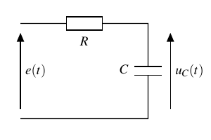
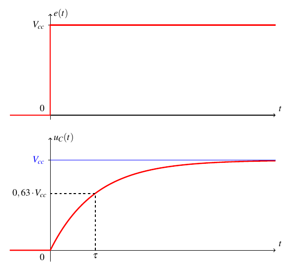
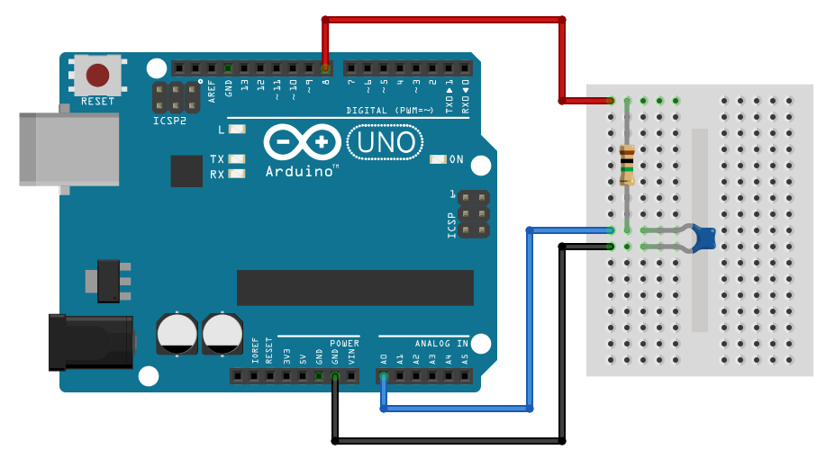

Capteur capacitif (terminale générale)
======================================

.. topic:: Programme de terminale générale 2019 - Enseignement de spécialité.

   Expliquer le principe de fonctionnement de quelques capteurs capacitifs. Étudier la réponse d’un dispositif modélisé par un dipôle RC. **Déterminer le temps caractéristique d'un dipôle RC** à l’aide d’un microcontrôleur, d’une carte d’acquisition ou d’un oscilloscope.

Principe
--------
Soit le circuit RC série suivant :

   Schéma électrique

   Évolution de la tension du condensateur en fonction du temps

Lors de la charge du condensateur C à travers la résistance R sous tension constante :math:`V_{cc}`,
le **temps caractéristique** (ou constante de temps) :math:`\tau` est la durée que prend
la tension :math:`u_{C}` pour atteindre 63% de sa valeur finale :math:`V_{cc}`.

Avec un microcontrôleur, il est assez facile de mesurer ce temps caractéristique par une **mesure de durée** jusqu'à la **détection du seuil de 63%** de la valeur finale de la tension du condensateur.

Montage
-------

   Charge d'un condensateur sous tension constante avec un Arduino UNO R3

* La broche digitale ``8`` charge ou décharge le condensateur à travers la résistance.
* ``A0`` mesure la tension aux bornes du condensateur.

Données :

.. math::

   R = 1\,M\Omega \qquad C=22\,nF

Programme
---------

.. code-block:: arduino

   /*
    *  Mesure de constante de temps d un circuit RC
    */

   #define pinE 8

   int N = 0;
   unsigned long t0;
   unsigned long t1;
   unsigned long tau;
   float C;

   void setup() {
     Serial.begin(9600);
     Serial.println("Start");
     pinMode(pinE,OUTPUT);      // Broche digitale en sortie

     digitalWrite(pinE,LOW);    // Décharge condensateur avant mesure
     delay(1000);               // pendant 1 s

     digitalWrite(pinE,HIGH);   // Début charge condensateur
     t0 = micros();             // Mesure instant initial

     while (N<646) {            // Boucle tant que tension inférieure à seuil (0,632*1023=646)
       N=analogRead(A0);        // Lecture tension condensateur
     }

     t1 = micros();             // Mesure instant où seuil atteint
     digitalWrite(pinE,LOW);    // Début décharge condensateur
     tau = t1 - t0;              // Calcul de tau

     Serial.print(tau);          // Début affichage
     Serial.println(" µs");
   }

   void loop() {
     // Boucle sans fin pas utilisée ici !
   }

A retenir
---------

* La fonction ``micros()`` renvoie la durée en µs (< 70 min) depuis que la carte Arduino a été mise sous tension. La précision est de 4 µs !

* La boucle ``while`` (tant que) associée à la fonction ``analogRead()`` détecte le seuil de la tension du condensateur.

Application : mesure d'une capacité
-----------------------------------

Sachant que le temps caractéristique est défini par la relation :

.. math::

   \tau = R \cdot C

Le calcul de la capacité C du condensateur est :

.. math::

   C = \dfrac{\tau}{R}

If suffit donc d'ajouter cette relation dans le code précédent !

.. code-block:: arduino

   /*
    *  Mesure de la capacité d un circuit RC
    */

   #define pinE 8

   float R = 1000;       // Resistance en kOhm
   int N = 0;
   unsigned long t0;
   unsigned long t1;
   unsigned long tau;
   float C;

   void setup() {
     Serial.begin(9600);
     Serial.println("Start");
     pinMode(pinE,OUTPUT);      // Broche digitale en sortie

     digitalWrite(pinE,LOW);    // Décharge condensateur avant mesure
     delay(1000);               // pendant 1 s

     digitalWrite(pinE,HIGH);   // Début charge condensateur
     t0 = micros();             // Mesure instant initial

     while (N<646) {            // Boucle tant que tension inférieure à seuil (0,632*1023=646)
       N=analogRead(A0);        // Lecture tension condensateur
     }
     t1 = micros();             // Mesure instant où seuil atteint
     digitalWrite(pinE,LOW);    // Début décharge condensateur

     tau = t1 - t0;             // Calcul de tau
     C = tau/R;                 // Calcul de C en nF

     Serial.print(C);           // Début affichage
     Serial.println(" nF");     // Fin affichage
   }

   void loop() {
     // Boucle sans fin pas utilisée ici !
   }
