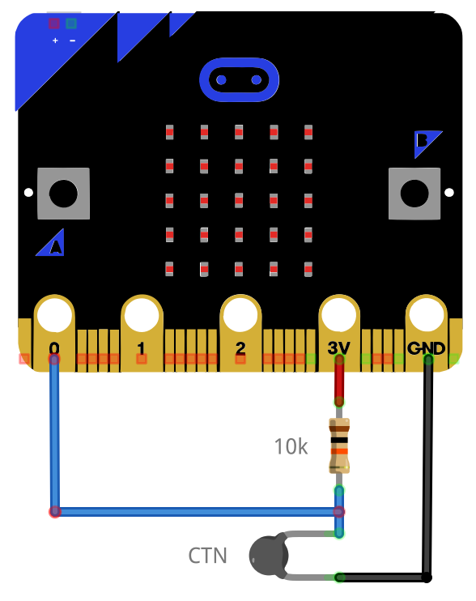
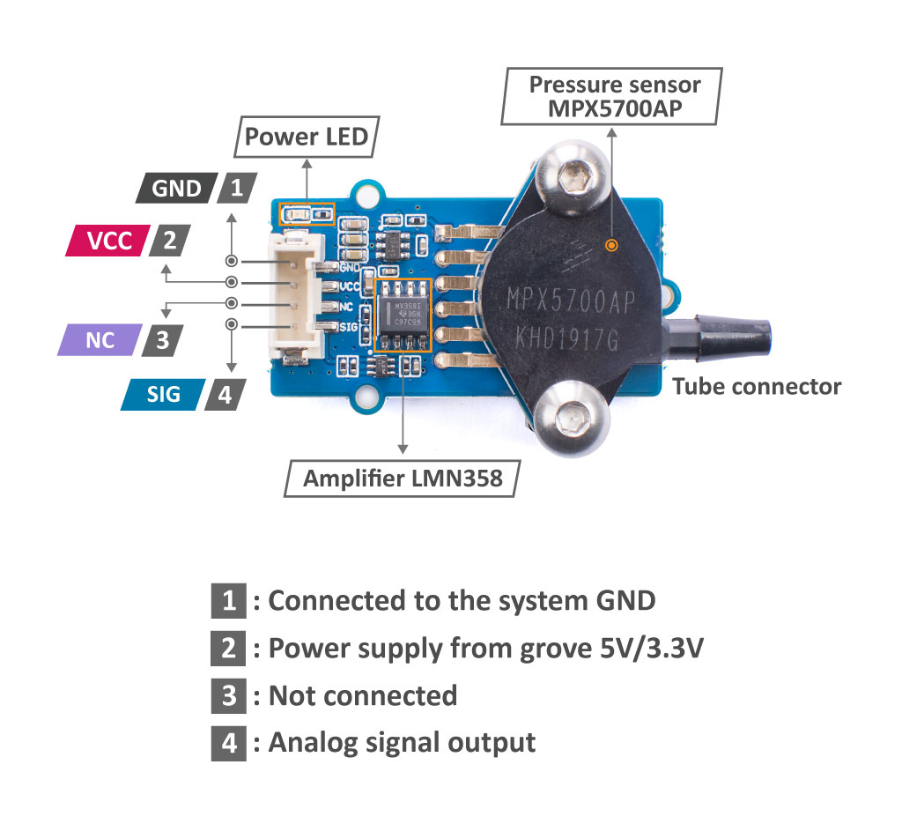
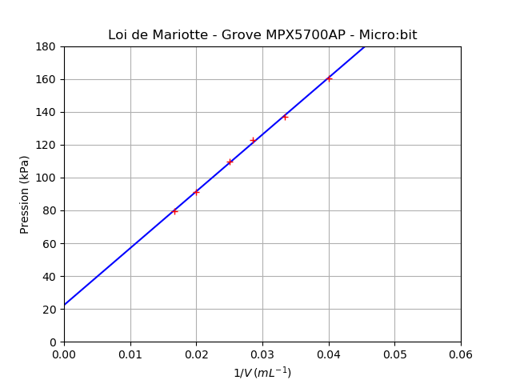

===================
Programmes du lycée
===================

Capteur résistif - CTN (seconde générale)
=========================================

   Branchement d'une CTN sur l'entrée analogique pin0

.. code-block:: Python

   # Mesure de la resistance d'une CTN
   from microbit import *
 
   Ro = 10e3                   # Résistance série

   while True:
      N = pin0.read_analog()   # Mesure de la tension
      R = Ro*N/(1023-N)        # Calcul de R
      print("R =", R)          # Affichage
      sleep(1000)              # Temporisation

Application : thermomètre numérique
===================================

   Branchement d'une CTN sur l'entrée analogique pin0

.. code-block:: Python

   # Mesure de la resistance d'une CTN et calcul de la température
   # Calcul de la température à partir de la relation de Steinhart-Hart
   from microbit import *
   from math import log

   Ro = 10e3     # Résistance série
   A = 1.0832e-3 # Coefficients de Steinhart-Hart
   B = 2.1723e-4 # ...
   C = 3.2770e-7 # ...

   while True:
      N = pin0.read_analog()                       # Mesure de la tension
      R = Ro*N/(1023-N)                            # Calcul de R
      T = 1/(A + B*log(R) + C*log(R)**3) - 273.15  # Relation de Steinhart-Hart
      print("R =", R, "T =", T)                    # Affichage
      sleep(1000)                                  # Temporisation

Mesurer une pression - Loi de Mariotte (première générale)
==========================================================

   
   Capteur MPX5700AP Grove (15 kPa à 700 kPa) (image : seeedstudio)

   
Cet exemple utilise également un module Grove MPX5700AP (15-700 kPa). Les mesures sont affichées au format CSV pour exploitation avec un tableur, Regressi, Latis ou Python par un copier-coller.

.. code-block:: python
   
   # Vérification de la loi de Boyle-Mariotte avec module Grove MPX5700AP 15-700 kPa > 0.2-4.7 V
   from microbit import *

   Vcc = 3.09    # Mesure au voltmètre entre 3V3 et GND
   No  = 4       # Décalage (entier) obtenu pour une tension de OV

   Pmin = 15     # Pression minimale
   Pmax = 700    # Pression maximale
               # Amplification = 3,3/4,7 = 0.702
   Umin = 0.14   # Tension minimale (0.2V * 0.702 = 0.140V) N=44
   Umax = 3.3    # Tension maximale (4.7V * 0.702 = 3.300V) N=1023

   volume   = [60,50,40,35,30,25]    # Proposition de volumes - 40 mL pour pression atmosphérique
   pression = []                     # Tableau des pressions

   # Mesures
   for vol in volume :                                   # Parcours des volumes prédéfinis
      input("Régler le volume sur " + str(vol) + " mL") # Validation du réglage du volume
      N = pin1.read_analog()                            # Lecture de la tension numérique (10 bit)
      U = (N-No)*Vcc/(1023-No)                          # Calcul de la tension
      P = (Pmax-Pmin)/(Umax-Umin)*(U-Umin) + Pmin       # Calcul de la pression
      print(P, "kPa")                                   # Affichage de la pression
      pression.append(P)                                # Ajout de la mesure dans le tableau de pression

   # Affichage au format CSV
   print("V ; P")                        # Affichage entête des grandeurs
   print("mL ; hPa")                     # Affichage entête des unités
   for i in range(len(volume)):          # Parcours des points de mesures
      print(volume[i],";",pression[i])  # Affichage des mesures
   

Résultats :

.. code-block:: text
   
   Régler le volume sur 60 mL
   79.3083 kPa
   Régler le volume sur 50 mL
   91.1404 kPa
   Régler le volume sur 40 mL
   109.546 kPa
   Régler le volume sur 35 mL
   122.693 kPa
   Régler le volume sur 30 mL
   137.154 kPa
   Régler le volume sur 25 mL
   160.161 kPa

   V ; P
   mL ; kPa
   60 ; 79.3083
   50 ; 91.1404
   40 ; 109.546
   35 ; 122.693
   30 ; 137.154
   25 ; 160.161
   
