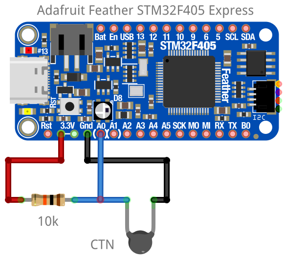
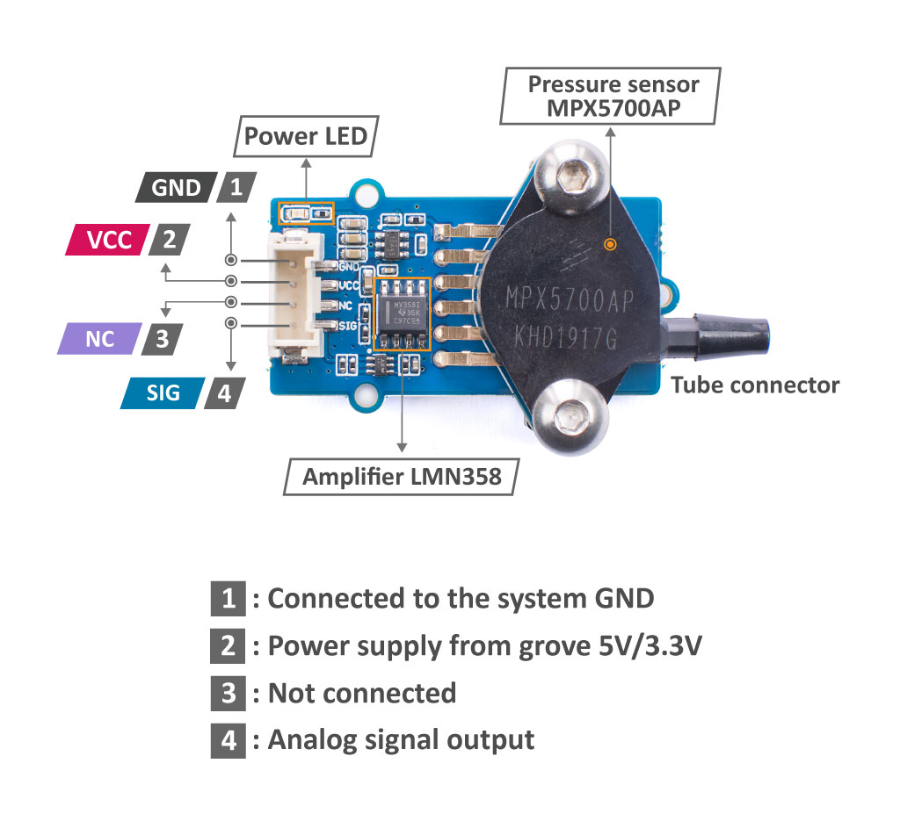
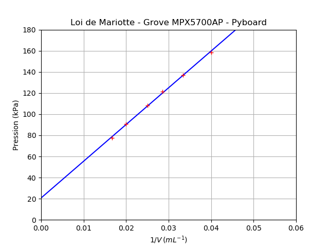

==================
Programme du lycée
==================

Capteur résistif - CTN (seconde générale)
=========================================

Le montage ci-dessous utilise une carte Feather STM32F405 Express. L’entrée analogique A0 mesure la tension du capteur.

   Branchement d'une CTN sur l'entrée analogique A0

.. code-block:: Python

   # Mesure de la resistance d'une CTN
   from pyb import Pin, ADC, delay

   adc = ADC(Pin("A0")) # Déclaration du CAN
   Ro = 10e3 # Résistance série

   while True:
      N = adc.read() # Mesure de la tension
      R = Ro*N/(4095-N) # Calcul de R
      print("R =", R) # Affichage
      delay(1000) # Temporisation

Application : thermomètre numérique
===================================

   Branchement d'une CTN sur l'entrée analogique A0

.. code-block:: Python

   # Mesure de la resistance d'une CTN et calcul de la température
   # Calcul de la température à partir de la relation de Steinhart-Hart
   from pyb import Pin, ADC, delay
   from math import log

   adc = ADC(Pin("A0"))        # Déclaration du CAN

   Ro = 10e3                   # Résistance série
   A = 0.0010832035972923174   # Coeff. de Steinhart-Hart
   B = 0.00021723460553451255  # ...
   C = 3.276999926128753e-07   # ...

   while True:
      N = adc.read()                              # Mesure de la tension
      R = Ro*N/(4095-N)                           # Calcul de R
      T = 1/(A + B*log(R) + C*log(R)**3) - 273.15 # Relation de Steinhart-Hart
      print("R =", R, "T =", T)                   # Affichage
      delay(1000)                                 # Temporisation

Mesurer une pression - Loi de Mariotte (première générale)
==========================================================

   
   Capteur MPX5700AP Grove (15 kPa à 700 kPa) (image : seeedstudio)

Cet exemple utilise également un module Grove MPX5700AP (15-700 kPa). Les mesures sont affichées au format CSV pour exploitation avec un tableur, Regressi, Latis ou Python par un copier-coller.

.. code-block:: python

   # Vérification de la loi de Boyle-Mariotte avec module Grove MPX5700AP 15-700 kPa > 0.2-4.7 V
   from pyb import Pin, ADC

   adc = ADC(Pin("A0"))              # Déclaration du CAN

   Pmin = 15                         # Pression minimale
   Pmax = 700                        # Pression maximale
                                     # Amplification = 3,3/4,7 = 0.702
   Umin = 174                        # Tension minimale (0.2V * 0.702 = 0.140V) N=174
   Umax = 4095                       # Tension maximale (4.7V * 0.702 = 3.300V) N=4095

   volume   = [60,50,40,35,30,25]    # Proposition de volumes - 40 mL pour pression atmosphérique
   pression = []                     # Tableau des pressions

   # Mesures
   for vol in volume :                                   # Parcours des volumes prédéfinis
      input("Régler le volume sur " + str(vol) + " mL") # Validation du réglage du volume
      U = adc.read()                                    # Lecture de la tension numérique (12 bit)
      P = (Pmax-Pmin)/(Umax-Umin)*(U-Umin) + Pmin       # Calcul de la pression du capteur
      print(P, "kPa")                                   # Affichage de la pression
      pression.append(P)                                # Ajout de la mesure dans le tableau de pression

   # Affichage au format CSV
   print("V ; P")                        # Affichage entête des grandeurs
   print("mL ; hPa")                     # Affichage entête des unités
   for i in range(len(volume)):          # Parcours des points de mesures
      print(volume[i],";",pression[i])  # Affichage des mesures

Résultats :

.. code-block:: text

   Régler le volume sur 60 mL
   79.81383 kPa
   Régler le volume sur 50 mL
   91.69345 kPa
   Régler le volume sur 40 mL
   109.1635 kPa
   Régler le volume sur 35 mL
   122.0913 kPa
   Régler le volume sur 30 mL
   137.4649 kPa
   Régler le volume sur 25 mL
   157.7302 kPa

   V ; P
   mL ; kPa
   60 ; 79.81383
   50 ; 91.69345
   40 ; 109.1635
   35 ; 122.0913
   30 ; 137.4649
   25 ; 157.7302

