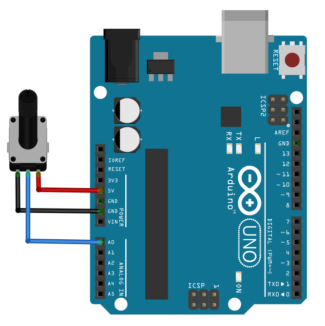

==================
Les bases de Nanpy
==================

Allumer une LED (sorties numériques)
====================================

.. figure:: images/Arduino_LED_PWM.png
   :width: 536
   :height: 423
   :scale: 60 %
   :alt:
   :align: center

   Branchement d'une LED sur la broche 11

.. code-block:: Python

   from nanpy import ArduinoApi, SerialManager
   from time import sleep                       # Importation fonction sleep()

   port = SerialManager(device='COM6')          # Sélection du port série à modifier 
   uno = ArduinoApi(connection=port)            # Déclaration de la carte Arduino Uno

   pinLed = 11                                  # Led branchée sur broche 11
   uno.pinMode(pinLed, uno.OUTPUT)              # Broche Led en sortie

   for i in range(100):                   # Boucle : répéter 100 fois
      uno.digitalWrite(pinLed, 0)         # Led éteinte
      sleep(1)                            # Attendre 1 s
      uno.digitalWrite(pinLed, 1)         # Led allumée
      sleep(1)                            # Attendre 1 s

* La fonction ``SerialManager()`` fixe le port série sur lequel l'Arduino est connecté. 
* La fonction ``ArduinoApi()`` déclare un objet (ici ``uno``) qui représente la carte Arduino.
* La méthode ``pinMode()`` fixe la broche `pinLed` en sortie (``uno.OUTPUT``).
* La méthode ``digitalWrite()`` écrit un niveau logique sur la broche ``pinLed`` (0 pour 0 V et 1 pour 5 V).

Modifier l'intensité lumineuse d'une LED (sorties PWM)
======================================================

Le montage reste le même.

.. code:: python

   from nanpy import ArduinoApi, SerialManager
   from time import sleep
   
   port = SerialManager(device='COM6')          # Sélection du port série à modifier
   uno = ArduinoApi(connection=port)            # Déclaration de la carte Arduino Uno
   
   pinLed = 11                                  # Led branchée sur broche 11
   uno.pinMode(pinLed, uno.OUTPUT)              # Broche Led en sortie
   
   for i in range(9):
       uno.analogWrite(pinLed, 10)   # PWM à 10/255
       sleep(1)                      # Attendre 1s
       uno.analogWrite(pinLed, 50)   # PWM à 50/255
       sleep(1)                      # Attendre 1s
       uno.analogWrite(pinLed, 200)  # PWM à 200/255
       sleep(1)                      # Attendre 1s
   
   port.close()                      # Fermeture du port série

Afficher des messages dans la console Python
============================================

Avec Nanpy, le code Python est exécuté sur l'ordinateur et non sur le microcontrôleur. La fonction native ``print()`` de Python s'utilise tout naturellement ! 

.. code-block:: Python

   from nanpy import ArduinoApi, SerialManager
   from time import sleep

   port = SerialManager(device='COM6')  # Sélection du port série à modifier
   uno = ArduinoApi(connection=port)    # Déclaration de la carte Arduino Uno

   N = 0                                # Initialisation du compteur

   while True:
      print("N =", N)                   # Affichage
      N = N + 1                         # Incrémentation du compteur
      sleep(1)                          # Temporisation

Mesurer une tension (CAN)
=========================

   
   Montage potentiométrique sur l'entrée analogique A0

.. code-block:: python

   from nanpy import ArduinoApi, SerialManager
   from time import sleep                       # Importation fonction sleep()

   port = SerialManager(device='COM6')          # Sélection du port série à modifier
   uno = ArduinoApi(connection=port)            # Déclaration de la carte Arduino Uno

   for i in range(10):
      N = uno.analogRead(0)              # Lecture la tension numérique sur A0
      print("N = ", N)                   # Affichage
      U = N*5/1023                       # Calcul de la tension en volt
      print("U = ", round(U, 3), " V")   # Affichage
      sleep(1)                           # Temporisation d'une seconde

   uno.connection.close()                 # Deconnexion de Arduino
   port.close()                           # Fermeture du port série

