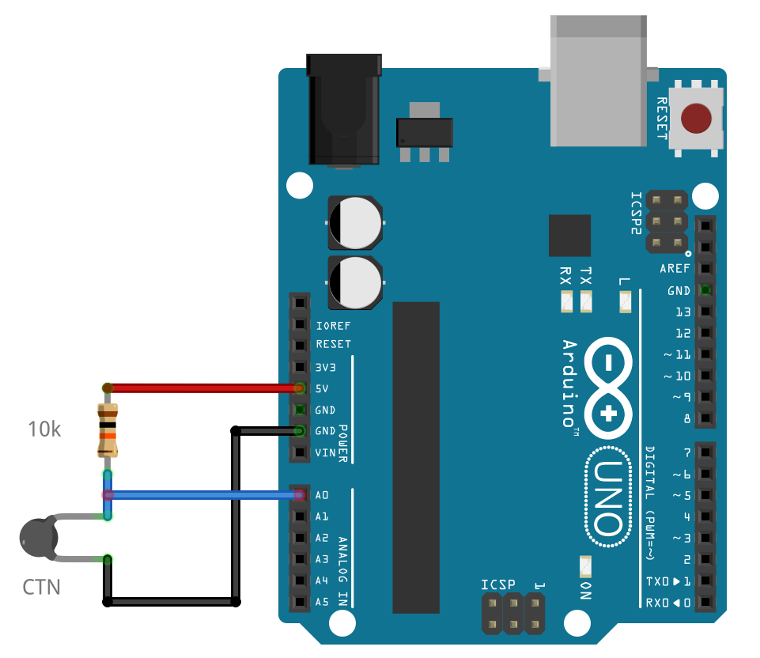
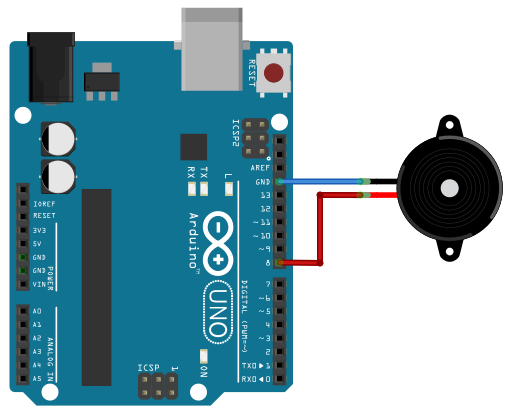
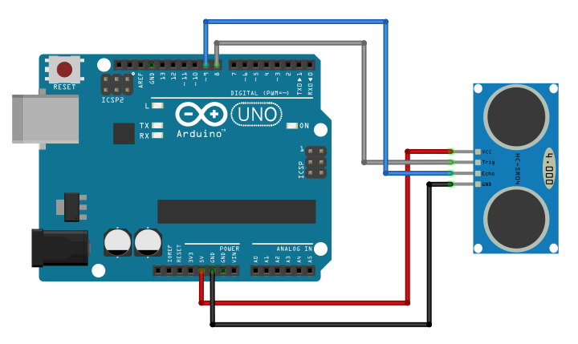
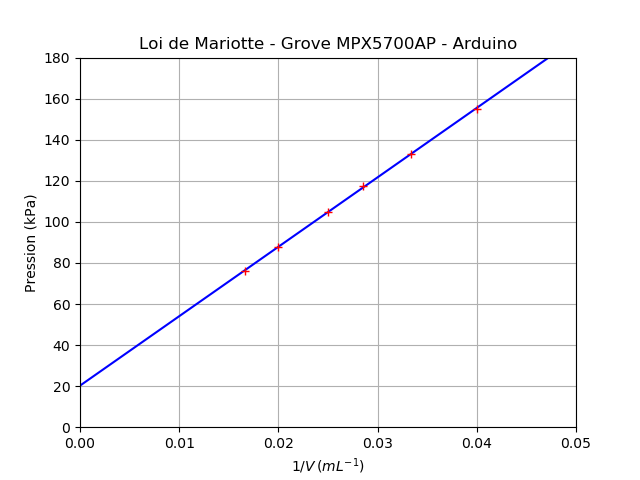

===================
Programmes du lycée
===================

Capteur résistif - CTN (seconde générale)
=========================================

   Branchement d'une CTN sur l'entrée analogique A0

.. code-block:: Python

   # Mesure de la résistance d'une CTN
   from nanpy import ArduinoApi           # Gestion de l'Arduino
   from nanpy import SerialManager        # Gestion port série
   from time import sleep                 # Importation de sleep(seconde)

   Vcc = 5.0                              # Tension d'alimentation
   Ro = 10000                             # Résistance du pont

   port = SerialManager(device='COM6')    # Sélection du port série (à remplacer) 
   uno = ArduinoApi(connection=port)      # Déclaration de la carte Arduino

   while True :
      U = uno.analogRead(0)*5/1023        # Lecture la tension sur A0
      R = Ro*U/(Vcc-U)                    # Calcul de la résistance
      print("R = ", R)                    # Affichage
      sleep(1)                            # Temporisation d'une seconde

   port.close()                           # Fermeture du port série

Application : thermomètre numérique
===================================

   Branchement d'une CTN sur l'entrée analogique A0

.. code-block:: Python

   # Mesure de la resistance d'une CTN et calcul de la température
   # Calcul de la température à partir de la relation de Steinhart-Hart
   from nanpy import ArduinoApi           # Gestion de l'Arduino
   from nanpy import SerialManager        # Gestion port série
   from time import sleep                 # Importation de sleep(seconde)
   from math import log                   # Importation du logarithme népérien

   Vcc = 5.0      # Tension d'alimentation
   Ro = 10000     # Résistance du pont
   A = 1.0832e-3  # Coeff. de Steinhart-Hart
   B = 2.1723e-4  # ...
   C = 3.2770e-7  # ...

   port = SerialManager(device='COM6')          # Sélection du port série (à remplacer) 
   uno = ArduinoApi(connection=port)            # Déclaration de la carte Arduino

   while True :
      U = uno.analogRead(0)*5/1023              # Lecture la tension sur A0
      R = Ro*U/(Vcc-U)                          # Calcul de la résistance
      T = 1.0 / (A + B*log(R) + C*log(R)**3)    # Calcul de la température en Kelvin
      T = T-273.15                              # Calcul de la température en Celsius
      print("R = ", R, "T = ", T)               # Affichage
      sleep(1)                                  # Temporisation d'une seconde

   port.close()                                 # Fermeture du port série

Émission d'un son (seconde générale)
====================================

   Branchement d'un haut-parleur sur la broche 8

La classe ``Note`` de Nanpy dispose des méthodes :

* ``play(fréquence, durée)`` pour jouer une note pendant un durée en ms ;
* ``stop()`` pour arrêter la lecture de la note.

.. code-block:: Python

   # Nanpy v0.96
   from nanpy import ArduinoApi, SerialManager, Tone
   from time import sleep                      

   port = SerialManager(device='/dev/ttyACM0')  # Sélection du port série (exemple : device = 'COM6')
   uno = ArduinoApi(connection=port)            # Déclaration de la carte Arduino Uno

   note =  [Tone.NOTE_C4, Tone.NOTE_G3, Tone.NOTE_G3, Tone.NOTE_A3,
            Tone.NOTE_G3, 0 , Tone.NOTE_B3, Tone.NOTE_C4]
   noteDuration = [4, 8, 8, 4,
                   4, 4, 4, 4]

   hp = Tone(8)                                 # Haut parleur sur broche 8

   for i in range(8):
      duree = 1000/noteDuration[i]              # durée en ms
      hp.play(note[i] , duree)                  # jouer la note
      sleep(1.3*duree*1E-3)                     # pause en les notes

   hp.stop()                                    # Arrêt de la lecture

.. note::

   Une méthode ``tone()`` équivalent à celle du langage Arduino a été ajoutée dans la version modifiée de Nanpy d'Eurosmart. 

.. code-block:: Python

   # Version modifiée de Nanpy par Eurosmart
   from nanpy import ArduinoApi, SerialManager, Tone
   from time import sleep                       
   
   port = SerialManager(device='/dev/ttyACM0')  # Sélection du port série (exemple : device = 'COM6')
   uno = ArduinoApi(connection=port)            # Déclaration de la carte Arduino Uno
   
   melody =  [Tone.NOTE_C4, Tone.NOTE_G3, Tone.NOTE_G3, Tone.NOTE_A3, Tone.NOTE_G3, 0 , Tone.NOTE_B3, Tone.NOTE_C4]
   noteDuration = [4, 8, 8, 4, 4, 4, 4, 4]
   
   pinHP = 8                          # Haut-parleur sur broche 8
   
   for i in range(8):
       duree = 1/noteDuration[i]      # durée en ms
       uno.tone(pinHP, melody[i])     # Lecture de la note      
       sleep(duree)                   # Attendre la lecture
       uno.noTone(pinHP)              # Arrêt de la note
       sleep(duree*1.3)               # Pause entre les notes

Mesurer la célérité d'un son (première générale)
================================================

   Montage célérité son

.. code-block:: python

   # Réalisé avec une version modifiée de Nanpy par Eurosmart
   from nanpy import SerialManager, Ultrasonic
   from time import sleep

   port = SerialManager(device='/dev/ttyACM0')   # Sélection du port série (exemple : device = 'COM6')

   moduleUltrason = Ultrasonic(trig=8, echo=9, useInches=False, connection=port) # Déclaration du module HC-SR04
   sleep(0.1)                                    # Temporisation

   for i in range(10):
      duree = moduleUltrason.get_duration()     # Durée en µs pour l'aller-retour du son
      print("Durée =", duree, "µs")             # Affichage
      sleep(1)                                  # Temporisation

Résultats :

.. code-block:: python

   Durée = 1456 µs
   Durée = 1453 µs
   Durée = 1451 µs
   Durée = 1450 µs
   Durée = 1453 µs
   Durée = 1453 µs
   Durée = 1447 µs
   Durée = 1444 µs
   Durée = 1452 µs
   Durée = 1446 µs

Application : télémètre  (première générale)
============================================

   Télémètre

.. code-block:: python

   # Réalisé avec une version modifiée de Nanpy par Eurosmart
   from nanpy import SerialManager, Ultrasonic
   from time import sleep

   port = SerialManager(device='/dev/ttyACM0')   # Sélection du port série (exemple : device = 'COM6')

   moduleUltrason = Ultrasonic(trig=8, echo=9, useInches=False, connection=port) # Déclaration du module HC-SR04
   sleep(0.1)                                    # Temporisation

   vitesse_son = 345                             # vitesse du son 345 m/S dans l'air

   for i in range(10):
      duree = moduleUltrason.get_duration()     # Durée en µs pour l'aller-retour du son
      print("Durée =", duree, "µs")             # Affichage
      distance = (vitesse_son*duree*1E-6)/2;    # Calcul de la distance en m
      print("Distance = ", distance, "m")       # Affichage
      sleep(1)                                  # Temporisation

Résultats :

.. code-block:: python

   Durée = 1997 µs
   Distance =  0.34448249999999997 m
   Durée = 1996 µs
   Distance =  0.34431 m
   Durée = 2019 µs
   Distance =  0.34827749999999996 m
   Durée = 8214 µs
   Distance =  1.416915 m
   Durée = 8181 µs
   Distance =  1.4112225 m
   Durée = 8177 µs
   Distance =  1.4105325 m
   Durée = 1822 µs
   Distance =  0.314295 m
   Durée = 1915 µs
   Distance =  0.3303375 m

Mesurer une pression - Loi de Mariotte (première générale)
==========================================================

Cet exemple utilise un module Grove MPX5700AP (15-700 kPa). Les mesures sont affichées au format CSV pour exploitation avec un tableur, Regressi, Latis ou Python par un copier-coller.

.. code-block:: Python

   # Vérification de la loi de Boyle-Mariotte avec module Grove MPX5700AP 15-700 kPa > 0.2-4.7 V
   from nanpy import ArduinoApi                    # Gestion de la carte Arduino
   from nanpy import SerialManager                 # Gestion du port série

   port = SerialManager(device='/dev/ttyACM0')     # Sélection du port série (exemple : device = 'COM6')
   uno = ArduinoApi(connection=port)               # Déclaration de la carte Arduino

   Pmin = 15     # Pression minimale en kPa
   Pmax = 700    # Pression maximale en kPa
   Umin = 41     # Tension minimale 0.2/5*1023 = 41 
   Umax = 962    # Tension maximale 4.7/5*1023 = 962

   volume   = [60,50,40,35,30,25]    # Proposition de volumes - 40 mL pour pression atmosphérique
   pression = []                     # Tableau des pressions

   # Mesures
   for vol in volume :                                   # Parcours des volumes prédéfinis
      input("Régler le volume sur " + str(vol) + " mL") # Validation du réglage du volume
      U = uno.analogRead(0)                             # Lecture de la tension numérique (10 bit)
      P = (Pmax-Pmin)/(Umax-Umin)*(U-Umin) + Pmin       # Calcul de la pression
      print(P, "kPa")                                   # Affichage de la pression
      pression.append(P)                                # Ajout de la mesure dans le tableau de pression

   # Affichage au format CSV
   print("V ; P")                        # Affichage entête des grandeurs
   print("mL ; hPa")                     # Affichage entête des unités
   for i in range(len(volume)):          # Parcours des points de mesures
      print(volume[i],";",pression[i])  # Affichage des mesures

Résultats :

.. code-block:: text

   Régler le volume sur 60 mL
   75.98805646036917 kPa
   Régler le volume sur 50 mL
   87.88816503800217 kPa
   Régler le volume sur 40 mL
   104.99457111834963 kPa
   Régler le volume sur 35 mL
   117.63843648208469 kPa
   Régler le volume sur 30 mL
   133.25732899022802 kPa
   Régler le volume sur 25 mL
   154.82627578718783 kPa

   V ; P
   mL ; kPa
   60 ; 75.98805646036917
   50 ; 87.88816503800217
   40 ; 104.99457111834963
   35 ; 117.63843648208469
   30 ; 133.25732899022802
   25 ; 154.82627578718783

